# Путеводитель по проекту: твой локальный AI-ассистент

> **Что это за документ.** Это не проектная спецификация и не инструкция по сборке.
> Это учебник. Его цель — не спроектировать систему (она уже спроектирована в
> `docs/01`–`docs/06`), а **сделать так, чтобы ты понимал каждую её деталь**: что
> мы строим, зачем нужен каждый компонент, как он работает, почему выбран именно
> он, какие есть альтернативы и на какие компромиссы мы пошли.
>
> После прочтения ты должен уметь на равных обсуждать систему с разработчиком или
> с LLM: не «кажется, тут какая-то векторная база», а «у нас Qdrant в embedded-режиме,
> потому что он даёт один и тот же клиентский API при переезде на сервер, и нативный
> гибридный поиск, который на смешанном ру/en корпусе точнее чистой семантики».

## Как читать эту книгу

Каждая большая глава построена по одной схеме — семь ступеней от простого к сложному:

1. **Простое объяснение** — идея на пальцах, аналогией, без единого технического термина.
2. **Как это устроено технически** — механика, уже с терминами (все они есть в глоссарии, глава 16).
3. **Как это сделано (или будет сделано) в нашем проекте** — привязка к твоему железу,
   твоему конфигу, твоему коду. Именно эта ступень отличает учебник от статьи в интернете.
4. **Альтернативы** — что ещё бывает и чем оно отличается.
5. **Плюсы и минусы** нашего выбора — включая скрытые недостатки, о которых обычно молчат.
6. **Какие решения предстоит принять тебе** — развилки, где выбор за владельцем.
7. **Вопросы, которые возникнут позже** — то, обо что ты споткнёшься через полгода;
   лучше знать заранее.

Читать можно подряд (главы выстроены по нарастанию), а можно как справочник —
через оглавление. Возвращаться сюда во время разработки — нормально и правильно:
это твой главный источник знаний о системе, и он должен расти вместе с ней.

## Где ты сейчас находишься

Чтобы учебник не был абстрактным, вот точная точка на карте (по состоянию проекта):

- **Готово:** скелет платформы (Sprint 0), Telegram + локальная LLM (Sprint 1),
  инструменты и агентность (Sprint 2), память v1 (Sprint 3).
- **Следующий шаг:** Sprint 4 — RAG (поиск по документам). Самый тяжёлый спринт.
- **Железо:** ноутбук, **только CPU** (i7-1165G7, 16 ГБ RAM), Windows. Дискретной
  видеокарты нет. Это не мелочь: половина архитектурных решений продиктована именно
  этим фактом, и учебник будет постоянно к нему возвращаться.
- **Мозг:** Ollama на `localhost:11434`, модель `qwen2.5:7b-instruct` для диалога,
  `qwen2.5:3b-instruct` для фоновых задач.

## Оглавление

1. [Что вообще такое AI-ассистент?](#глава-1-что-вообще-такое-ai-ассистент)
2. [Как работает локальная LLM?](#глава-2-как-работает-локальная-llm)
3. [Как агент принимает решения?](#глава-3-как-агент-принимает-решения)
4. [Память](#глава-4-память)
5. [Документы](#глава-5-документы)
6. [Векторная база](#глава-6-векторная-база)
7. [Переиндексация](#глава-7-переиндексация)
8. [Telegram](#глава-8-telegram)
9. [Задачи](#глава-9-задачи)
10. [Архитектура проекта](#глава-10-архитектура-проекта)
11. [Хранение данных](#глава-11-хранение-данных)
12. [Что происходит при типичных сценариях](#глава-12-что-происходит-при-типичных-сценариях)
13. [Производительность](#глава-13-производительность)
14. [Стоимость эксплуатации](#глава-14-стоимость-эксплуатации)
15. [FAQ](#глава-15-faq)
16. [Глоссарий](#глава-16-глоссарий)

---

# Глава 1. Что вообще такое AI-ассистент?

## 1.1. Простое объяснение

Представь разницу между **справочным бюро по телефону** и **личным помощником**.

Справочное бюро отвечает на вопросы. Ты звонишь, спрашиваешь «сколько времени в
Токио», тебе говорят — и на этом всё. Каждый звонок начинается с чистого листа:
бюро не помнит, что ты звонил вчера, не может само перезвонить тебе завтра, не
пойдёт вместо тебя на почту. Оно только *говорит*.

Личный помощник — другое. Он тебя знает: помнит, что твою жену зовут так-то, что
ты не любишь совещания по утрам, что проект «Экспедиция» для тебя сейчас главный.
Он *делает*: находит нужный документ в твоих папках, ставит задачу, сам напоминает
о ней в нужный момент, разбирает завал в «Загрузках». И он живёт рядом постоянно, а
не оживает только когда ты набрал номер.

**ChatGPT — это справочное бюро.** Гениальное, эрудированное, но справочное: без
твоей памяти, без доступа к твоим файлам, без права что-либо сделать в твоём мире.

**Наш проект — это личный помощник.** Причём такой, который живёт на *твоём*
компьютере, а не на чужом сервере, и постепенно становится твоей «второй головой».

Ключевая мысль, которую надо усвоить с самого начала: **языковая модель (та самая,
что «умная») — это только один орган ассистента, его речевой центр. Сам ассистент —
это целый организм вокруг этого органа.** Речевой центр не имеет памяти, не видит
твоих файлов, не умеет ждать до понедельника. Всё это — другие органы, которые мы и
строим.

## 1.2. Как это устроено технически

Введём три понятия и разведём их, потому что новички их путают, и из-за этой путаницы
рождаются неверные ожидания.

**LLM (Large Language Model, большая языковая модель).** Функция, которая на вход
получает текст и предсказывает продолжение. Она не «знает» и не «помнит» в бытовом
смысле — она статистически продолжает то, что ей дали. Дай ей пустой лист — она
ничего не «вспомнит» о вчера, потому что вчера для неё не существует. Это чистая,
не имеющая состояния (stateless) функция «текст → текст».

**Обёртка-чат (как ChatGPT).** LLM плюс минимальный слой вокруг: веб-интерфейс,
хранение текущей переписки, чтобы модель «помнила» в пределах одного окна. Всё.
Как только окно закрыто или переписка стала слишком длинной — память теряется.

**AI-агент.** LLM, которой дали три вещи, превращающие «говорящую» модель в
«действующую»:

1. **Инструменты (tools)** — функции, которые модель может *вызвать*: «найди файл»,
   «создай задачу», «поставь напоминание». Модель не выполняет их сама — она *просит*
   систему выполнить, а система возвращает результат.
2. **Память** — хранилище, которое переживает перезапуск: факты, предпочтения,
   история. Модель на каждом шаге получает нужную выжимку из этого хранилища.
3. **Цикл (agent loop)** — механизм, который позволяет модели действовать не в один
   ход, а в несколько: подумала → вызвала инструмент → увидела результат → подумала
   снова → вызвала следующий → …→ дала финальный ответ.

**Почему агент — это не «просто LLM»?** Потому что интеллект (LLM) и способность
действовать в мире (инструменты, память, цикл) — разные вещи. Мозг в банке очень
умён, но без рук, глаз и памяти он ничего не изменит в комнате. Агент — это мозг,
которому приделали руки, глаза и записную книжку. И огромная часть инженерной работы
(и этого учебника) — не про мозг, а про руки, глаза и записную книжку.

## 1.3. Из каких частей состоит наш ассистент

Вот органы нашего организма и за что каждый отвечает. Подробно — в главе 10, здесь —
общая карта, чтобы дальнейшие главы ложились на неё.

| Орган | Роль в аналогии | Что делает |
|-------|-----------------|------------|
| **Каналы** (Telegram, консоль, web) | Уши и рот | Принимают твоё сообщение, отдают ответ |
| **Router** (маршрутизатор) | Секретарь на входе | Приводит любое сообщение к единому виду, ведёт сессии |
| **Orchestrator** (агентный цикл) | Кора головного мозга | Решает, что делать: ответить или вызвать инструмент |
| **LLM Gateway** | Речевой центр + переводчик | Единая дверь к языковой модели (Ollama) |
| **Context Builder** | Рабочий стол мышления | Собирает то, о чём модель будет думать: промпт |
| **Tool Registry** | Ящик с инструментами | Хранит список доступных действий и их правила |
| **Memory** | Долговременная память | Факты, предпочтения, история |
| **RAG + Indexer** | Зрение по документам | Ищет смысл в твоих файлах |
| **Tasks + Reminders + Scheduler** | Ежедневник и будильник | Помнит задачи, приходит вовремя |

Важнейший архитектурный принцип: **эти органы разделены жёсткими границами**.
Речевой центр (LLM) не лезет напрямую в память; каналы ничего не знают об устройстве
мозга. Зачем такая строгость — целиком глава 10, но запомни термин: у нас **модульный
монолит**. Один процесс (как один организм), но внутри — чётко разграниченные органы.

## 1.4. Что происходит после того, как я отправил сообщение

Это самая важная схема первой главы — полный жизненный цикл одного запроса. Пример:
ты пишешь в Telegram «*Напомни завтра купить билеты*».

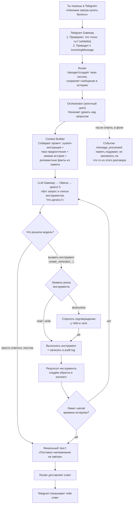

Прочитай эту схему медленно — в ней вся книга в миниатюре. Обрати внимание на четыре
вещи, каждой из которых посвящена отдельная глава дальше:

- **Между «твоим сообщением» и «мозгом» есть слои** (Gateway, Router). Мозг никогда
  не общается с Telegram напрямую. → глава 8, глава 10.
- **Модель не отвечает сразу — сначала решает, нужен ли инструмент.** И может вызвать
  несколько по кругу. Это и есть «агентность». → глава 3.
- **У инструментов есть уровни риска.** Поставить напоминание — безопасно. Удалить
  файлы — только с твоего подтверждения. → глава 3, глава 10.
- **После ответа что-то происходит «в фоне».** Ответ уже у тебя, а система ещё
  дособирает память. Диалог никогда не ждёт фоновых задач. → глава 4.

## 1.5. Альтернативы: а можно было проще?

Да, и полезно понимать, от чего мы отказались и почему.

| Подход | Что это | Почему не подошло нам |
|--------|---------|-----------------------|
| **Просто ChatGPT/Claude** | Облачный чат | Нет твоей памяти, нет доступа к файлам, данные уходят на чужой сервер |
| **Готовый «комбайн»** (LangChain-агент из 50 строк) | Собрать агента из готового фреймворка | Быстрый прототип, но абстракции «протекают» там, где у нас специфика (слабая локальная модель, уровни риска, своя модель памяти); плюс постоянные breaking changes фреймворка |
| **Микросервисы** | Каждый орган — отдельный процесс | Вся цена (сеть, оркестрация, отладка) остаётся, вся выгода (независимый деплой командами) на личной машине отсутствует |
| **Наш выбор: модульный монолит** | Один процесс, жёсткие границы модулей | Быстро завести, легко отлаживать, дёшево по ресурсам, и при этом можно расти — любой модуль выносится в отдельный процесс, когда реально понадобится |

## 1.6. Плюсы и минусы того, что мы строим

**Плюсы:**

- Данные не покидают твою машину (Local First) — приватность по устройству, а не по обещанию.
- Ассистент растёт под тебя: память, привычки, твой корпус документов.
- Нет абонентской платы и лимитов облака; работает без интернета (кроме доставки в Telegram).

**Минусы (честно):**

- Локальная модель слабее облачной — медленнее и чаще ошибается. Половина
  инженерных решений — это компенсация её слабости (короткие промпты, валидация,
  разбиение сложного на простое).
- Это *твоя* система — некому пожаловаться в поддержку; надёжность = наш код + бэкапы.
- Первый запуск и обслуживание требуют участия, хоть мы и делаем всё, чтобы «поставил и забыл».

## 1.7. Какие решения тебе предстоит принять

- **Насколько автономным должен быть ассистент?** Где граница между «делает сам» и
  «сначала спрашивает»? Мы задали дефолт (destructive — всегда спрашивает), но планку
  можно двигать.
- **Что вообще ему доверить?** Файлы? Почту? Календарь? Каждый источник — это и польза,
  и поверхность для ошибок модели. Мы включаем возможности по одной, спринтами.

## 1.8. Вопросы, которые возникнут позже

- «А если модель придумает несуществующий файл?» — да, qwen2.5 7B этим грешит; в
  проекте уже встроены защиты (маркеры 🔧, чистка выдуманных строк, дедуп вызовов).
  Подробно — глава 3 и глава 15.
- «Можно ли потом переехать в облако/на сервер?» — да, архитектура это предусматривает.
  Глава 15.
- «Что будет, если два органа захотят одно и то же одновременно?» — на одной машине с
  одной моделью мы намеренно сериализуем тяжёлое (диалог важнее фоновой индексации).
  Глава 13.

---

# Глава 2. Как работает локальная LLM?

## 2.1. Простое объяснение

Языковая модель — это **гигантская таблица догадок «что дальше»**, полученная из
прочтения половины интернета. Ты даёшь ей начало фразы, она предсказывает самое
вероятное продолжение — слово за словом. «Столица Франции — …» → «Париж», потому что
в текстах, которые она видела, после этих слов почти всегда шло «Париж».

Всё, что делает модель, — это раз за разом отвечает на вопрос «какой следующий
кусочек текста наиболее уместен?». Ответ на твой вопрос, вызов инструмента, перевод —
всё сводится к этому предсказанию. Магии нет; есть очень хорошо угаданное продолжение.

«**Локальная**» значит, что эта таблица догадок лежит файлом на твоём диске, и
считает её твой процессор — а не чужой сервер. Ты ни от кого не зависишь и ничего
никуда не отправляешь. Плата за это — твой процессор не так быстр, как стойка
видеокарт в дата-центре, поэтому ответы приходят не мгновенно, а за десятки секунд.

## 2.2. Как это устроено технически

**Что такое «модель» как файл.** Модель — это набор чисел (**весов**, weights):
миллиарды коэффициентов гигантской математической функции. «7B» значит 7 миллиардов
таких чисел. Если хранить каждое число полноценно (16 бит), 7B заняли бы ~14 ГБ. Но
их **квантуют** — огрубляют до 4 бит на число почти без потери качества, — и файл
ужимается до **~4.5 ГБ**. Именно такой файл (`qwen2.5:7b-instruct`, квантование Q4)
лежит у тебя.

**Где она хранится.** Ollama складывает модели в свою папку (на Windows —
`C:\Users\<ты>\.ollama\models`). Один раз скачал (`ollama pull ...`) — дальше офлайн.

**Сколько занимает памяти.** Чтобы отвечать, модель надо целиком загрузить с диска в
**оперативную память (RAM)**. 7B в Q4 → **~4.5–5 ГБ RAM**, пока модель «жива». Плюс
растущий по ходу разговора буфер контекста. На твоих 16 ГБ это комфортно для *одной*
модели сразу — отсюда важное следствие (см. 2.4): держим в памяти одну модель, а не три.

**Кто её запускает.** Сам по себе файл весов — мёртвый. Его нужно *исполнить*:
загрузить, прогнать через него твой текст, посчитать предсказания. Это делает
**рантайм** (runtime, «движок инференса»). У тебя рантайм — **Ollama**.

**Что физически происходит, когда ты задаёшь вопрос:**

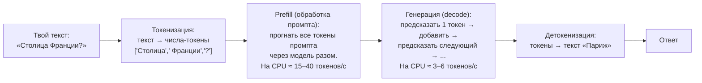

Здесь спрятан **самый важный для тебя факт про производительность**. Есть две
разные стадии, и они идут с разной скоростью:

- **Prefill** — «прочитать» весь промпт. Скорость ~15–40 ток/с. Промпт в 2000 токенов
  → **до минуты только на чтение, прежде чем появится первое слово ответа**.
- **Генерация** — «писать» ответ. Скорость ~3–6 ток/с.

Вывод, который пронизывает весь проект: **длина промпта — главный рычаг скорости**.
Не потому что «так аккуратнее», а потому что каждая лишняя тысяча токенов промпта —
это лишние ~30–60 секунд ожидания на твоём CPU. Поэтому в проекте есть жёсткий
бюджет промпта (~1200–1500 токенов) и фильтрация инструментов — об этом главы 3, 4, 13.

**Что такое «контекст» (context window).** Это максимум токенов, которые модель может
удержать «в поле зрения» за один вызов — промпт плюс ответ. У qwen2.5 это до 32K
токенов *технически*, но на CPU мы намеренно держим гораздо меньше: чем длиннее
контекст, тем (а) медленнее и (б) хуже модель следует инструкциям. Контекст — это не
память ассистента (память переживает перезапуск и хранится в базе); контекст — это
рабочий стол на один вызов. Разницу «контекст ≠ память» разберём в главе 4 — она
принципиальна.

## 2.3. Ollama, LM Studio, llama.cpp, vLLM, Open WebUI — кто есть кто

Новичок путается, потому что все эти слова «про запуск моделей», но они с разных
этажей. Разложим по полкам.

| Инструмент | Что это по сути | Кому и когда |
|------------|-----------------|-------------|
| **llama.cpp** | Низкоуровневый движок (библиотека на C++), который собственно и считает модель на CPU/GPU. Фундамент, на котором стоят остальные | Разработчикам движков; напрямую тебе трогать не нужно |
| **Ollama** | Удобная обёртка вокруг llama.cpp: скачивание моделей одной командой, автозагрузка/выгрузка из памяти, готовый HTTP-API. **Твой выбор** | Тебе — идеально: поставил, `ollama pull`, работает как сервис |
| **LM Studio** | То же, что Ollama, но с графическим окном и «магазином» моделей | Кто любит кнопки вместо консоли; хорош как «второй рантайм» для проверки |
| **vLLM** | Промышленный движок для серверов с мощными GPU, заточен на много одновременных пользователей | Не для тебя: требует GPU и Linux, избыточен для одного человека |
| **Open WebUI** | Красивый веб-чат поверх Ollama (похож на ChatGPT-интерфейс) | Если захочется «морду» к Ollama отдельно; нам не нужен — у нас свой web-чат в планах |

Обрати внимание: **Ollama, LM Studio и vLLM — конкуренты между собой** (это рантаймы),
а **llama.cpp под ними** (движок), **Open WebUI над ними** (интерфейс). Мы выбрали
Ollama как рантайм и пишем свой «организм» вокруг неё.

## 2.4. Как это сделано в нашем проекте

Три конкретных решения, все продиктованы твоим железом (CPU-only, 16 ГБ).

**Решение 1. Разные модели на разные роли.** Не одна модель на всё, а «бригада»:

```yaml
# config/models.yaml — реальный фрагмент твоего конфига
roles:
  chat:       { runtime: ollama, model: "qwen2.5:7b-instruct", temperature: 0.3 }
  extraction: { runtime: ollama, model: "qwen2.5:3b-instruct", temperature: 0.0 }
  summarize:  { runtime: ollama, model: "qwen2.5:3b-instruct", temperature: 0.3 }
```

- `chat` (диалог с тобой) — модель покрупнее и поумнее, **7B**.
- `extraction`/`summarize` (фоновые задачи: извлечь факт, суммировать) — **3B**,
  вдвое-втрое быстрее, и для структурных задач 7B избыточна.

Почему это записано в YAML, а не в коде: смена модели должна быть **правкой конфига,
а не переписыванием программы** (требование NFR-9). Захочешь завтра попробовать
`llama3.1:8b` — поменяешь строчку.

**Решение 2. `temperature: 0.3` для диалога — не случайность.** Temperature — это
«степень творческой отсебятины». Высокая (0.7–1.0) — модель разнообразнее, но у
qwen2.5 7B на высокой температуре resulta: чаще вставляет слова на других языках и,
главное, **выдумывает списки файлов вместо честного вызова инструмента**. Низкая
(0.3) — предсказуемее и дисциплинированнее. Это выученный урок, записанный прямо в
комментарии твоего конфига.

**Решение 3. Одна модель в памяти за раз.** Настройки Ollama
`OLLAMA_NUM_PARALLEL=1` и `OLLAMA_MAX_LOADED_MODELS=1`: не пытаться держать 7B и 3B
одновременно (не влезет комфортно в 16 ГБ вместе с эмбеддером, Qdrant и ОС).
Переключение 7B↔3B стоит секунды (3B грузится быстро), и это приемлемо, потому что
фоновые задачи и так идут в очереди, а не параллельно диалогу.

## 2.5. Что такое OpenAI-совместимый API и почему это важно

**API** — это «розетка»: договорённость о форме запроса и ответа, чтобы разные
программы стыковались. **OpenAI-совместимый API** — это конкретный, ставший
де-факто стандартом формат: тот самый, который придумала OpenAI для ChatGPT, и
который теперь понимают почти все рантаймы, включая Ollama.

Ollama слушает на `http://localhost:11434/v1` и говорит на этом стандартном
«языке розетки». Наш **LLM Gateway** общается с ней ровно так же, как общался бы с
облачным OpenAI. Практическое следствие огромно:

- Хочешь заменить Ollama на LM Studio? Обе говорят на OpenAI-формате → меняешь
  `base_url` в конфиге, код не трогаешь.
- Захочешь однажды подключить облачную модель на одну роль? Тот же формат → та же розетка.

Это и есть причина, по которой в проекте **рантайм — деталь конфигурации, а не
фундамент**. Мы «воткнуты в стандартную розетку», а не припаяны к конкретной Ollama.

## 2.6. Альтернативы, плюсы/минусы, твои решения

**Альтернатива всему подходу — облачная модель (GPT-4, Claude).** Была бы умнее и
быстрее в разы. Отвергнута по принципу Local First: приватность и независимость важнее.
Но «форточка» оставлена: любую роль можно явно (и только явно) перевести на облако.

**Плюсы локального инференса:** приватность, офлайн, без оплаты за токены.
**Минусы (скрытые тоже):**
- Скорость на CPU — десятки секунд; это придётся принять и проектировать вокруг.
- Качество 7B заметно ниже GPT-4; отсюда весь «пояс защит» вокруг модели.
- Модель занимает RAM постоянно (`keep_alive`); если выгрузить ради экономии — первый
  ответ после паузы будет медленнее (перезагрузка ~5 ГБ с диска).

**Твои решения:**
- **Держать ли 7B резидентно в памяти** (`keep_alive: 60m`) или выгружать? Резидентно
  — быстрее отклик, но 5 ГБ RAM всегда занято. Для ноутбука, где ты и работаешь, и
  общаешься с ассистентом, — обычно стоит держать.
- **Экспериментировать ли с ipex-llm** (сборка Ollama от Intel, умеет твою Iris Xe и
  даёт ~1.5–2× ускорения)? В backlog: потенциально ощутимо, но усложняет установку.
  Отложено намеренно, чтобы не спотыкаться на старте.
- **Пробовать ли модель покрупнее** (14B) на роль chat? На 16 ГБ RAM без GPU — не
  влезет комфортно и будет мучительно медленной. Реалистичный апгрейд качества —
  это апгрейд железа (мини-ПК с 12–16 ГБ VRAM), а не подмена модели на текущем.

## 2.7. Вопросы, которые возникнут позже

- «Почему первое сообщение после запуска такое медленное?» — модель грузится с диска
  в RAM (~5 ГБ). Дальше, пока `keep_alive` не истёк, быстрее.
- «Ollama пишет `bind: Only one usage of each socket address` — это поломка?» — нет.
  Это значит, что Ollama уже работает фоновым сервисом и слушает порт. Запускать
  `ollama serve` вручную не нужно.
- «Можно ли ускорить генерацию?» — короче промпт (главный рычаг), модель поменьше на
  фоновые роли (уже сделано), ipex-llm (эксперимент), в пределе — другое железо.

---

# Глава 3. Как агент принимает решения?

## 3.1. Простое объяснение

Вернёмся к аналогии из главы 1: LLM — это речевой центр, который умеет только
*говорить*. Как же тогда ассистент *действует* — находит файлы, ставит задачи?

Секрет в том, что модель не действует сама. Она **проговаривает намерение в
специальной форме**, а система его исполняет. Это как повар и су-шеф. Повар (модель)
не бегает за продуктами — он говорит: «Мне нужны два яйца». Су-шеф (наша система)
слышит, приносит яйца, кладёт на стол. Повар смотрит на то, что принесли, и говорит
следующее: «Теперь разбей их в миску». И так до готового блюда.

Ключевой сдвиг в понимании: **модель не «выполняет команды» — она ведёт диалог с
системой, где вместо слов иногда произносит „вызовы инструментов“, а система отвечает
ей результатами.** Каждый такой обмен — один круг. Кругов может быть несколько, пока
блюдо (ответ) не готово. Этот повторяющийся цикл «модель сказала → система сделала →
модель посмотрела → сказала снова» и называется **agent loop**, и он — сердце системы.

## 3.2. Как это устроено технически

Разберём по терминам, от простого к составному.

**Tool Calling (вызов инструментов).** Мы заранее описываем модели список функций,
которые она может попросить выполнить, — с именем, описанием на человеческом языке и
схемой аргументов. Например:

```
Инструмент: create_reminder
Описание: Поставить напоминание пользователю на конкретное время
Аргументы: { text: строка, when: строка (когда напомнить) }
```

Модель, получив запрос «напомни завтра купить билеты», вместо текстового ответа
выдаёт **структурированный вызов**: `create_reminder(text="купить билеты",
when="завтра")`. Технически это работает так: модель обучена, увидев подходящий
запрос и список инструментов, генерировать не обычный текст, а особый блок в
формате JSON. Наша система распознаёт этот блок, исполняет настоящую функцию и
возвращает модели результат.

**ReAct (Reason + Act, «рассуждай и действуй»).** Это и есть шаблон цикла: модель
чередует шаги рассуждения и шаги действия. Не «один вопрос — один ответ», а
«подумал — сделал — посмотрел на результат — подумал снова». Именно ReAct позволяет
решать составные задачи: «найди договор *и* скажи сроки» = поиск (действие) → чтение
результата (рассуждение) → формулировка ответа.

**Orchestrator (оркестратор).** Это код, который *крутит* этот цикл: вызывает модель,
ловит её вызовы инструментов, исполняет их, кладёт результат обратно, снова вызывает
модель — и следит за лимитами (чтобы цикл не закрутился бесконечно). У нас это
`core/agent/orchestrator.py`, ~300 строк. Оркестратор — это су-шеф из аналогии.

**Planner (планировщик действий).** В сложных системах бывает отдельный шаг, где
модель сначала строит план из нескольких пунктов, а потом исполняет. У нас *явного*
отдельного планировщика нет — для слабой 7B-модели это скорее вредно (она путается в
длинных планах). Вместо этого мы полагаемся на пошаговый ReAct: модель планирует
неявно, по одному шагу за раз. Это осознанное решение под слабую локальную модель
(принцип «лучше 5 простых вызовов, чем 1 сложный»).

**MCP (Model Context Protocol).** Представь USB для инструментов. Раньше каждый
инструмент надо было «припаивать» к агенту вручную. MCP — это стандартная «розетка»
(придуманная Anthropic), в которую можно воткнуть готовый *сервер инструментов* —
например, готовый коннектор к календарю или git — и агент сразу получит эти
инструменты, не написав ни строки под них. Работает в обе стороны: мы можем и
*подключать* чужие MCP-серверы (быть клиентом), и *опубликовать* свои инструменты как
MCP-сервер (чтобы твой ассистент был доступен, скажем, из Claude Desktop). Для агента
инструмент из MCP-сервера неотличим от встроенного — тот же реестр, те же уровни
риска. В roadmap MCP — это Sprint 9; заложен же он с самого начала.

**Почему агент умеет действовать, а не только болтать?** Собери всё вместе: (1) мы
описали модели инструменты, (2) модель умеет вместо текста выдать вызов инструмента,
(3) оркестратор исполняет вызов и возвращает результат, (4) цикл повторяется. Именно
эти четыре вещи, а не какая-то особая «агентность внутри модели», превращают
говорящую LLM в действующего агента. Интеллект — в модели; способность действовать —
в коде вокруг неё.

## 3.3. Три примера шаг за шагом

**Пример А. «Найди договор аренды.»**

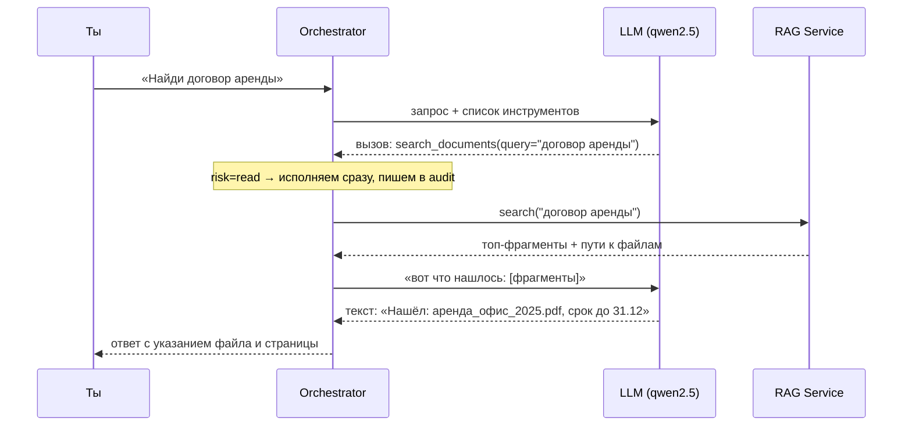

Один инструмент, один круг. Обрати внимание: модель **не искала сама** — она попросила
`search_documents`, а нашёл RAG. Модель лишь сформулировала запрос и потом красиво
изложила результат.

**Пример Б. «Напомни через неделю продать велосипед.»**

Здесь спрятана тонкость — разделение *понимания* и *исполнения* (это ключевой принцип
проекта, противоречие П-1 из требований):

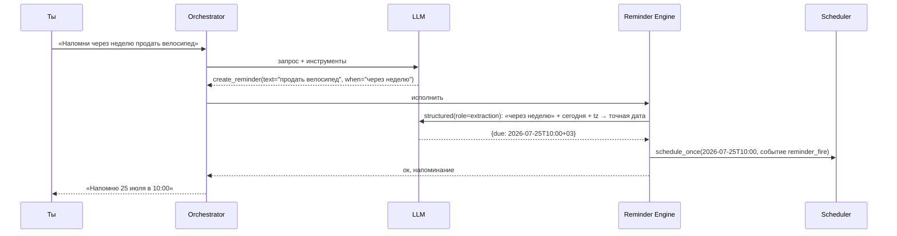

Разбор тонкости: **LLM понимает «через неделю» → превращает в точную дату. Но само
срабатывание в нужный момент — работа детерминированного кода (Scheduler), без всякой
LLM.** Почему так строго? Потому что напоминание в 10:00 обязано сработать в 10:00,
даже если модель в этот момент выгружена, тормозит или галлюцинирует. Интерпретацию
доверяем умной-но-ненадёжной модели; исполнение — тупому-но-надёжному коду. Это одно
из важнейших архитектурных решений, и оно повторяется везде (файлы: LLM решает *что*,
код *делает*).

**Пример В. «Посмотри цену этой вещи.»**

Это пример на *границы* и *включаемость*. Поиск цены в интернете требует инструмента
`web_search`, а он у нас:
- **опциональный** (внешний трафик — только с явного разрешения, принцип Local First);
- **выключен по умолчанию** (в конфиге `feature flag`).

Если `web_search` выключен — модель его просто не видит в списке инструментов и честно
ответит «не умею искать в интернете» вместо того, чтобы выдумать цену. Если включён —
круг будет как в примере А, только вместо RAG отработает веб-поиск. Урок: **набор
доступных инструментов управляется конфигом, и модель физически не может вызвать то,
чего ей не дали.** Это и безопасность, и защита от галлюцинаций.

## 3.4. Как это сделано в нашем проекте (и защиты от слабой модели)

Это тот раздел, где теория встречается с суровой реальностью 7B-модели на CPU. В
проекте уже накоплен «пояс защит» — прямо из живой отладки (записано в roadmap
Sprint 2):

| Проблема слабой модели | Защита в коде |
|------------------------|---------------|
| Выдумывает список файлов вместо вызова `list_files` | Принудительный `tool_choice` на тематических вопросах; низкая temperature |
| Имитирует служебные форматы, «отчитывается» о невыполненных действиях | Видимые маркеры реальных вызовов 🔧; чистка выдуманных служебных строк из контекста |
| Зовёт один и тот же инструмент по кругу | Дедупликация повторных вызовов |
| Ломает формат вызова, пишет JSON текстом | «Спасение» JSON-вызовов из текста; JSON-fallback режим (`tool_mode: json`) |
| Модель без нативного tool calling | Прозрачный переход в режим «JSON в ответе» + Pydantic-валидация + retry до 3 раз |
| Длинный промпт → модель хуже слушается | Бюджет промпта; фильтр «≤ 6–8 инструментов в промпте» |
| Долго думает — кажется, что зависла | Heartbeat «модель думает…» в Telegram; таймауты на все инструменты |

Запомни главный принцип проектирования новых фич (он записан в `CLAUDE.md`):
**проектируй с недоверием к модели.** Всё внешнее — с таймаутом. Всё, что модель
«говорит, что сделала», — проверяй. Служебные обмены не пускай в историю диалога.

**Уровни риска инструмента** — механизм, встроенный в оркестратор:

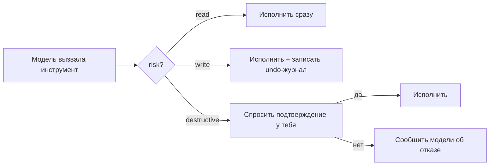

`read` (поиск, чтение) — свободно. `write` (создать, переместить) — свободно, но с
журналом отмены. `destructive` (удалить, перезаписать, массовое) — **только после
твоего «да» в чате**. Каждый вызов пишется в audit log до и после. Это защита от того,
что одна галлюцинация необратимо испортит твои файлы.

## 3.5. Альтернативы

| Подход к «мышлению агента» | Что это | Почему не у нас |
|---------------------------|---------|-----------------|
| **Жёсткий сценарий (if/else)** | Программист заранее прописал все ветки | Не гибко: каждый новый тип запроса — новый код. Мы хотим, чтобы модель сама выбирала |
| **Явный Planner-Executor** | Модель строит план из N шагов, потом исполняет | Слабая 7B путается в длинных планах; для нас вреднее пошагового ReAct |
| **Мульти-агенты** (рой специализированных агентов) | Несколько LLM-ролей спорят/делятся работой | На CPU с одной моделью в памяти — роскошь не по карману; в backlog как «профили агентов» |
| **Наш выбор: ReAct + Tool Registry** | Один цикл, пошагово, инструменты из реестра | Простой, отлаживаемый, дружелюбный к слабой модели |

## 3.6. Плюсы и минусы

**Плюсы:** прозрачность (каждый шаг в audit-логе, можно спросить «что ты делал?»);
гибкость (новый инструмент = функция + декларация, ядро не трогаем); безопасность
(уровни риска + подтверждения).

**Минусы (скрытые тоже):**
- Каждый круг цикла — это ещё один вызов LLM, а значит ещё десятки секунд на CPU.
  Задача в 3 инструмента может занять минуту-две. Это цена агентности на слабом железе.
- Слабая модель иногда выбирает не тот инструмент или зацикливается — отсюда лимиты
  итераций и «пояс защит». Идеальной надёжности выбора у 7B не будет; мы её страхуем.

## 3.7. Какие решения тебе предстоит принять

- **Сколько инструментов давать модели одновременно?** Чем больше выбор, тем чаще
  7B ошибается. Мы держим ≤ 6–8 через фильтрацию по контексту — но какие именно в
  каждом профиле, решать тебе по мере роста набора.
- **Где граница destructive?** Сейчас удаление и массовые операции требуют подтверждения.
  Хочешь строже (подтверждать и перемещения) или мягче — это твоя настройка.
- **Включать ли web-поиск и другие внешние инструменты?** Каждый — это дырка во
  «внешний мир»; по умолчанию всё закрыто.

## 3.8. Вопросы, которые возникнут позже

- «Модель зациклилась / думает уже минуту — что происходит?» — сработает лимит
  итераций/времени, и ассистент честно ответит о частичном результате. Heartbeat
  покажет, что он жив, а не завис.
- «Почему он не сделал то, что я просил, а придумал, что сделал?» — классика 7B;
  проверь audit-лог (`/audit`): там видно, был ли *реальный* вызов инструмента. Если
  модель «отчиталась» без вызова — это галлюцинация, и защиты обычно её ловят.
- «Как добавить свой инструмент?» — функция + `ToolSpec` в `tools.py` модуля, и всё;
  ни ядро, ни каналы не трогаются. Глава 10.

---

# Глава 4. Память

Это одна из важнейших глав. Если усвоить из неё одну мысль — пусть это будет:
**память ассистента — это не «длинный промпт», а поиск нужного в нужный момент.**

## 4.1. Простое объяснение

У человека память многослойна, и это удобная аналогия — наша система построена ровно
по ней.

- **Рабочая память** — то, что ты держишь в голове *прямо сейчас*, в этом разговоре.
  «О чём мы говорили минуту назад». Ограниченная, быстро выветривается.
- **Эпизодическая память** — воспоминания о *событиях*: «на прошлой неделе мы обсуждали
  бюджет экспедиции».
- **Семантическая память** — *факты*, оторванные от события: «мою жену зовут Аня»,
  «проект Экспедиция — про Алтай». Ты не помнишь, *когда* узнал, что Париж — столица
  Франции; ты просто это знаешь.
- **Процедурная память** — *как себя вести*: привычки, стиль. «Я предпочитаю краткие
  ответы» — это не факт о мире, а правило поведения.

И ещё у людей есть **сон**, во время которого мозг перекладывает свежие впечатления из
рабочей памяти в долговременную, обобщает, наводит порядок. У нашего ассистента тоже
есть «сон» — ночная **консолидация**.

Наша память устроена по этим же четырём слоям плюс ночная консолидация. Это не
метафора для красоты — это буквальная архитектура (см. `docs/02-architecture.md §3`).

## 4.2. Контекст против памяти — почему это разные вещи

Новичок думает: «памятью ассистента» является то, что помещается в окно модели. Это
опаснейшее заблуждение, и вот почему оно разваливается.

| | **Контекст** | **Память** |
|--|-------------|-----------|
| Что это | Рабочий стол на один вызов модели | Хранилище на диске (SQLite + Qdrant) |
| Живёт | Один вызов LLM, потом стирается | Годами, переживает перезапуск |
| Размер | Жёстко ограничен (у нас — ~1500 токенов бюджета) | Практически неограничен |
| Скорость | Каждый токен замедляет ответ | Не влияет на скорость ответа |
| Аналогия | То, что сейчас в голове | Записная книжка на полке |

Ключевое следствие (противоречие П-6 из требований): **нельзя положить „всю память“
в контекст.** Во-первых, не влезет. Во-вторых, даже если бы влезло — на CPU это были
бы минуты ожидания и модель бы захлебнулась. Поэтому память — это **retrieval-задача**:
в контекст на каждый запрос попадает только *релевантная выжимка*, найденная под
текущий вопрос. Записная книжка лежит на полке; в руки берём только ту страницу,
что нужна сейчас.

Это переворачивает интуицию: «ассистент помнит всё» реализуется не через «модель
держит всё в голове», а через «система умеет быстро найти нужное и подсунуть в
контекст ровно перед вызовом модели».

## 4.3. Как это устроено технически: четыре слоя

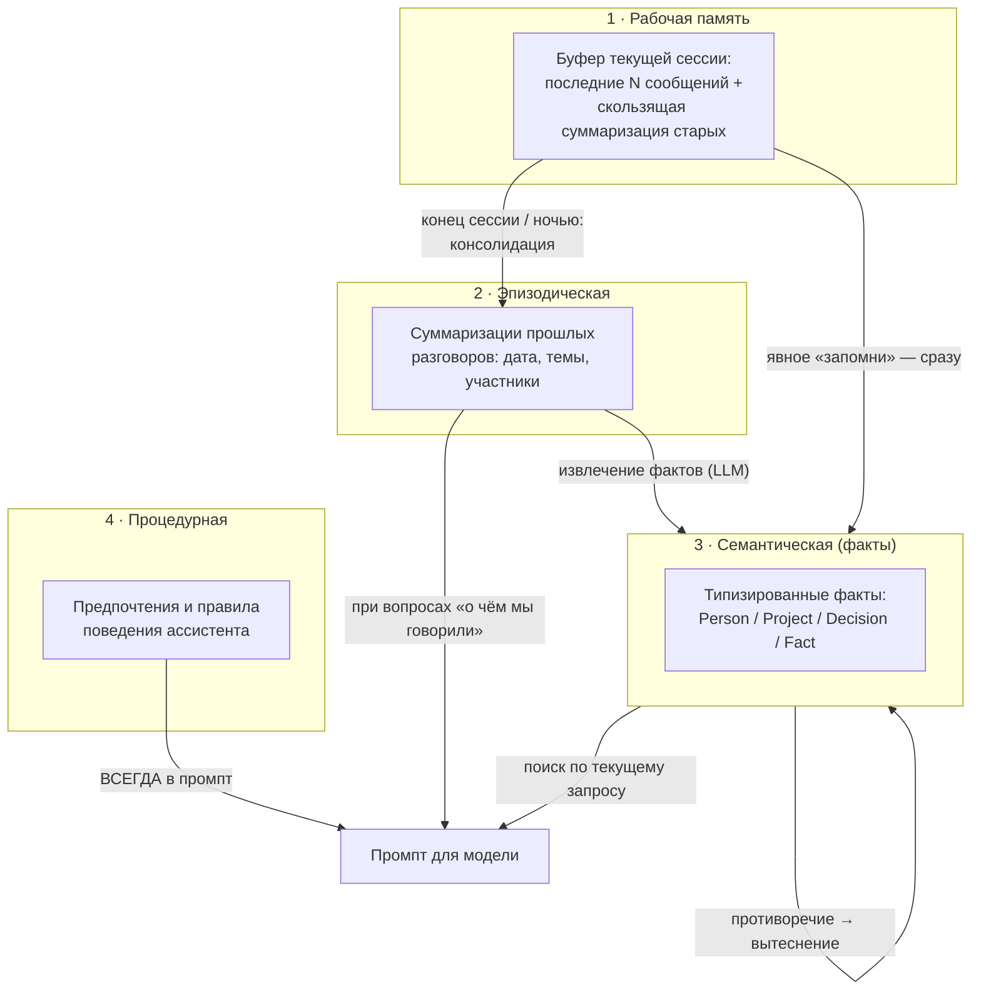

Разберём, что откуда берётся в промпт (это и есть работа **Context Builder**):

- **Процедурная (предпочтения)** попадает в промпт **всегда** — она короткая и должна
  влиять на *каждый* ответ. «Отвечай кратко» бессмысленно доставать «по запросу»; это
  фон поведения.
- **Семантическая (факты)** попадает **по релевантности** к текущему вопросу. Спросил
  про Ивана — подтянулись факты про Ивана, а не все 500 фактов сразу.
- **Эпизодическая** — при вопросах вида «о чём мы вчера говорили».
- **Рабочая** — это сам текущий разговор, всегда под рукой, но старое ужимается в
  «скользящую суммаризацию», чтобы не раздувать контекст.

**Типизированный факт** — не просто строка «Иван — подрядчик», а структура:

```
MemoryFact:
  type: person | project | decision | fact
  subject:   "Иван Петров"
  content:   "подрядчик по экспедиции, отвечает за снаряжение"
  confidence: 1.0 (явное «запомни») или 0.6–0.9 (извлечено моделью)
  source:    id сообщения / документ / "explicit"
  created_at, updated_at, superseded_by?
```

Зачем типы и `subject`: чтобы уметь отвечать на «что ты знаешь об Иване?» (фильтр по
subject) и «какие решения по проекту X?» (тип=decision + project). Зачем `confidence`:
явно сказанному верим полностью (1.0), самостоятельно извлечённому — с оговоркой,
чтобы мусор не копился с тем же весом, что и твои прямые указания.

## 4.4. Как агент решает, что запомнить

Два пути, и это важное различие:

1. **Явно** — ты сказал «запомни, что…» или «моё предпочтение — …». Модель вызывает
   инструмент `remember_fact`, факт сохраняется сразу с `confidence=1.0`. Это уже
   работает (Sprint 3).
2. **Автоматически** — система *сама* замечает в разговоре факт, достойный запоминания
   («вскользь упомянул, что жену зовут Аня»), и сохраняет его фоновой задачей. Это
   тоньше и опаснее (легко нахватать мусора), поэтому **отложено в Sprint 7** и будет
   с осторожными порогами `confidence` и ручной ревизией.

Почему авто-извлечение отложено намеренно (риск из roadmap): слишком рьяное
автозапоминание — прямой путь к замусориванию памяти галлюцинациями слабой модели.
Сначала обкатываем явную память и механику извлечения, потом включаем автоматику.

**Извлечение никогда не блокирует диалог.** Оно висит на событии `message_processed` —
том самом «в фоне» из схемы главы 1. Ты уже получил ответ; система *потом*, в свободную
минуту, маленькой моделью (`extraction`, 3B) решает, не запомнить ли что-то. Диалог
важнее фоновой работы — это железное правило на CPU-железе.

## 4.5. Можно ли забыть? Как не копить мусор?

**Забывание.** Скажешь «забудь про Ивана» — факт помечается retracted (мягкое
удаление): мгновенно исчезает из выдачи, но физически какое-то время хранится
(политика хранения вычистит). Это уже работает (Sprint 3, «мягкое забудь»).

**Противоречия — самое интересное.** Новый факт о том же subject **не затирает
старый**, а ставит ему `superseded_by`. Пример: «мы решили ехать в июле» → позже «нет,
передумали, едем в августе». Старое решение не исчезает — оно помечается как
вытесненное. В выдачу идёт актуальное («едем в августе»), но история сохранена, и на
вопрос «а почему передумали?» ассистент сможет ответить. Это принципиально: **память
решений — это не текущее состояние, а летопись.**

**Гигиена от мусора** — несколько механизмов вместе:
- порог `confidence` (низкоуверенные факты не лезут в выдачу наравне с твёрдыми);
- дедупликация (один и тот же факт не плодится);
- вытеснение вместо накопления копий;
- ручная ревизия: «покажи, что ты запомнил за неделю» → удобно почистить (Sprint 7).

## 4.6. Как это хранится (реальная привязка к коду)

| Слой | Где хранится | Статус |
|------|-------------|--------|
| Рабочая | SQLite: `conversations`, `messages` | Готово (Sprint 1/3) |
| Эпизодическая | SQLite `episodes` + вектор в Qdrant `memory` | Sprint 7 |
| Семантическая | SQLite `memory_facts` + вектор в Qdrant `memory` | Факты — готово (Sprint 3); вектор — Sprint 4 |
| Процедурная | SQLite `preferences` | Готово (Sprint 3) |

**Важная деталь про текущее состояние.** Прямо сейчас (после Sprint 3) семантический
поиск по фактам работает **не через векторы**, а через **SQLite FTS5** — полнотекстовый
поиск с префиксным матчингом, специально настроенный под русскую морфологию (чтобы
«Ивану», «Ивана», «Иваном» находили «Иван»). Это осознанный промежуточный шаг: память
дала «wow-эффект» уже в Sprint 3, до тяжёлого RAG. В **Sprint 4** память «переедет» на
векторный recall через Qdrant — тогда поиск станет по *смыслу*, а не только по словам
(почему это важно — глава 6).

Ещё деталь для точности: в текущем коде инструменты называются `remember_fact`,
`recall_memory`, `forget_memory` (в ранних доках — `recall`/`forget`). Модуль памяти
подключён к ядру через `MemoryPort` (инверсия зависимости: ядро *не знает* про модуль
памяти, только про абстрактный порт) и включается feature-флагом
`modules.memory.enabled`. Это иллюстрация принципа границ из главы 10.

## 4.7. Архитектура памяти — общий вид

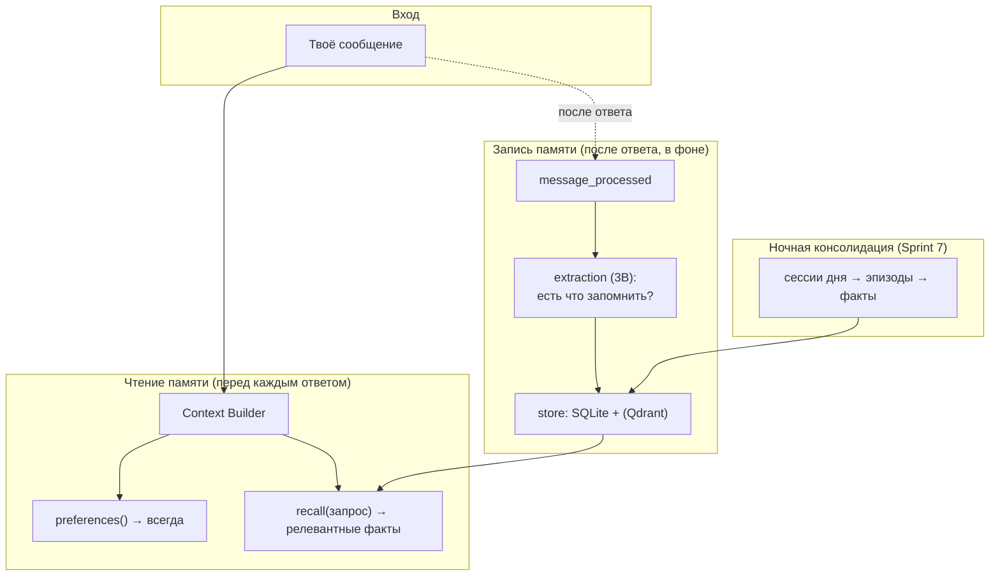

## 4.8. Альтернативы

| Подход к памяти | Что это | Компромисс |
|-----------------|---------|-----------|
| **Всё в промпт** | Пихать всю историю в контекст | Не масштабируется, на CPU — смерть по скорости |
| **Только «сырой» векторный поиск по всем сообщениям** | Никаких типов, просто ищем похожие реплики | Проще, но нет структуры: не ответишь «какие решения по X», копится мусор |
| **Готовая «memory»-библиотека** (mem0, Zep и т.п.) | Внешний модуль памяти | Чужие абстракции, свой формат хранения, зависимость; наша модель памяти специфична |
| **Наш выбор: 4 слоя + типизированные факты** | Своя модель под задачу | Больше кода, но точный контроль, структура и летопись решений |

## 4.9. Плюсы, минусы, твои решения

**Плюсы:** структурированность (умеет отвечать на «что знаешь о ком-то»); летопись
(история решений не теряется); не замусоривается; не зависит от размера контекста.

**Минусы (скрытые):** качество авто-извлечения ограничено 3B-моделью (будет пропускать
и иногда придумывать — отсюда осторожные пороги и ревизия); консолидация — ночная
LLM-работа, требует, чтобы машина была включена ночью (или наверстает при следующем
включении).

**Твои решения:**
- **Насколько агрессивно авто-запоминать** (Sprint 7): много помнить, но с мусором,
  или мало, но чисто? Порог `confidence` — твоя ручка.
- **Что считать предпочтением** (всегда в промпте — значит, ест бюджет каждого запроса):
  держать список коротким.
- **Политика хранения**: как долго держать retracted-факты и сессии перед вычисткой.

## 4.10. Вопросы, которые возникнут позже

- «Ассистент „забыл“ то, что я говорил на прошлой неделе» — до Sprint 7 (консолидация)
  между сессиями сохраняются *факты*, но не автоматически весь разговор. Скажешь
  «запомни» — сохранится точно.
- «Он вспомнил устаревшее» — проверь, не остался ли старый факт без `superseded_by`;
  скажи «забудь X» или поправь.
- «Память переехала на векторы (Sprint 4) — старые факты пропадут?» — нет, они в
  SQLite (источник истины); Qdrant добавляет *способ поиска*, а не заменяет хранилище.

---

# Глава 5. Документы

## 5.1. Простое объяснение

Представь, что у тебя есть очень внимательный библиотекарь. Ты вываливаешь на него
все свои файлы — PDF, вордовские документы, заметки, таблицы. Он их читает и делает
две вещи: (1) составляет подробную картотеку — что где лежит и о чём; (2) запоминает
*смысл* каждого куска так, чтобы потом ты мог спросить не по точному названию, а по
сути: «где там про сроки аренды?» — и он принесёт нужную страницу, даже если слова
«сроки» в документе нет, а есть «действует до 31 декабря».

Этот процесс превращения кучи файлов в умную картотеку называется **индексирование**.
А то, что librarian сделал не читая заново все шкафы каждый раз, — это **индекс**:
заранее подготовленная структура, по которой искать быстро.

Важно с самого начала понять: **ассистент не „держит открытыми“ твои файлы и не
перечитывает их на каждый вопрос.** Он один раз их прочитал, разложил по умной
картотеке, и дальше работает с картотекой. Когда файл меняется — обновляет только его
карточку. Это и делает поиск по тысячам документов быстрым.

## 5.2. Как это устроено технически: конвейер индексации

Превращение файла в «искомое» — это конвейер из пяти станций:


Разберём каждую станцию — это фундамент, на котором стоит глава 6 и 7.

**Станция 1. Извлечение текста (extraction).** PDF, DOCX, XLSX — это не текст, это
контейнеры со сложной структурой. Из них нужно *достать* чистый текст. Для каждого
формата — свой инструмент:

| Формат | Чем достаём | Нюанс |
|--------|-------------|-------|
| PDF | PyMuPDF | Быстро для «текстовых» PDF; сканы (картинки) требуют OCR — это Sprint 8 |
| DOCX | python-docx | Абзацы, таблицы |
| XLSX | openpyxl | Каждый лист как текст (Sprint 8) |
| Markdown | парсер + frontmatter | Сохраняем структуру заголовков и метаданные |
| txt / код | как текст | Код — плюс метки функций/классов |
| Изображения, сканы | OCR (Tesseract/RapidOCR) | Распознавание текста на картинке; Sprint 8 |

В Sprint 4 делаем PDF/DOCX/MD/txt; OCR и XLSX — Sprint 8. Кривые PDF (где текст плохо
достаётся) получат OCR-fallback тоже в Sprint 8.

**Станция 2. Чанкинг (chunking) — почему нельзя целиком.** Документ на 40 страниц
нельзя ни (а) засунуть в модель целиком — не влезет в контекст и убьёт скорость на CPU,
ни (б) сделать одним вектором — «средний смысл» 40 страниц бесполезен для поиска.
Поэтому режем на **чанки** — куски по ~500–800 токенов. Но не механически по длине, а
**структурно**: по заголовкам в Markdown, по страницам в PDF, по листам в Excel. С
небольшим **перекрытием (overlap)** между соседними кусками — чтобы фраза, разрезанная
на границе, не потерялась. Каждый чанк — это будущая «карточка», которую найдёт поиск.

**Станция 3. Эмбеддинг** — превращение куска текста в вектор (список чисел),
кодирующий смысл. Это тема главы 6, здесь только отметим: делает это *отдельная*
маленькая модель (не qwen2.5!), у нас — `bge-m3` или `multilingual-e5-small`,
работающая прямо в нашем процессе (in-process).

**Станция 4–5. Хранение и каталог.** Векторы едут в **Qdrant** (векторная БД, глава
6). А в **SQLite** ведётся **каталог файлов** — таблица `files`: путь, хэш содержимого,
время изменения (mtime), сколько чанков. Этот каталог — **источник истины** о том, что
и в каком виде проиндексировано. Он же — ключ ко всей главе 7 (переиндексация).

## 5.3. Что хранится в индексе, а что — нет

Частый вопрос новичка, и ответ неочевиден:

**В индексе (Qdrant) хранится:**
- **Вектор** каждого чанка (список чисел — смысл).
- **Копия текста** самого чанка (чтобы показать тебе цитату).
- **Метаданные (payload)**: путь к файлу, страница/заголовок, тип, дата, проект, теги.

**В каталоге (SQLite) хранится:**
- Путь, хэш содержимого, mtime, статус индексации, число чанков.

**Что НЕ хранится:**
- **Сам оригинальный файл никуда не копируется целиком** (кроме кэша извлечённого
  текста для быстрого «прочитай документ полностью»). Оригинал остаётся у тебя на
  диске там, где лежал. Индекс *ссылается* на него по пути.

Это важно понять: **индекс — это не копия твоих файлов, это умный указатель на них
плюс закодированный смысл их кусков.** Удалишь индекс — файлы целы, просто поиск
перестанет работать, пока не переиндексируешь (глава 15).

## 5.4. Кто замечает изменения и что происходит автоматически

За твоими папками следит **Indexer** (`modules/indexer/`) — двумя способами сразу:

1. **Watcher (наблюдатель) в реальном времени** — библиотека `watchdog` слушает
   события файловой системы от ОС: «файл создан», «изменён», «удалён», «перемещён».
   Реагирует за секунды.
2. **Периодический полный скан** — на случай, если событие потерялось (watcher не
   идеален, особенно на сетевых дисках): раз в какое-то время обходим все папки и
   сверяем с каталогом по хэшу.

Что происходит при каждом типе изменения — таблица, которую стоит запомнить (детали
стоимости — глава 7):

| Ты сделал | Кто заметил | Что происходит автоматически |
|-----------|-------------|------------------------------|
| **Переименовал файл** | Watcher (событие moved) | Обновляется путь в каталоге; **содержимое не переиндексируется** (хэш тот же) — дёшево |
| **Переместил файл** | Watcher (moved) | То же: меняется только путь, векторы остаются |
| **Изменил содержимое** | Watcher (modified) | Хэш изменился → старые чанки файла удаляются, файл извлекается и индексируется заново |
| **Удалил файл** | Watcher (deleted) | Чанки файла удаляются из Qdrant, запись из каталога убирается |
| **Восстановил файл** | Watcher (created) | Как новый: извлечение → чанки → эмбеддинг → индекс |
| **Создал новую папку** | Watcher/скан | Если папка в whitelisted корнях — её содержимое встаёт в очередь на индексацию |

Ключевая механика — **хэш содержимого**. Именно сравнение хэшей отвечает на вопрос
«файл реально изменился или просто переехал?». Переименование/перемещение хэш не
меняет → тяжёлую переиндексацию не запускаем, правим только путь. Это и есть
**инкрементальность**: работаем только с тем, что реально поменялось.

**Всё это идёт через очередь.** Indexer не индексирует прямо в момент события — он
кладёт задачу в **очередь индексации** (в SQLite, переживает перезапуск). Очередь
разбирается с низким приоритетом, **паузится во время активного диалога** (диалог
важнее!) и делает тяжёлое в тихие часы. Поэтому индексация никогда не мешает тебе
разговаривать с ассистентом — важнейшее следствие на CPU-железе.

## 5.5. Какие документы ассистент сможет понимать

На разных спринтах:
- **Sprint 4:** PDF (текстовые), DOCX, Markdown, txt, код.
- **Sprint 8:** XLSX (Excel), OCR (сканы, изображения, кривые PDF), полноценный
  Obsidian (wikilinks, теги, frontmatter как метаданные для поиска «найди связанные
  заметки»).

Obsidian — первоклассный источник: заметки не просто индексируются как текст, а с
сохранением связей между ними и тегов, что даёт запросы вроде «найди заметки,
связанные с этой».

## 5.6. Альтернативы

| Решение | Альтернатива | Почему у нас так |
|---------|--------------|------------------|
| Слежение | Только периодический скан (без watcher) | Watcher даёт реакцию за секунды; скан оставлен как страховка |
| Извлечение PDF | Готовый «комбайн» (unstructured.io) | Тяжёлый, много зависимостей; PyMuPDF быстрый и точный для наших нужд |
| Чанкинг | Механический по N символов | Структурный (по заголовкам/страницам) даёт осмысленные куски и точные цитаты |
| Каталог | Хранить только в Qdrant | SQLite-каталог как источник истины проще для диффов по хэшу и дедупликации |

## 5.7. Плюсы, минусы, твои решения

**Плюсы:** инкрементальность (правим только изменённое); поиск по смыслу; цитаты с
точным местом (файл + страница); не копирует твои файлы.

**Минусы (скрытые):** первичная индексация большого корпуса на CPU — долго (может не
одна ночь, см. главу 7); watcher на сетевых/облачных дисках (OneDrive, сетевые шары)
ненадёжен — там опираемся на периодический скан; качество зависит от качества
извлечения (кривой скан без OCR = пустой чанк).

**Твои решения (это открытый вопрос Q-3 из требований, нужен к Sprint 4):**
- **Какие корневые папки индексировать?** Точные пути. Не «весь диск C» — это и
  медленно, и опасно (системные файлы).
- **Есть ли Obsidian vault и где он?** Приоритет коннектора.
- **Примерный объём корпуса?** От него зависит выбор эмбеддера и время первой индексации.
- **Язык корпуса** (Q-5): русский, смешанный ру/en? От этого зависит выбор
  мультиязычной модели эмбеддингов.

## 5.8. Вопросы, которые возникнут позже

- «Я переименовал папку с документами — всё переиндексируется заново?» — нет, если
  watcher поймал это как перемещение: обновятся пути, векторы останутся. Если не
  поймал (например, было офлайн) — периодический скан заметит по хэшам, что содержимое
  то же, и тоже обойдётся правкой путей. Подробно — глава 7.
- «Загрузил 20 PDF разом — почему поиск по ним не сразу?» — они встают в очередь и
  индексируются в паузах/тихие часы; на CPU эмбеддинг 20 PDF — это минуты-десятки минут.
  Появятся в поиске «в течение минут», как и записано в критериях Sprint 4.
- «Ассистент нашёл старую версию документа» — проверь, обновился ли индекс после
  правки (хэш); при сомнении — ручная переиндексация (`scripts/reindex.py`).

---

# Глава 6. Векторная база

Эту главу объясняю особенно подробно — это концептуальное сердце RAG, и именно здесь у
новичков «щёлкает» понимание, как машина может искать *по смыслу*.

## 6.1. Простое объяснение

Представь огромную карту, на которой расставлены **все понятия мира**. Похожие по
смыслу вещи стоят рядом: «кошка» рядом с «котёнком» и «мурлыканьем», «король» рядом с
«королевой» и «троном», а «экскаватор» — где-то далеко в другом районе. Такая карта
есть — только не двумерная (как бумажная), а с сотнями измерений. Место каждого
понятия на этой карте задаётся списком координат — и вот этот список координат и
называется **эмбеддинг (embedding)**, «вектор смысла».

Теперь фокус. Когда ты спрашиваешь «где про сроки аренды?», система ставит *твой
вопрос* точкой на этой же карте и смотрит, какие кусочки документов оказались к нему
**ближе всего по расстоянию**. Кусок, где написано «договор действует до 31 декабря»,
окажется рядом — хотя слова «сроки» в нём нет! Потому что *по смыслу* «действует до
даты» и «сроки» — соседи на карте.

Вот почему **нельзя искать только по словам**: обычный текстовый поиск найдёт слово
«сроки», только если оно буквально написано. А смысловой (семантический) поиск найдёт
*идею* срока, как бы она ни была сформулирована — «до 31.12», «на год», «истекает в
конце года». Это и есть суперсила векторного поиска.

## 6.2. Как это устроено технически

**Что такое embedding.** Это результат работы специальной модели (эмбеддера), которая
берёт кусок текста и выдаёт список чисел фиксированной длины — например, 1024 числа
для `bge-m3`. Каждое число — координата в одном из 1024 «измерений смысла». Модель
обучена так, что тексты с близким смыслом получают близкие наборы координат.

**Почему текст превращается в числа.** Потому что компьютер не умеет сравнивать
«смыслы», но прекрасно умеет считать **расстояние между точками**. Превратив текст в
координаты, мы свели неуловимое «насколько похожи по смыслу» к арифметике: чем меньше
расстояние (обычно косинусное) между векторами — тем ближе смысл. Смысл стал
геометрией.

Классическая иллюстрация того, что векторы ловят *отношения*, а не просто слова:
`вектор("король") − вектор("мужчина") + вектор("женщина") ≈ вектор("королева")`.
Арифметика над смыслами работает, потому что смысл закодирован в координатах.

**Что именно хранится в векторной базе.** Для каждого чанка:
- **вектор** (те самые 1024 числа) — по нему ищем;
- **payload** — метаданные (путь, страница, тип, дата, проект) — по ним фильтруем;
- **копия текста чанка** — чтобы вернуть тебе читаемую цитату.

**Где хранится оригинальный текст.** Сам чанк-текст лежит рядом с вектором в Qdrant
(в payload). Полный оригинальный файл — на твоём диске (индекс на него ссылается);
плюс кэш извлечённого текста в `data/files_cache/` для быстрого «прочитай целиком».

**Что происходит при поиске** (семантический поиск, шаг за шагом):

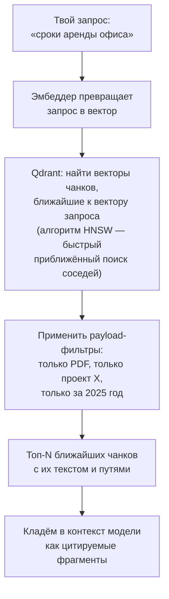

**HNSW** (Hierarchical Navigable Small World) — алгоритм, которым Qdrant ищет ближайшие
векторы. Перебирать все миллион векторов по одному — медленно; HNSW строит хитрую
«сеть дорог» между векторами и находит ближайших почти мгновенно, жертвуя капелькой
точности (приближённый поиск). Тебе не нужно его реализовывать — это встроено в Qdrant.

## 6.3. Почему одного семантического поиска мало: гибридный поиск

Тонкость, которую упускают новички. Семантика гениальна для *смысла*, но **проваливается
на точных совпадениях**: артикулах, кодах, именах, номерах. Запрос «договор №2024-АБ-17»
семантически «размажется» — база вернёт похожие *по смыслу* договоры, а не именно этот
номер. А запрос по редкому имени «Пшемыслав» семантика может не поймать, если такого
имени почти не было в обучении эмбеддера.

Поэтому используется **гибридный поиск** — два движка вместе:
- **Dense (плотный, семантический)** — векторы, ловит смысл.
- **Sparse (разреженный, по ключевым словам, BM25)** — ловит точные слова, номера, коды.

Результаты обоих сливаются алгоритмом **RRF (Reciprocal Rank Fusion)** — грубо говоря,
«кусок хорош, если он высоко и в смысловом, и в словесном рейтинге». Это критично для
твоего **смешанного ру/en корпуса** и точных терминов. Qdrant умеет гибрид нативно —
это одна из причин выбора (см. 6.5).

## 6.4. Сравнение векторных хранилищ

Теперь — обещанное подробное сравнение. Ты спрашивал про FAISS, Qdrant, Chroma,
LanceDB, SQLite, Postgres+pgvector. Вот они по-честному:

| Критерий | Chroma | **Qdrant** | FAISS | LanceDB | SQLite (sqlite-vec) | Postgres+pgvector |
|----------|:--:|:--:|:--:|:--:|:--:|:--:|
| Без отдельного сервера | ✅ | ✅ embedded | ✅ (библиотека) | ✅ | ✅ | ❌ нужен сервер |
| Гибридный поиск (dense+sparse) | 🟡 частично | ✅ нативно | ❌ сам пиши | ✅ | 🟡 руками | 🟡 расширения |
| Богатые фильтры (тип/дата/папка) | 🟡 | ✅ | ❌ | ✅ | 🟡 вручную | ✅ SQL |
| Масштаб ~1 млн чанков на десктопе | 🟡 | ✅ HNSW+квантование | ✅ | ✅ | 🟡 предел ~сотни тыс. | ✅ |
| Инкрементальные update/delete | ✅ | ✅ | ❌ пересборка | ✅ | ✅ | ✅ |
| Снапшоты/бэкапы | 🟡 | ✅ штатные | ❌ | ✅ | ✅ файл | 🟡 pg_dump |
| Named vectors (сменить эмбеддер) | ❌ | ✅ | ❌ | 🟡 | ❌ | 🟡 |
| Windows без Docker | ✅ | ✅ | ✅ | ✅ | ✅ | 🟡 инсталлятор |
| Путь роста (embedded→сервер) | 🟡 | ✅ тот же API | ❌ | 🟡 | ❌ | ✅ |

Коротко про каждого:
- **FAISS** — легендарная библиотека поиска соседей от Meta. Быстрая, но это *только*
  поиск: ни CRUD (обновить/удалить один документ — пересобирай весь индекс), ни
  метаданных, ни фильтров. Пришлось бы строить целую БД вокруг неё. Отвергнут.
- **Chroma** — дружелюбная, простая. Но слабее фильтры и нет пути роста на сервер.
- **LanceDB** — сильный кандидат №2: быстрая, встраиваемая, есть гибрид. Моложе и
  слабее по гибридному поиску и named vectors. Держим в уме как запасной.
- **SQLite + sqlite-vec** — «нулевая» опция: всё в одном файле, ноль эксплуатации. Но
  упирается в масштаб (~сотни тысяч чанков) и гибрид приходится собирать вручную.
- **Postgres + pgvector** — мощно и зрело, но тянет за собой Postgres-**сервер**, что
  для одного пользователя на ноутбуке — неоправданная тяжесть.
- **Qdrant** — золотая середина под наши требования (см. ниже).

## 6.5. Как это сделано в нашем проекте: почему Qdrant

**Выбор — Qdrant, в embedded-режиме** (`QdrantClient(path=...)` — просто файлы на
диске в `data/qdrant/`, никакого отдельного сервера). Четыре решающих аргумента:

1. **Один и тот же клиентский API в embedded и в server-режиме.** Стартуешь с файлов
   на ноутбуке (ноль эксплуатации). Вырастет корпус или захочешь вынести на домашний
   сервер — меняешь `path=...` на `url=...` в конфиге, **код не трогаешь**. Миграция =
   снапшот + смена URL. Это ровно требования NFR-1/NFR-9 (жизнь проекта 3–5 лет без
   переписывания, смена инфраструктуры — конфиг).
2. **Гибридный поиск нативно** (dense + sparse + RRF) — критично для ру/en и точных
   терминов (см. 6.3).
3. **Богатые payload-фильтры** — «найди в PDF из папки X за прошлый год по проекту Y»
   выражается штатно, а не костылём.
4. **Named vectors** — можно держать рядом векторы от *разных* эмбеддеров. Захочешь
   сменить модель эмбеддингов (e5-small → bge-m3) — доиндексируешь рядом и атомарно
   переключишься, не сносив коллекцию. Это делает смену эмбеддера безопасной операцией.

**Какой эмбеддер** (это отдельное решение от выбора БД!). На CPU есть развилка:

| Эмбеддер | Размер | Скорость на CPU | Качество |
|----------|--------|-----------------|----------|
| `bge-m3` | 570M | Медленный (большой корпус → многочасовая индексация) | Отличное, мультиязычный |
| `multilingual-e5-small` | 118M | Быстрый | Хорошее, мультиязычный |

Рекомендация под твоё железо: начать с **e5-small** (индексация корпуса реалистична по
времени), а `bge-m3` держать как «опцию качества», если retrieval не устроит. Это как
раз тот случай, ради которого сделаны named vectors — сменить эмбеддер без пересоздания
всего. (В roadmap Sprint 4 упомянут bge-m3 «по умолчанию», но CPU-адаптация из
требований §4.2 прямо рекомендует e5-small на старте — это твоя развилка, см. 6.7.)

Эмбеддер работает **in-process** (прямо в нашем Python-процессе, через
`sentence-transformers`), а не через Ollama. Почему: чтобы эмбеддинги не зависели от
перезапусков Ollama и не конкурировали с чат-моделью за место в её памяти.

## 6.6. Плюсы и минусы

**Плюсы Qdrant для нас:** ноль эксплуатации на старте (файлы), но есть куда расти;
нативный гибрид; богатые фильтры; штатные снапшоты для бэкапа; named vectors для
безболезненной смены эмбеддера.

**Минусы (скрытые):**
- Embedded-Qdrant держит индекс в памяти для скорости — на большом корпусе (сотни
  тысяч чанков) это ощутимая доля твоих 16 ГБ. Следить при росте; квантование векторов
  и переезд на server-режим — рычаги.
- Гибридный поиск требует *двух* представлений каждого чанка (dense + sparse) — чуть
  больше места и времени индексации.
- Qdrant — отдельная зависимость со своим форматом; «просто открыть файл руками» не
  выйдет (в отличие от SQLite). Отсюда важность штатных снапшотов для бэкапа.

## 6.7. Какие решения тебе предстоит принять

- **Эмбеддер: e5-small или bge-m3?** Скорость индексации против качества поиска. Совет:
  старт на e5-small, апгрейд на bge-m3 точечно, если качество не устроит (named vectors
  это позволяют без боли).
- **Embedded или server-режим Qdrant?** (открытый вопрос Q-6). Старт — embedded (по
  умолчанию, ноль эксплуатации). Server (в т.ч. в Docker) — когда корпус вырастет.
- **Включать ли reranker** (`bge-reranker-v2-m3`)? Он переупорядочивает топ результатов
  для точности, но добавляет секунды на каждый поиск на CPU. По умолчанию **выключен**;
  включать, если качество retrieval не устроит.
- **Размер чанка и overlap** — влияет и на качество, и на объём. Дефолт (~500–800
  токенов) разумен; тонкая настройка — по мере обкатки на твоём корпусе.

## 6.8. Вопросы, которые возникнут позже

- «Поиск находит нерелевантное» — возможные причины: не тот эмбеддер для языка, слишком
  крупные чанки, нужен гибрид/reranker. Развилки выше.
- «Точный номер договора не находится» — это ограничение чистой семантики; на то и
  гибридный поиск (sparse-компонент). Убедись, что он включён.
- «Сменил эмбеддер — старый индекс сломался?» — нельзя искать вектором от новой модели
  по векторам старой (они в «разных системах координат»). Именно поэтому — named vectors
  и переиндексация рядом с атомарным переключением, а не «на месте».
- «Сколько места займёт индекс?» — грубо: миллион чанков × 1024 float ≈ 4 ГБ только на
  dense-векторы, плюс sparse, плюс текст и payload. Планируй по объёму корпуса (глава 14).

---

# Глава 7. Переиндексация

Эта глава — про то, что происходит, когда твой корпус *меняется*. Она целиком выросла
из механики главы 5 (хэши, каталог, очередь), так что если та ясна — эта пойдёт легко.

## 7.1. Простое объяснение

Вернёмся к библиотекарю. У него есть картотека. Когда в библиотеку приносят одну
новую книгу — он заводит на неё одну карточку, а не переписывает всю картотеку заново.
Когда книгу переставили на другую полку — он меняет в карточке номер полки, но не
перечитывает книгу. Когда книгу выбросили — выбрасывает карточку.

Вот это и есть **инкрементальная переиндексация**: трогаем только то, что реально
изменилось, и ровно настолько, насколько изменилось. Полная переиндексация («перечитать
все книги заново») — крайняя мера, нужная редко.

Ключевой вопрос, на который отвечает вся глава: **как система понимает, что именно
изменилось и насколько дорого это обработать?** Ответ — через хэш содержимого и каталог
файлов из главы 5.

## 7.2. Как система понимает, что изменилось

Единственный надёжный признак «файл реально стал другим» — **хэш его содержимого**
(короткий отпечаток: одинаковое содержимое → одинаковый хэш, изменил хоть байт → хэш
другой). Каталог `files` в SQLite хранит хэш каждого файла. Механизм сверки:

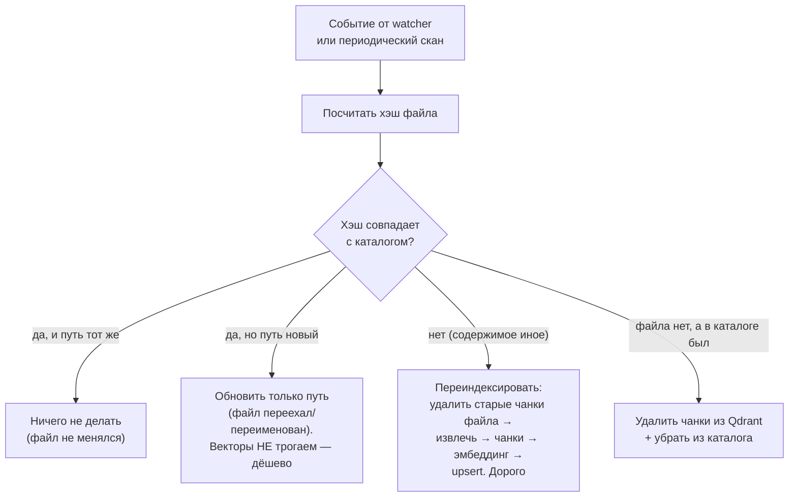

Запомни это раздвоение: **«переехал» (хэш тот же) — дёшево, правим строчку в каталоге;
«изменился» (хэш другой) — дорого, гоним через весь конвейер главы 5.** Вся экономия
переиндексации держится на этом различии.

## 7.3. Разбор твоих сценариев по стоимости

Ты спрашивал про конкретные ситуации — вот они, с ценой каждой:

| Сценарий | Кто обнаружил | Что переиндексируется | Стоимость |
|----------|---------------|----------------------|-----------|
| **Изменил 1 файл** | Watcher (modified) | Только этот файл: его чанки удаляются, файл индексируется заново | Секунды–минута (зависит от размера) |
| **Изменил 1000 файлов** | Watcher/скан | Каждый из 1000 — заново, но по очереди, в паузах диалога | Часы; идёт фоново, не мешает |
| **Переместил каталог** | Watcher (moved) | **Ничего** из содержимого! Обновляются только пути в каталоге | Секунды (правка путей) |
| **Переименовал папку** | Watcher (moved) | То же: только пути | Секунды |
| **Удалил документы** | Watcher (deleted) | Ничего не индексируется; чанки удалённых убираются из Qdrant | Мгновенно (удаление) |
| **Подключил новый диск** | Периодический скан | Всё содержимое (если диск в whitelisted корнях) — как первичная индексация | Долго (см. 7.5) |

Разбор двух неочевидных:

**«Переместил каталог с 5000 файлов».** Наивная система переиндексировала бы все 5000
(часы работы CPU!). Наша — увидит по хэшам, что содержимое не изменилось, ни один
байт, и обновит только *пути* в каталоге. Секунды вместо часов. Вот ради чего каталог
хранит хэши.

**Оговорка про надёжность обнаружения перемещения.** Watchdog не всегда присылает
чистое событие «moved» — иногда это выглядит как «delete старого + create нового»
(особенно на разных дисках или при офлайн-перемещении). Чтобы это не вызвало напрасную
переиндексацию, при `create` система сначала считает хэш и проверяет: «а нет ли уже
файла с таким хэшем в каталоге?» Если есть — это перемещение, а не новый файл, правим
путь. Так «переехал» остаётся дешёвым, даже когда ОС не сказала прямо «moved».

## 7.4. Что можно НЕ индексировать

Экономия начинается с того, чтобы не делать лишнего:
- **Файлы вне whitelisted корней** — не наша забота вообще.
- **Неподдерживаемые/бинарные типы** (архивы, видео, exe) — пропускаем.
- **Слишком большие файлы** — по порогу из конфига (гигантский лог не нужен в RAG).
- **Не изменившиеся файлы** — по хэшу (главный механизм).
- **Служебные папки** (`.git`, `node_modules`, `.obsidian/`) — исключаются паттернами.

## 7.5. Сколько это стоит: время, память, процессор

Честные порядки величин на твоём CPU (i7-1165G7):

**Время.** Основная стоимость — **эмбеддинг** (прогон текста через модель-эмбеддер).
На CPU с e5-small — порядка сотен–тысяч чанков в минуту (зависит от длины). Прикидка
первичной индексации:
- 100 документов (~2000 чанков) — минуты–десятки минут.
- 10 000 документов (~200 000 чанков) — **часы, возможно не одна ночь**. Это нормально
  и заложено в план: первичная индексация большого корпуса — ночной инкрементальный
  процесс, спешить некуда.

**Процессор.** Эмбеддинг грузит CPU почти полностью. Именно поэтому очередь
**паузится во время диалога** (иначе твой вопрос будет ждать, пока CPU занят
индексацией) и тяжёлое уходит в **тихие часы** (конфиг, напр. 02:00–06:00). Воркеров
индексации — 1–2, не больше: незачем отбирать все ядра у системы.

**Память.** Эмбеддер (e5-small, 118M) в памяти — сотни МБ. Растущий индекс Qdrant —
пропорционально числу чанков (см. главу 14). Извлечение больших PDF временно требует
памяти под текст. Всё это на фоне 16 ГБ и одной LLM — почему и держим одну модель в
памяти за раз (глава 2).

**Диск.** Кэш извлечённого текста + индекс Qdrant + sparse-представления. Планируй
единицы–десятки ГБ на большой корпус (глава 14).

## 7.6. Инкрементальная индексация и стратегии

**Да, инкрементальная индексация — основной режим** (не полная). Стратегии, которые
комбинируются:

1. **Событийная (watcher)** — реакция за секунды на изменения, пока система работает.
2. **Периодический полный скан** — сверка по хэшам, ловит пропущенные события
   (сетевые диски, офлайн-изменения). Реже, в тихие часы.
3. **Ручная полная переиндексация** — `scripts/reindex.py`, крайняя мера: сменил
   эмбеддер, повредился индекс, radikально поменял настройки чанкинга.
4. **Приоритеты в очереди** — только что присланный тобой файл индексируется раньше,
   чем фоновая массовая дозагрузка.
5. **Дедупликация в очереди** — если файл изменился трижды, пока ждал очереди, он
   проиндексируется один раз (по последнему состоянию), а не трижды.

## 7.7. Альтернативы, плюсы/минусы

**Альтернатива:** переиндексировать всё по расписанию (раз в ночь — весь корпус).
Проще в коде, но на CPU с большим корпусом — неподъёмно (каждую ночь часы работы ради
пары изменившихся файлов). Инкрементальность обязательна на нашем железе.

**Плюсы нашего подхода:** дёшево (трогаем только изменённое); не мешает диалогу
(очередь + паузы); переживает перезапуск (очередь в SQLite); «переезд» файлов почти
бесплатен.

**Минусы (скрытые):** watcher ненадёжен на сетевых/облачных дисках — там задержка до
следующего скана; первичная индексация большого корпуса всё равно долгая (это цена
CPU, не архитектуры); если хэш-каталог повредится, придётся сверять заново.

## 7.8. Твои решения и поздние вопросы

**Решения:** частота периодического скана; границы тихих часов; порог размера файла;
число воркеров (1 или 2); паттерны исключений.

**Поздние вопросы:**
- «Индексатор стоит уже 2 часа» — в Sprint 10 появится health-мониторинг с
  самоотчётом в Telegram именно про такое. Пока — смотри логи и очередь через `/jobs`
  (в планах CLI).
- «Переиндексировал вручную — дубли в поиске?» — не должно: перед upsert старые чанки
  файла удаляются по его id. Если что-то пошло не так — полный `reindex.py` пересобирает
  коллекцию с нуля.
- «Как понять, что файл уже проиндексирован?» — статус в каталоге `files`; в планах —
  команда показа состояния индексации.

---

# Глава 8. Telegram

Ты писал, что почти ничего не знаешь про Telegram Bot API. Эта глава закрывает пробел с
нуля — и объясняет, почему именно Telegram оказался идеальным каналом для *локального*
ассистента (это неочевидно и красиво).

## 8.1. Простое объяснение

**Бот в Telegram — это просто „пользователь“, которым управляет не человек, а
программа.** У него есть имя (@твой_бот), он есть в твоём списке чатов, ты пишешь ему
как другу — а отвечает ему наша программа.

Где он «живёт»? Вот тут ловушка для интуиции. Кажется, что бот живёт «в Telegram», на
серверах Telegram. На самом деле в Telegram живёт только его *почтовый ящик*. А *мозг*
бота — наша программа — живёт **на твоём ноутбуке**. Telegram лишь передаёт сообщения
между тобой и этим мозгом, как почта передаёт письма между двумя людьми.

И вот почему это гениально для локального ассистента: **твой ноутбук не обязан быть
доступен из интернета.** Он сам, когда хочет, «заходит на почту» к Telegram, забирает
накопившиеся сообщения и оставляет ответы. Никто снаружи не может достучаться до твоего
ноутбука — он всегда инициатор связи. Твой домашний компьютер за роутером, без белого
IP, без проброса портов — и при этом ты пишешь ассистенту из любой точки мира через
обычный Telegram. Магия в том, что связь всегда идёт *изнутри наружу*.

## 8.2. Как это устроено технически: polling против webhook

Есть два способа боту получать сообщения. Разница между ними — ядро этой главы.

**Webhook (обратный вызов).** Ты говоришь Telegram: «когда придёт сообщение, постучись
на такой-то мой адрес в интернете». Telegram сам *приходит* к твоему серверу. Требует:
у тебя есть публичный адрес в интернете, открытый порт, HTTPS-сертификат. Для сервера —
удобно и эффективно. **Для домашнего ноутбука — кошмар:** белый IP, проброс портов,
сертификаты, дырка в firewall для входящих соединений.

**Long polling (длинный опрос).** Твоя программа сама периодически спрашивает Telegram:
«есть новые сообщения?» и держит соединение открытым, пока не появятся. Никаких входящих
соединений, никакого публичного адреса — только исходящие запросы от тебя к Telegram.

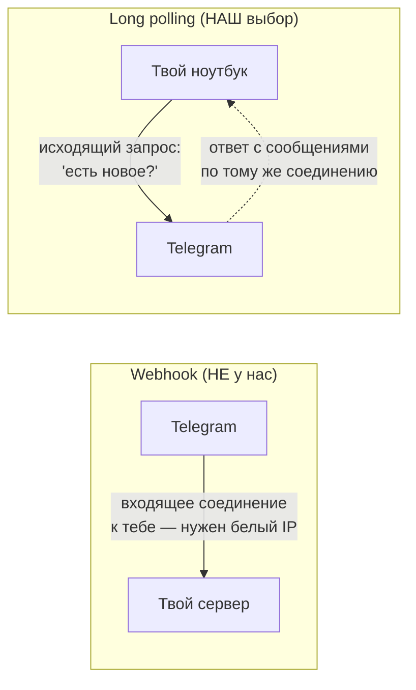

**Наш выбор — long polling**, и это прямое следствие принципа Local First: **у системы
нет ни одного входящего соединения.** Telegram работает через исходящий опрос, web-чат
слушает только `127.0.0.1` (сам себя). Твой ноутбук снаружи невидим и недостижим — и
это не ограничение, а фича безопасности.

## 8.3. Нужен ли сервер?

Нет. Нужен только **твой включённый ноутбук с запущенной программой и интернетом**.
Пока программа работает — она опрашивает Telegram и отвечает. Выключил ноутбук —
сообщения копятся у Telegram в «почтовом ящике» (несколько дней), включил — программа
их заберёт. Отдельный сервер, облако, хостинг — не нужны. Именно это делает ассистента
по-настоящему *твоим* и бесплатным в эксплуатации (глава 14).

## 8.4. Как это сделано в нашем проекте

**Библиотека — aiogram 3** (`channels/telegram/gateway.py`), современный асинхронный
фреймворк для Telegram-ботов на Python. Что делает наш Telegram Gateway:

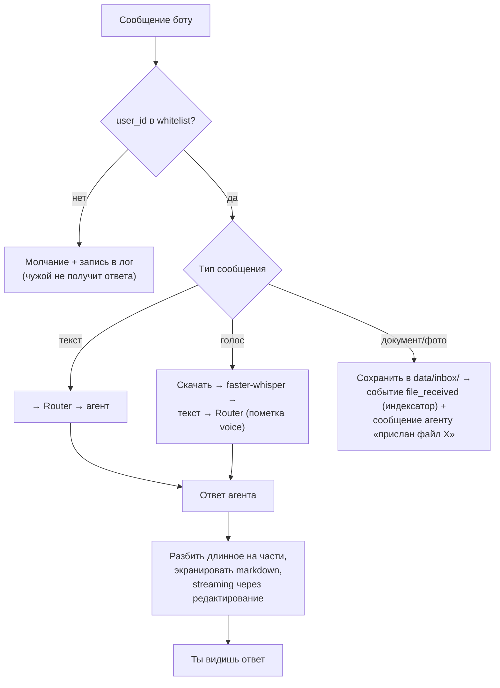

Разберём ключевые механики:

**Whitelist (белый список).** Первое, что проверяется, — твой ли это `user_id`
(в конфиге; у тебя это `909506738`). Чужому — **тишина и запись в лог**, не «доступ
запрещён» (чтобы не подтверждать существование бота). Это выполнение требования
FR-9.2 / безопасность: только ты можешь пользоваться ассистентом.

**Голосовые сообщения.** Ты наговорил — Gateway скачивает `.ogg`, прогоняет через
**faster-whisper** (модель распознавания речи, роль `stt`, работает in-process на CPU
в реальном времени), получает текст и отдаёт агенту с пометкой «это было голосовое».
Дальше — как обычный текст. Ты можешь диктовать ассистенту на ходу.

**Документы.** Прислал PDF — Gateway кладёт его в `data/inbox/`, публикует событие
`file_received` (его подхватит индексатор — файл станет искомым), и отдельно сообщает
агенту «пользователь прислал файл X» (чтобы тот мог отреагировать: резюмировать,
спросить куда положить). Так связаны Telegram и RAG (глава 5, поток 4).

**Streaming (потоковый ответ).** LLM на CPU пишет ответ медленно (3–6 ток/с). Ждать
30 секунд молча — плохо. Поэтому Gateway показывает ответ *по мере генерации*,
периодически **редактируя** одно и то же сообщение (Telegram это умеет). Ты видишь,
как ответ «печатается», а не пустоту. Плюс **heartbeat** «модель думает…», пока идёт
долгий prefill.

**Разбиение и экранирование.** У Telegram лимит на длину сообщения (~4096 символов) и
свои правила markdown. Gateway режет длинные ответы на части (`split.py`) и экранирует
спецсимволы, чтобы форматирование не ломалось.

## 8.5. Как работают напоминания через Telegram

Тонкость архитектуры: **Reminder Engine доставляет напоминание не напрямую в Telegram,
а через Router.** Почему это важно — Router разошлёт напоминание *во все активные
каналы* (сегодня Telegram, завтра добавишь web-чат — напоминания появятся и там без
единой правки в движке напоминаний). Само срабатывание — это детерминированный
Scheduler (глава 9), а Telegram — лишь способ доставки. К напоминанию Gateway рисует
inline-кнопки [✅ Сделал] [⏰ Позже] [✖ Отмена] — нажатие возвращается тем же путём
(Telegram → Router → Reminder Engine).

## 8.6. Полная схема канала

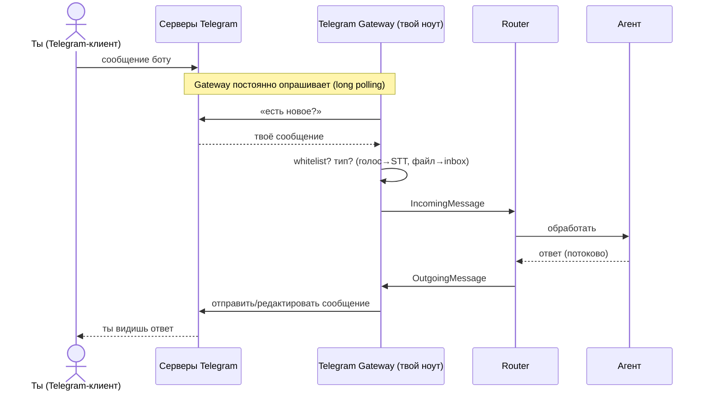

## 8.7. Альтернативы, плюсы/минусы, решения

**Альтернативы каналу:**

| Канал | Плюс | Минус |
|-------|------|-------|
| **Telegram (наш основной)** | Работает из любой точки, голос/файлы/кнопки из коробки, не нужен сервер | Зависимость от стороннего сервиса (единственный внешний трафик) |
| Только локальный web-чат | Полностью офлайн, ноль внешних зависимостей | Доступен только когда ты за этим же компьютером |
| Консоль (CLI) | Идеально для отладки | Не для повседневного использования |
| Свой мобильный клиент | Полный контроль | Огромный объём работы, незачем при наличии Telegram |

Web-чат и CLI у нас *тоже есть* — как дополнительные каналы (тонкие адаптеры к тому же
Router). Telegram — основной, потому что он единственный даёт «пишу ассистенту откуда
угодно» без сервера.

**Плюсы Telegram-подхода:** мобильность без инфраструктуры; голос, файлы, кнопки
бесплатно; нет входящих соединений (безопасность).

**Минусы (скрытые):** сообщения проходят через серверы Telegram (хоть и не хранятся у
нас, это единственная точка, где твой текст покидает машину по пути к тебе же — но
это *твой* трафик между *твоими* устройствами); зависимость от доступности Telegram;
токен бота — секрет, утечёт — чужой сможет слать боту (но whitelist его отсечёт).

**Твои решения:** создать бота у @BotFather и положить токен в `config/local.yaml`
(нужно к Sprint 1 — вероятно, уже сделано); отказаться ли от Telegram в пользу только
web-чата (можно, если мобильность не нужна — глава 15); список разрешённых user_id
(сейчас только ты).

## 8.8. Вопросы, которые возникнут позже

- «Написал боту, а он молчит» — проверь: программа запущена? твой user_id в whitelist?
  Ollama жива? Чужому боту он и должен молчать.
- «Ноутбук был выключен — сообщения потерялись?» — нет, Telegram хранит их несколько
  дней; при запуске Gateway их заберёт (long polling подтянет накопленное).
- «Токен бота засветился» — немедленно перевыпусти у @BotFather; старый перестанет
  работать. Whitelist — вторая линия обороны.
- «Хочу голосом, но распознаёт с ошибками» — faster-whisper small на CPU — компромисс
  скорость/качество; можно взять модель побольше ценой скорости.

---

# Глава 9. Задачи

## 9.1. Простое объяснение

Задачи — это то, ради чего ассистент становится по-настоящему полезным в быту: он не
просто отвечает, а *помнит твои дела и сам напоминает о них вовремя*. Ты говоришь
человеческим языком — «надо позвонить Ивану насчёт сметы в понедельник утром», — а
ассистент превращает это в аккуратную запись со сроком и заводит будильник.

Тут есть тонкость, которую важно почувствовать сразу. В связке «задача + напоминание»
работают **две очень разные натуры**:
- Понять, что ты имел в виду под «в понедельник утром» и «каждую первую пятницу
  месяца», — это работа для *умной, но ненадёжной* LLM.
- Сработать ровно в 9:00 в понедельник, даже если ноутбук только что включился, —
  это работа для *тупого, но абсолютно надёжного* будильника.

Смешивать их нельзя. Будильник, который «обычно звонит, но иногда задумался и забыл», —
бесполезен. Поэтому в проекте эти две натуры строго разделены. Это тот же принцип
«интерпретация отдельно, исполнение отдельно», что и в главе 3, — здесь он виден
нагляднее всего.

## 9.2. Как агент хранит задачи и где они лежат

Задачи живут в **SQLite** (таблица `tasks`, модуль `modules/tasks/` — это Sprint 5).
Каждая задача — структурированная запись:

```
Task:
  title:      "позвонить Ивану насчёт сметы"
  notes:      подробности, если есть
  due:        точный срок (дата-время с часовым поясом) — или пусто
  rrule:      правило повторения (для «каждый понедельник») — или пусто
  project_id: привязка к проекту (для «что у меня по проекту X?»)
  status:     open / done / cancelled
  source:     ссылка на исходное сообщение (чтобы помнить, откуда задача)
```

Почему SQLite, а не векторы: задачи — это **структурированные данные с точными
полями** (срок, статус, проект), по которым нужны точные запросы («покажи открытые
задачи по проекту X со сроком на этой неделе»). Это классическая работа для SQL. Поиск
задач *по смыслу* («что там было про смету?») добавляется поверх — семантикой, но
основа реляционная.

## 9.3. Как ассистент понимает даты

Это самое хрупкое место, и сделано оно осторожно. Когда ты говоришь «через неделю» или
«каждую первую пятницу», Task Manager обращается к LLM (роль `extraction`, маленькая
3B-модель, `temperature: 0.0` для предсказуемости) и просит **structured output** —
строго форматированный ответ по одной из трёх форм:

| Ты сказал | Тип | Во что превращается |
|-----------|-----|---------------------|
| «в понедельник в 9» | точная дата | `due: 2026-07-20T09:00+03:00` |
| «каждый понедельник» | повторение | `rrule: FREQ=WEEKLY;BYDAY=MO` (стандарт RRULE) |
| «после отпуска», «если не сделаю» | условие-триггер | триггер-условие для follow-up |

Три защиты от ошибок слабой модели (риск из roadmap Sprint 5):
1. **Часовой пояс** передаётся модели явно (иначе «9 утра» неоднозначно) — из конфига
   (допущение A-6).
2. **Валидация** результата: получилась не дата или дата в прошлом — переспрос.
3. **Переспрос при неуверенности**: «в этот понедельник или в следующий?» — лучше
   уточнить, чем поставить не туда.

**RRULE** — это международный стандарт описания повторений (из формата календарей
iCalendar). «Каждый второй вторник», «по будням», «раз в месяц 1-го» — всё это
выражается строкой RRULE, и её понимают готовые библиотеки. LLM лишь *переводит* твою
фразу в RRULE; дальше с ней работает детерминированный код.

## 9.4. Что такое Scheduler и как работают повторения

**Scheduler (планировщик)** — это тот самый «тупой надёжный будильник». В проекте это
обёртка над библиотекой **APScheduler** с хранением заданий в **SQLite** (модуль
`modules/scheduler/`, Sprint 6). Две функции:

```
schedule_once(время, событие)   — сработать один раз в указанный момент
schedule_rrule(rrule, событие)  — срабатывать по правилу повторения
```

Важнейшая деталь архитектуры: **Scheduler сам ничего не исполняет.** Когда приходит
время, он просто публикует *событие* в шину (Event Bus): `reminder_fire(id)`. А уже
Reminder Engine, услышав это событие, решает, что делать (актуально ли ещё напоминание,
сформировать сообщение с кнопками, отдать Router'у). Зачем так: слабая связанность —
Scheduler ничего не знает про напоминания, задачи или Telegram; он умеет только «в
такой-то момент крикнуть в шину». Это делает его простым и надёжным.

**Повторяющиеся задачи** работают через RRULE + `schedule_rrule`: APScheduler сам
вычисляет следующее срабатывание по правилу, снова и снова.

## 9.5. Что будет, если компьютер выключен?

Это главный вопрос надёжности, и ответ продуман (иначе вся затея с напоминаниями
бессмысленна).

**Задания хранятся в SQLite, а не в памяти.** Выключил ноутбук — задания не пропали,
они на диске. Включил — APScheduler восстанавливает их из SQLite (`restore из
SQLite`). Дальше два случая:

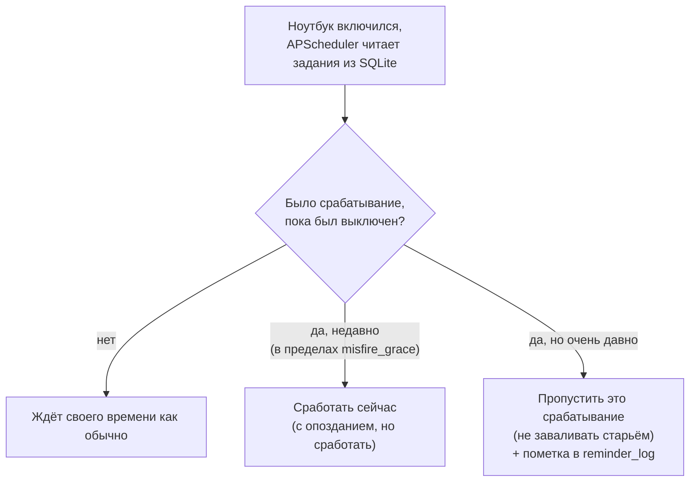

- **Напоминание на 9:00, ноутбук включился в 9:30** — сработает в 9:30 (опоздало, но
  не потерялось). За это отвечает **misfire_grace** — «допустимая просрочка»: сколько
  можно опоздать и всё равно доставить.
- **Напоминание было три дня назад, всё это время ноутбук был выключен** — не будем
  бомбить тебя трёхдневным старьём; пропустим с пометкой (или, для важных, покажем в
  утренней сводке).
- **Защита от двойной доставки** (риск из roadmap): каждое срабатывание фиксируется в
  `reminder_log`; если после сбоя система не уверена, доставила ли уже, — сверяется с
  логом (идемпотентность), чтобы не прислать одно напоминание дважды.

Честное ограничение: **если в момент напоминания ноутбук выключен, оно придёт при
следующем включении, а не «вовремя».** Локальный ассистент физически не может напомнить,
когда его «мозг» спит. Для критичных напоминаний это надо понимать (глава 15 — там же
про варианты вроде дублирования в облачный календарь).

## 9.6. Как реализуются напоминания и follow-up

Напоминание — отдельная сущность (может ссылаться на задачу): одноразовое,
повторяющееся (RRULE) или **условное follow-up** — «если не сделал X, напомни снова
через 2 дня». Follow-up работает так: при срабатывании Reminder Engine проверяет, не
закрыта ли задача; если открыта — планирует следующую проверку. Это цикл «пока не
сделаешь — буду напоминать», реализованный через события и Scheduler. Полный поток —
глава 12, сценарий 2 и `docs/05-flows.md` поток 3.

## 9.7. Альтернативы, плюсы/минусы, решения

**Альтернативы Scheduler'у:** системный планировщик ОС (Windows Task Scheduler / cron)
— но он не знает про наши задачи и события, пришлось бы городить мост; отдельный сервис
очередей (Celery + Redis) — избыточно для одной машины. APScheduler + SQLite —
встроенный, лёгкий, переживает перезапуск. Отсюда ADR-9.

**Плюсы:** надёжность (SQLite-store, misfire, идемпотентность); слабая связанность
(Scheduler только публикует события); человеческий ввод дат через LLM.

**Минусы (скрытые):** напоминания не сработают при выключенной машине (см. 9.5);
парсинг дат слабой моделью иногда ошибается (отсюда валидация и переспрос); RRULE
покрывает не любые экзотические правила (но 99% бытовых — да).

**Твои решения:** `misfire_grace` (сколько опоздание ещё допустимо); часовой пояс в
конфиге; политика для «умного момента» без срока (утро для планирования, рабочие часы
для рабочих задач — эвристика, которую можно настраивать); держать ли ноутбук включённым
в часы, когда важны напоминания.

## 9.8. Вопросы, которые возникнут позже

- «Напоминание не пришло» — ноутбук был включён в тот момент? Проверь `reminder_log` и
  логи Scheduler; возможно misfire_grace был превышен.
- «Пришло дважды» — не должно (идемпотентность по `reminder_log`); если случилось —
  баг в фиксации доставки, смотри лог.
- «Понял дату неправильно» — слабая 3B-модель; помогает явный переспрос и проверка
  «дата не в прошлом». Можно уточнять формулировку.
- «Хочу, чтобы напоминало, даже когда ноут выключен» — это уже за рамками локального
  ассистента; вариант — двусторонний календарь (backlog), где событие дублируется в
  облако с уведомлением на телефон.

---

# Глава 10. Архитектура проекта

Эта глава собирает все органы из предыдущих глав в единый организм и объясняет
*правила*, по которым они соединены. Если предыдущие главы отвечали «что делает каждый
орган», эта отвечает «почему они соединены именно так и что сломается, если убрать
любой».

## 10.1. Простое объяснение

Представь хорошо организованную компанию. В ней есть отделы (модули), у каждого — своя
зона ответственности и свой начальник. Отделы не лезут в чужие дела напрямую: если
бухгалтерии нужно что-то от склада, она не роется на складских полках сама, а посылает
*официальный запрос по установленной форме*. Есть общая доска объявлений (событийная
шина), куда отделы вешают новости («пришёл новый груз»), и другие отделы реагируют,
если им это интересно.

Почему такая бюрократия, а не «все всё делают вместе по-семейному»? Потому что компания
из трёх человек может работать по-семейному, а компания, которая должна прожить 3–5 лет
и вырасти, — нет. Без границ отделы срастаются в «большой ком грязи», где нельзя
поменять одно, не сломав другое. Границы — это цена, которую платят *сейчас*, чтобы
не платить страшную цену *потом*.

Наша система — именно такая компания в виде одной программы: **модульный монолит**.
Один процесс (одна компания в одном здании), но внутри — строгие отделы с формальными
интерфейсами.

## 10.2. Три правила, которые держат всё вместе

Вся архитектура держится на трёх правилах (их проверяет робот-инспектор `import-linter`
в CI — если кто-то нарушит границу, сборка падает):

1. **Модуль обращается к другому модулю только через его официальный интерфейс**
   (`interface.py`, формально — Python Protocol) — или через событие. Нельзя залезть в
   чужие внутренности напрямую.
2. **Таблицы БД принадлежат одному модулю.** Память владеет своими таблицами, задачи —
   своими. Читать чужие таблицы напрямую нельзя (только через интерфейс владельца).
3. **Ядро (`core/`) не знает ни об одном модуле; модули не знают о каналах.** Ядро
   умеет крутить агентный цикл, не зная, существует ли вообще память или Telegram.

Эти правила — не педантизм. Именно они дают обещанное в требованиях: любой модуль можно
выключить (feature flag), заменить или вынести в отдельный процесс, не трогая остальное.
Иллюстрация из твоего кода: модуль памяти подключён через `MemoryPort` — ядро знает
абстрактный «порт памяти», но *не знает*, что за ним конкретный модуль с SQLite и FTS5.
Выключи `modules.memory.enabled` — ядро продолжит работать, просто без памяти.

## 10.3. Каждый сервис: зачем существует и что будет, если убрать

Пройдёмся по всем органам. Колонка «если убрать» — лучший способ понять, зачем орган
нужен.

| Сервис | Зачем существует | Что делает | Если убрать |
|--------|------------------|-----------|-------------|
| **LLM Gateway** (`llm/`) | Единственная дверь к моделям | Роли→модели, retry, таймауты, structured output, JSON-fallback, учёт токенов | Каждый модуль сам стучится к Ollama, дублируя логику; смена модели — правки по всему коду |
| **Message Router** (`core/router.py`) | Развязать каналы и мозг | Нормализует вход, ведёт сессии, доставляет ответы в нужный канал | Каждый канал знает внутренности агента; напоминания не доставить в новый канал |
| **Agent Orchestrator** (`core/agent/`) | Крутить agent loop | Вызовы LLM, исполнение инструментов, риск-подтверждения, лимиты | Нет агентности вообще — только «вопрос-ответ» без действий |
| **Context Builder** (`core/agent/context.py`) | Собрать промпт по бюджету | Склеивает system + память + история + результаты, режет по приоритету | Промпт раздувается → на CPU всё умирает по скорости; память не попадает к модели |
| **Tool Registry** (`core/tools/`) | Единый учёт инструментов | Регистрация, выдача по фильтрам, исполнение с валидацией и аудитом | Инструменты разбросаны; нет уровней риска и аудита; destructive без подтверждения |
| **Memory** (`modules/memory/`) | Долговременная память | Факты, предпочтения, recall, забывание | Ассистент забывает всё между сессиями — снова «справочное бюро» |
| **RAG** (`modules/rag/`) | Поиск по документам | Гибридный поиск, фильтры, цитаты | «Найди в моих документах» не работает |
| **File Indexer** (`modules/indexer/`) | Держать индекс актуальным | Watcher, очередь, извлечение, чанкинг, эмбеддинг, каталог | Индекс не обновляется; новые файлы не находятся |
| **Task Manager** (`modules/tasks/`) | Помнить дела | CRUD задач, парсинг дат, поиск | Нет задач как сущности; напоминаниям не к чему привязаться |
| **Reminder Engine** (`modules/reminders/`) | Приходить вовремя | Одноразовые/RRULE/follow-up, кнопки, доставка через Router | Ассистент не напоминает сам — только по прямому вопросу |
| **Scheduler** (`modules/scheduler/`) | Надёжный «будильник» | APScheduler+SQLite, публикация событий по времени | Ничего не срабатывает по расписанию: ни напоминания, ни бэкапы, ни сводка |
| **File Ops** (`modules/fileops/`) | Безопасно трогать файлы | move/copy/rename/archive с undo, дубликаты | «Разбери Downloads» не работает; нет undo-журнала |
| **Config Service** (`infra/config.py`) | Единая правда о настройках | yaml+env→валидированный конфиг, feature flags | Настройки разбросаны; ошибка конфига всплывает в рантайме, а не на старте |
| **Logging/Audit** (`infra/`) | Наблюдаемость и «что ты делал?» | JSON-логи с request_id, append-only аудит | Нельзя понять, что произошло; «что ты делал вчера?» не ответить |
| **MCP Hub/Server** (`mcp/`) | Мост к внешним инструментам | Подключение чужих MCP-серверов, экспорт своих | Нет готовых интеграций конфигом; свой «мозг» не доступен из Claude Desktop |
| **Backup** (`infra/backup.py`) | Пережить катастрофу | Ночной бэкап + проверка восстановления | Один сбой диска — и вся память/индекс потеряны навсегда |

## 10.4. Как органы общаются: два способа

Важно понять два *разных* канала связи между модулями — их путают.

**1. Прямой вызов через интерфейс (синхронно, «дай мне это сейчас»).** Оркестратору
нужен результат поиска *прямо сейчас*, чтобы продолжить ответ → он зовёт RAG через его
интерфейс и ждёт ответа. Это как позвонить в отдел и дождаться ответа.

**2. Событие через шину (асинхронно, «к сведению»).** После ответа оркестратор кидает
в шину `message_processed` и забывает — а память *потом*, когда захочет, это подхватит
и решит, не запомнить ли факт. Это как повесить объявление на доску: кому интересно —
среагирует, отправитель не ждёт.

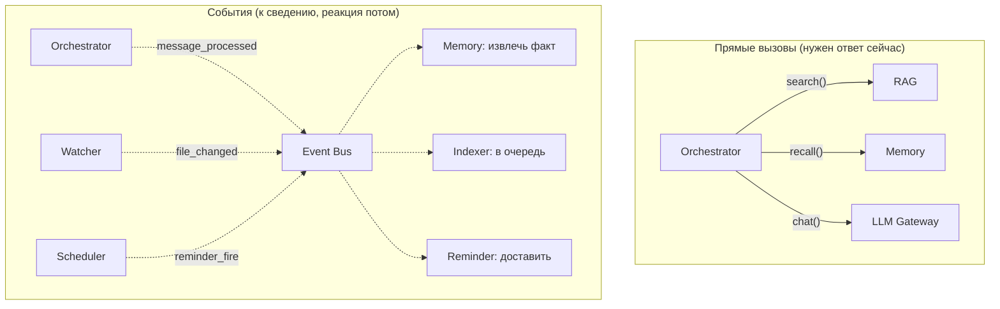

Правило: **если результат нужен для продолжения прямо сейчас — прямой вызов; если это
реакция „после“ — событие.** Событиями связаны именно фоновые реакции (память,
индексация, напоминания), чтобы модули не выстраивались в жёсткую цепочку вызовов друг
друга.

## 10.5. Альтернативы (та самая развилка A/B/C)

Напомню развилку из требований — теперь она должна читаться осмысленно:

| Вариант | Суть | Вердикт |
|---------|------|---------|
| **A. Скрипты + фреймворк-комбайн** | Собрать на LangChain за дни | Быстрый прототип, но протекающие абстракции + breaking changes; ядро не под контролем |
| **B. Микросервисы** | Каждый модуль — отдельный процесс + брокер + Docker | Вся цена распределённости, нулевая выгода на одной машине |
| **C. Модульный монолит** ⭐ | Один процесс, жёсткие границы модулей | Наш выбор: скорость монолита + дисциплина границ |

Тонкость про исходное требование «не монолит»: оно на самом деле означало «не
сильносвязанный ком», а не «обязательно микросервисы». Модульный монолит даёт слабую
связанность *без* цены микросервисов. Это разрешение противоречия П-4.

## 10.6. Плюсы, минусы, решения, поздние вопросы

**Плюсы:** быстрый старт и лёгкая отладка (всё в одном процессе, один стектрейс);
дёшево по ресурсам (нет сети/сериализации между модулями — критично на слабом железе);
расширяемость (новый инструмент/канал/источник — по чёткому рецепту, ядро не трогаем);
управляемый рост (модуль выносится в процесс через MCP, когда реально нужно).

**Минусы (скрытые):** «средний» риск сползания в «ком» — держится только дисциплиной
границ (поэтому import-linter в CI обязателен, а не по желанию); один процесс — тяжёлый
баг в одном модуле теоретически может уронить всё (купируется таймаутами и обработкой
ошибок на границах); всё на одной машине конкурирует за один CPU (глава 13).

**Твои решения:** какие модули включены (feature flags); когда выносить модуль в
отдельный процесс (обычно — никогда на одной машине, но заложено); профили агента
(какой набор инструментов в каком режиме).

**Поздние вопросы:** «хочу вынести RAG на домашний сервер» → он уже общается только
через интерфейс, оборачивается в MCP-сервер, меняешь конфиг; «добавить голосовой
канал» → новый адаптер в `channels/`, ядро не меняется; «import-linter ругается» →
ты нарушил границу модуля, это фича, а не баг — смотри, какой импорт лишний.

---

# Глава 11. Хранение данных

## 11.1. Простое объяснение

У ассистента много «памяти» в широком смысле — и вся она где-то физически лежит на
диске. Новичку кажется, что это одна большая куча. На самом деле у каждого типа данных
— своё место, выбранное под его природу. Как в доме: продукты в холодильнике, книги на
полке, документы в сейфе — не потому что так «красиво», а потому что у каждого свои
требования к хранению.

Главный принцип, ради которого всё складывается аккуратно: **всё состояние системы
лежит в одной папке `data/`.** Скопировал `data/` + конфиг на другую машину — перенёс
ассистента целиком, со всей памятью и индексом. Одна папка = один объект для бэкапа и
переноса. Это делает систему по-настоящему *твоей* и переносимой.

## 11.2. Что где лежит и почему именно там

Два главных хранилища с разными характерами:

**SQLite** — для всего *структурированного и точного*: записи с полями, связи, точные
запросы. Один файл `data/sba.db`. Транзакции, надёжность, «просто открыть и посмотреть».

**Qdrant** — для всего *смыслового и приблизительного*: векторы, поиск по похожести.
Папка `data/qdrant/`.

Полная карта данных:

| Данные | Где | Почему там |
|--------|-----|-----------|
| **Документы (оригиналы)** | Там, где лежат у тебя (вне `data/`) | Мы их не копируем — только ссылаемся; они твои |
| **Индекс (векторы чанков)** | Qdrant (`data/qdrant/`) | Смысловой поиск — природа векторной БД |
| **Копии текста чанков + метаданные** | Qdrant payload | Рядом с вектором, чтобы вернуть цитату |
| **Кэш извлечённого текста** | `data/files_cache/` | Быстро «прочитать документ целиком» без повторного извлечения |
| **Каталог файлов** (path, hash, mtime) | SQLite `files` | Точные диффы по хэшу — работа для SQL |
| **История чатов** | SQLite `conversations`, `messages` | Структурированные сообщения сессий |
| **Память: факты** | SQLite `memory_facts` (+ вектор в Qdrant `memory`) | Точные поля (тип, subject, confidence) + смысловой recall |
| **Память: предпочтения** | SQLite `preferences` | Ключ-значение, всегда в промпт |
| **Память: эпизоды** | SQLite `episodes` (+ вектор в Qdrant) | Суммаризации с датами |
| **Задачи** | SQLite `tasks` | Точные поля: срок, статус, проект |
| **Напоминания** | SQLite `reminders`, `reminder_log` | Точность + журнал доставки (идемпотентность) |
| **Задания планировщика** | SQLite (APScheduler job store) | Переживают перезапуск |
| **Настройки** | `config/*.yaml` (вне `data/`) | Правится руками, версионируется отдельно |
| **Логи** | `data/logs/` (JSON с ротацией) | Наблюдаемость, поиск по request_id |
| **Аудит действий** | SQLite (append-only) | «Что ты делал вчера?»; неизменяемая летопись |
| **Очередь индексации** | SQLite | Переживает перезапуск |
| **Бэкапы** | `data/backups/` (или отдельный диск) | Копии всего вышеперечисленного |

Обрати внимание на закономерность: **точное → SQLite, смысловое → Qdrant, а факты и
эпизоды живут в обоих сразу** (SQLite — источник истины и точные поля; Qdrant — способ
найти по смыслу). Это не дублирование ради дублирования: у каждой копии своя работа.

## 11.3. Структура каталогов

```
second-brain/
├── config/
│   ├── default.yaml     # дефолты (в git)
│   ├── local.yaml       # твои переопределения: токен TG, allowed_roots (НЕ в git)
│   └── models.yaml      # роли моделей → рантайм/модель
│
├── data/                # ВСЁ состояние (в .gitignore); путь — в конфиге
│   ├── sba.db           #   SQLite: история, память, задачи, напоминания, аудит, каталог
│   ├── qdrant/          #   векторный индекс (RAG + память)
│   ├── files_cache/     #   извлечённый текст, OCR-кэш
│   ├── inbox/           #   присланные в TG файлы (ждут индексации)
│   ├── logs/            #   JSON-логи с ротацией
│   └── backups/         #   версионированные бэкапы (retention 7d + 4w)
│
└── src/sba/             # код (глава 10)
```

Ключевой момент: **`config/local.yaml` не в git** — там секреты (токен Telegram) и
машинно-зависимое (пути `allowed_roots`, твой user_id `909506738`). `data/` тоже не в
git — это состояние, не код. В git только код и дефолтный конфиг. Это правило прямо
записано в `CLAUDE.md`: не переписывать `local.yaml`.

## 11.4. Почему SQLite, а не «настоящая» база

Ты спрашивал в задании «можно ли хранить всё в SQLite» — отвечаю здесь, потому что это
частый и важный вопрос.

SQLite — это не «база для бедных», это **самая распространённая СУБД в мире** (она в
каждом телефоне, браузере, самолёте). Для одного пользователя на одной машине она
идеальна: ноль эксплуатации (один файл, никакого сервера), транзакции, надёжность,
режим WAL для параллельного чтения-записи. Отсюда ADR-4: SQLite (WAL) для всех
реляционных данных.

Почему тогда *не* всё в SQLite (и векторы тоже)? Потому что векторный поиск на миллион
чанков — не сильная сторона SQLite (расширение sqlite-vec упирается в масштаб и требует
ручного гибрида). Смысловой поиск отдаём Qdrant, который для этого создан. Но *всё
структурированное* — да, в одном `sba.db`.

## 11.5. Бэкапы: как не потерять всё

Раз всё в `data/`, бэкап — это грамотная копия `data/`. Ночью (Sprint 10):
- SQLite → `VACUUM INTO` (консистентная копия без остановки работы);
- Qdrant → штатный снапшот;
- конфиг → копия;
- всё это → версионированная папка с retention: 7 ежедневных + 4 недельных.

И — редкая, но важная деталь — **ежемесячная автоматическая проверка восстановления**:
система сама поднимает бэкап во временную папку и делает smoke-запрос. Бэкап, который
никогда не проверяли на восстановление, — это не бэкап, а надежда. При неудаче — отчёт
в Telegram.

## 11.6. Альтернативы, плюсы/минусы, решения

**Альтернативы:** всё в Postgres (сервер, избыточно); всё в файлах-JSON (нет транзакций,
медленный поиск); облачное хранилище (против Local First). Наш сплит SQLite+Qdrant —
минимум эксплуатации при нужных возможностях.

**Плюсы:** переносимость (одна папка); ноль серверов; правильный инструмент под каждый
тип данных; простой бэкап.

**Минусы (скрытые):** два хранилища надо держать *согласованными* (удалил файл → чанки
из Qdrant *и* запись из каталога SQLite; если рассинхрон — «призрачные» результаты
поиска на удалённые файлы); Qdrant-файлы нельзя «открыть глазами» как SQLite (нужны
снапшоты для бэкапа); embedded-Qdrant держит часть индекса в RAM.

**Твои решения:** куда складывать бэкапы (тот же диск — плохо; лучше внешний/сетевой);
retention (сколько копий держать — место против глубины истории); шифрование на диске
(Q-7: BitLocker уже шифрует весь диск? нужен ли SQLCipher поверх?); политика вычистки
retracted-фактов и старых сессий.

## 11.7. Вопросы, которые возникнут позже

- «Перенести ассистента на новый компьютер» — скопировать `data/` + `config/`,
  поставить код и Ollama, скачать модели. Всё состояние переедет.
- «Удалил индекс Qdrant случайно» — данные (память, задачи) целы в SQLite; теряется
  только поиск по документам; лечится переиндексацией (`reindex.py`). См. главу 15.
- «Sqlite.db распух» — `VACUUM` сжимает; аудит и логи чистятся по retention (Sprint 10).
- «Рассинхрон каталога и Qdrant» — полный `reindex.py` пересобирает индекс из каталога
  как источника истины.

---

# Глава 12. Что происходит при типичных сценариях

Это глава-сборка: она берёт все органы из предыдущих глав и показывает их в работе,
по шагам, на твоих же примерах. Читать её стоит после остальных — здесь всё соединяется.

## 12.1. «Где лежит мой договор аренды?»

```mermaid
sequenceDiagram
    actor U as Ты
    participant TG as Telegram GW
    participant R as Router
    participant O as Orchestrator
    participant CB as Context Builder
    participant M as Memory
    participant L as LLM
    participant RAG as RAG
    U->>TG: «Где лежит мой договор аренды?»
    TG->>TG: whitelist ✓
    TG->>R: IncomingMessage
    R->>O: обработать (сессия, история)
    O->>CB: собрать контекст
    CB->>M: preferences() + recall("договор аренды")
    M-->>CB: предпочтения; факт «аренда — проект Офис»
    CB-->>O: промпт (≤1500 токенов)
    O->>L: chat(+инструменты: search_documents, ...)
    L-->>O: search_documents(query="договор аренды")
    Note over O: risk=read → сразу, запись в audit
    O->>RAG: гибридный поиск
    RAG-->>O: топ-фрагменты: аренда_офис_2025.pdf стр.1
    O->>L: chat(+результаты)
    L-->>O: «Договор: .../аренда_офис_2025.pdf, стр. 1, срок до 31.12.2025»
    O->>R: ответ (streaming)
    R->>TG: доставка
    TG->>U: ответ с путём и страницей
    O-->>M: message_processed (фон: запомнить?)
```

**Что здесь важно:** модель не искала сама (RAG искал); ответ с точной цитатой (файл +
страница); память подсказала контекст («аренда = проект Офис»), сузив поиск; после
ответа — фоновое «не запомнить ли что-то».

## 12.2. «Напомни через две недели продать велосипед»

1. Telegram → Router → Orchestrator.
2. Модель зовёт `create_reminder(text="продать велосипед", when="через две недели")`.
3. Task/Reminder просит LLM (`extraction`, 3B) перевести «через две недели» + сегодня +
   tz → точную дату `2026-08-01T10:00+03`.
4. Валидация: дата в будущем ✓.
5. `Scheduler.schedule_once(2026-08-01T10:00, reminder_fire)` — задание в SQLite.
6. Ответ: «Напомню 1 августа в 10:00».
7. **Через две недели:** Scheduler публикует `reminder_fire` → Reminder Engine проверяет
   актуальность → формирует сообщение с кнопками [✅][⏰][✖] → Router → Telegram.
8. Доставка фиксируется в `reminder_log` (защита от повтора).

**Ключ:** интерпретация «через две недели» — LLM; срабатывание точно в срок — код.
Переживает перезапуски (задание на диске).

## 12.3. «Сколько примерно стоит этот объектив?»

Сценарий про *границы* и включаемость:
- Если `web_search` **выключен** (дефолт): модель не видит инструмента → честно:
  «не умею искать актуальные цены в интернете» (а не выдумывает цену).
- Если **включён** тобой явно: модель зовёт `web_search("цена объектив X")` → HTTP через
  **единый клиент с allowlist хостов** (внешний трафик только к разрешённым) → результат
  → ответ с оговоркой, что цена приблизительная.

**Ключ:** ассистент не может выйти в интернет, если ты этого явно не разрешил; это и
безопасность, и защита от галлюцинаций. Отказ «не умею» — правильное поведение, не баг.

## 12.4. «Я перенёс папку с документами»

1. Watcher ловит перемещение (или скан замечает позже).
2. Для каждого файла: хэш совпадает с каталогом? → **да**.
3. Значит содержимое не изменилось → обновляются **только пути** в каталоге `files`.
4. Векторы в Qdrant **не трогаются** (их payload с путём обновляется).
5. Стоимость — секунды. Переиндексации нет.

**Ключ (глава 7):** «переехал» ≠ «изменился». Хэш отличает одно от другого и спасает от
напрасных часов переиндексации. Даже если ОС сказала «delete+create» вместо «move» —
проверка «нет ли файла с таким хэшем» распознаёт перемещение.

## 12.5. «Я удалил половину файлов»

1. Watcher ловит серию `deleted` (или скан замечает пропажу).
2. Для каждого удалённого: чанки убираются из Qdrant, запись — из каталога.
3. Поиск перестаёт возвращать удалённые файлы (нет «призраков»).
4. Ничего не переиндексируется — только удаление. Быстро.

**Ключ:** согласованность двух хранилищ (Qdrant + каталог SQLite) — удаление проходит в
обоих, иначе поиск возвращал бы ссылки на несуществующие файлы. Оригиналы — твои: если
удалил зря, восстановление из корзины ОС система заметит как `created`.

## 12.6. «Я добавил новый внешний диск»

1. Диск в whitelisted корнях? Если нет — **ничего не происходит** (границы безопасности).
2. Если да — периодический скан обнаруживает новое содержимое.
3. Всё содержимое встаёт в очередь как первичная индексация.
4. Идёт в паузах диалога и тихие часы, с низким приоритетом.
5. На CPU большой диск — это часы/ночи; нормально, инкрементально.

**Ключ:** новый источник = первичная индексация, самая дорогая операция; спешки нет,
диалогу не мешает. Границы (whitelisted корни) защищают от случайной индексации всего
подряд.

## 12.7. «Я загрузил 20 PDF одновременно»

Два случая:
- **Через Telegram:** каждый файл → `data/inbox/` → событие `file_received` → очередь.
  Плюс агент может кратко отреагировать на каждый («принял файл X»).
- **Скопировал в папку:** watcher ловит 20 `created` → 20 задач в очередь.

Дальше:
1. Дедупликация в очереди (если какой-то файл уже есть по хэшу — пропуск).
2. Извлечение → чанкинг → эмбеддинг по очереди, 1–2 воркера.
3. Приоритет: только что присланное — раньше фоновой массовой дозагрузки.
4. На CPU 20 PDF — это минуты–десятки минут; «в течение минут» появляются в поиске
   (критерий Sprint 4).
5. Диалог не блокируется: очередь паузится, когда ты пишешь.

**Ключ:** очередь + приоритеты + пауза на диалог + дедуп. Массовая загрузка не «вешает»
ассистента, а переваривается фоном.

## 12.8. Ночные фоновые циклы (что происходит, пока ты спишь)

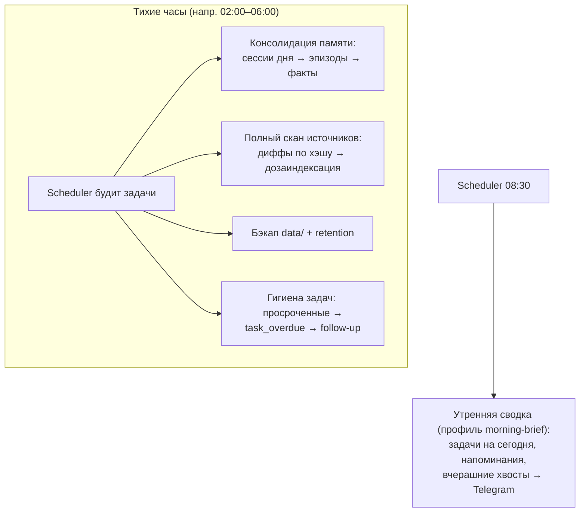

**Ключ:** тяжёлое (консолидация памяти, полная сверка индекса, бэкап) — ночью, когда
CPU свободен и спешить некуда. К утру всё готово, и в 08:30 приходит сводка. Если ночью
ноутбук был выключен — задачи наверстаются при следующем включении.

---

# Глава 13. Производительность

Эта глава — про то, что на твоём железе будет быстрым, что медленным, и *почему*. Без
неё легко ждать от CPU-ноутбука скорости, которой у него быть не может, и разочароваться
на ровном месте. С ней — понимаешь, где узкое горло и на какие рычаги давить.

## 13.1. Простое объяснение

Представь, что вся система — это кухня с одним поваром (твой процессор). Повар один, и
он может делать только одно дело за раз. Есть быстрые операции (достать тарелку из
шкафа — это как поиск в базе) и есть медленные (приготовить сложное блюдо с нуля — это
как подумать языковой моделью). Когда повар готовит блюдо, он не может одновременно
резать салат — поэтому мы выстраиваем очередь и делаем важное (твой диалог) вперёд
фонового (индексация).

Главное, что нужно принять: **самая дорогая операция в системе — это „подумать“
языковой моделью, и на CPU она стоит десятки секунд.** Всё остальное — на фоне этого
почти бесплатно. Поэтому вся оптимизация системы сводится к одному: *звать модель реже
и с более короткими промптами*.

## 13.2. Что делает GPU и что делает CPU (в твоём случае)

Тут важная развилка, и у тебя она предопределена железом.

**В обычной AI-системе** тяжёлые вычисления (перемножение матриц в нейросети) делает
**GPU** (видеокарта) — она создана для тысяч параллельных умножений и делает это в
десятки раз быстрее процессора.

**У тебя дискретного GPU нет.** Есть встроенная Intel Iris Xe, но Ollama её не
использует (она умеет только CUDA/ROCm/Metal — Nvidia/AMD/Apple). Поэтому:

**Всё считает CPU.** И языковую модель, и эмбеддинги, и распознавание речи. Это работает
(7B в Q4 → 3–6 токенов/с генерации), но небыстро. Отсюда все компромиссы проекта.

| Задача | На GPU (если бы был) | На твоём CPU |
|--------|----------------------|--------------|
| Генерация 7B | 30–100+ ток/с | 3–6 ток/с |
| Обработка промпта (prefill) | сотни ток/с | 15–40 ток/с |
| Эмбеддинг корпуса | минуты | часы |

Не расстраивайся: для *личного* ассистента, где ответ за 10–30 секунд приемлем, CPU
достаточно. Мы просто проектируем вокруг его скорости, а не вопреки ей.

## 13.3. Что дорого, что дёшево

Порядки величин на i7-1165G7 — это твоя «карта местности»:

| Операция | Стоимость | Комментарий |
|----------|-----------|-------------|
| **Вызов LLM (chat, 7B)** | 🔴 Очень дорого | Десятки секунд; главный расход. Каждый круг агента = +один вызов |
| **Обработка длинного промпта** | 🔴 Дорого | 2000 токенов ≈ минута только prefill. Отсюда бюджет промпта |
| **Первичная индексация корпуса** | 🔴 Дорого | Часы/ночи; но фоново и разово |
| **Эмбеддинг одного запроса** | 🟡 Средне | Доли секунды–секунды (маленькая модель) |
| **Распознавание голоса (Whisper)** | 🟡 Средне | ~реальное время (10 сек аудио ≈ 10 сек) |
| **Вызов LLM (extraction, 3B)** | 🟡 Средне | Вдвое-втрое быстрее 7B; фоновая роль |
| **Векторный поиск в Qdrant** | 🟢 Дёшево | Миллисекунды даже на большом корпусе (HNSW) |
| **Запрос в SQLite** | 🟢 Дёшево | Миллисекунды |
| **Событие в шине, аудит** | 🟢 Почти бесплатно | Микросекунды |

Вывод, который надо усвоить: **поиск (Qdrant, SQLite) — дёшев; думание (LLM) — дорого.**
Поэтому RAG-ответ (30–45 сек) — это не «поиск медленный», а «модель дважды думала»
(один раз чтобы решить искать, второй — чтобы сформулировать ответ по найденному).

## 13.4. Сколько нужно памяти

Раскладка твоих 16 ГБ RAM в типичный момент:

| Потребитель | Память |
|-------------|--------|
| ОС Windows + твои программы | ~4–6 ГБ |
| LLM (qwen2.5:7b Q4, резидентно) | ~4.5–5 ГБ |
| Эмбеддер (e5-small, in-process) | ~0.3–0.5 ГБ |
| Qdrant embedded (индекс в RAM) | зависит от корпуса, сотни МБ–ГБ |
| Наш процесс (Python + буферы) | ~0.3–0.5 ГБ |
| **Итого** | комфортно для одной 7B-модели |

Отсюда три решения (уже в конфиге): одна LLM в памяти за раз
(`OLLAMA_MAX_LOADED_MODELS=1`); эмбеддер маленький; на большом корпусе — квантование
векторов Qdrant. Модель на 14B не влезла бы комфортно — ещё одна причина остаться на 7B.

## 13.5. Как система масштабируется

Два направления роста, и они по-разному упираются:

**Рост корпуса документов (больше файлов):** Qdrant тянет до ~1 млн чанков на десктопе
(NFR-5: до ~100 тыс. документов). Поиск остаётся быстрым (HNSW почти не зависит от
размера). Упирается в: время первичной индексации (часы→сутки) и RAM под индекс.
Рычаги: квантование векторов, server-режим Qdrant, e5-small вместо bge-m3.

**Рост нагрузки диалогом (больше запросов):** тут упор жёсткий — **один CPU, одна
модель, один пользователь.** Система намеренно *не* рассчитана на параллельные диалоги
(тебе это и не нужно). Фоновое (индексация, память) сериализуется за диалогом. Хочешь
принципиально быстрее — это апгрейд железа (GPU/мини-ПК), а не кода: перенёс `data/` +
конфиг, всё работает (NFR-9).

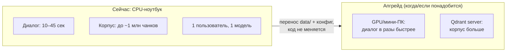

## 13.6. Что делает систему субъективно быстрой

Даже при медленном железе есть приёмы, чтобы *ощущалось* живо (они уже в проекте):
- **Streaming** — ответ печатается по мере генерации, ты не ждёшь молча.
- **Heartbeat** «модель думает…» — видно, что система жива во время долгого prefill.
- **Бюджет промпта** — короткий промпт = быстрее первое слово.
- **Маленькая модель на фон** — извлечение памяти не тормозит следующий диалог.
- **Пауза индексации на диалог** — твой вопрос не ждёт, пока CPU занят фоном.
- **Фильтр инструментов (≤6–8)** — меньше промпт, реже неверный выбор (меньше лишних кругов).

## 13.7. Альтернативы, минусы, решения

**Альтернатива:** облачная модель на роль chat — ответы в разы быстрее и умнее. Против
Local First, но «форточка» есть (явно включить облако на роль). Твоё решение, если
скорость 7B станет невыносимой.

**Скрытые узкие места:** первый ответ после простоя (модель грузится с диска ~5 ГБ);
длинная агентная цепочка (3 инструмента = 3+ вызова LLM = минуты); одновременная тяжёлая
фоновая работа (её и сериализуем).

**Твои решения:** держать ли модель резидентно (`keep_alive`, быстрее отклик ценой RAM);
границы тихих часов; число воркеров индексации; эксперимент с ipex-llm (Iris Xe, ~1.5–2×).

## 13.8. Вопросы, которые возникнут позже

- «Почему RAG-ответ 40 секунд, а поиск „мгновенный“?» — поиск и правда мгновенный;
  время — это два думания модели вокруг него.
- «Можно ли ускорить?» — короче промпт (главный рычаг), меньше кругов агента, ipex-llm,
  в пределе — GPU.
- «Система тормозит, когда работаю в других программах» — CPU делится; тяжёлый фон
  уступает, но чужие программы с ассистентом за CPU конкурируют. Тихие часы — ночью.

---

# Глава 14. Стоимость эксплуатации

«Локально и бесплатно» — правда лишь наполовину. Денег ты почти не платишь, но платишь
*ресурсами*: временем процессора, памятью, местом на диске, электричеством. Эта глава —
честный счёт, чтобы не было сюрпризов.

## 14.1. Простое объяснение

Облачный ChatGPT берёт деньги за каждый запрос, но взамен даёт чужие мощные компьютеры.
Твой локальный ассистент денег за запросы не берёт — но *работает на твоём ноутбуке*,
а значит тратит его ресурсы: греет процессор, занимает память и диск, немного увеличивает
счёт за электричество. Это не «бесплатно», это «оплачено заранее покупкой ноутбука плюс
копейки за свет».

Главная мысль: **основная цена — не деньги, а то, что часть твоего ноутбука постоянно
занята ассистентом.** Разберём, что именно и сколько.

## 14.2. Что работает постоянно, а что — по требованию

Это ключевое разделение для понимания расхода ресурсов:

| Компонент | Режим | Расход |
|-----------|-------|--------|
| **Наш процесс (sba)** | Постоянно (сервис) | ~0.3–0.5 ГБ RAM, почти 0% CPU в простое |
| **Ollama (сервис)** | Постоянно слушает | Почти 0% CPU в простое |
| **LLM в памяти** | Постоянно, если `keep_alive` | ~5 ГБ RAM; 0% CPU, пока не спросили |
| **Telegram polling** | Постоянно | Ничтожный трафик, ~0% CPU |
| **Watcher файлов** | Постоянно | Почти 0% CPU (реагирует на события) |
| **Вызов LLM** | По требованию | 🔴 100% CPU на десятки секунд |
| **Индексация** | По требованию/ночью | 🔴 высокий CPU, но фоново и с паузами |
| **Whisper (голос)** | Только при голосовом | 🟡 CPU на время распознавания |
| **Ночные джобы** | По расписанию | 🔴 CPU ночью (консолидация, бэкап, скан) |

Вывод: **в простое система почти ничего не ест** (немного RAM под резидентную модель,
ноль CPU). Дорого становится только в моменты работы — и эти моменты мы разводим по
времени (диалог сейчас, тяжёлое ночью).

## 14.3. Счёт по ресурсам

**По времени (твоего внимания):** после установки — почти ноль. Цель проекта (Sprint
10) — «поставил и забыл»: сервис-режим с автоперезапуском, самоотчёт в Telegram при
проблемах. Разово: установка, создание бота, первичная индексация (идёт сама).

**По памяти (RAM):** ~10 ГБ из 16 в рабочем состоянии (ОС + модель + индекс + процесс),
остальное — тебе. Комфортно, пока не запускаешь тяжёлые программы одновременно с
большим диалогом. Рычаг: выгружать модель (`keep_alive` короче) ценой скорости отклика.

**По процессору (CPU):** 0% в простое, 100% на время думания/индексации. Именно поэтому
диалог и фон сериализованы — чтобы 100% не наложились и не подвесили всё.

**По диску:** прикидка для среднего личного корпуса:

| Что | Место |
|-----|-------|
| Модели Ollama (7B + 3B) | ~6–8 ГБ |
| Эмбеддер, Whisper | ~1–2 ГБ |
| SQLite (память, задачи, история, аудит) | десятки–сотни МБ |
| Qdrant индекс (зависит от корпуса) | ~4 ГБ на 1 млн чанков (dense) + sparse + текст |
| Кэш извлечённого текста | пропорционально корпусу |
| Бэкапы (7d+4w) | кратно размеру data/ |
| **Итого** | единицы–десятки ГБ |

У тебя ~113 ГБ свободно — достаточно, но за ростом (OCR-кэш, бэкапы, большой корпус)
надо следить; retention бэкапов и вычистка логов держат это в узде.

**По электроэнергии:** существенно только в моменты 100% CPU. Ноутбук под полной
нагрузкой — десятки ватт; в простое — единицы. За месяц активного использования — это
единицы киловатт-часов, то есть *копейки*. Практически незаметно в счёте за свет. Важнее
не деньги, а что под нагрузкой ноутбук греется и шумит вентилятором — заметно при долгой
индексации (ещё повод делать её ночью).

## 14.4. Сравнение с облаком (чтобы видеть картину)

| | Локальный (наш) | Облачный (ChatGPT API) |
|--|-----------------|------------------------|
| Деньги за запрос | 0 | платишь за токены |
| Железо | твой ноутбук (уже есть) | чужое |
| Приватность | данные не уходят | данные у провайдера |
| Скорость | десятки секунд (CPU) | секунды |
| Качество модели | 7B (скромное) | топовое |
| Работает офлайн | да (кроме TG) | нет |
| Эксплуатация | твоя забота | их забота |

Наш выбор оплачен принципом Local First: приватность и независимость важнее скорости и
качества модели. Деньги экономятся, ресурсы ноутбука тратятся.

## 14.5. Плюсы, минусы, решения, поздние вопросы

**Плюсы:** нет абонентки и оплаты за токены; предсказуемая стоимость (ты уже купил
ноутбук); почти ноль расхода в простое.

**Минусы (скрытые):** часть RAM всегда занята; под нагрузкой ноутбук греется/шумит/ест
батарею; растущий корпус ест диск; «бесплатно» не значит «без ресурсов».

**Твои решения:** держать модель резидентно или выгружать (RAM против скорости); где
хранить бэкапы (внешний диск — безопаснее); retention (глубина истории против места);
на батарее ли гонять тяжёлое (лучше от сети — индексация сажает аккумулятор).

**Поздние вопросы:** «ноутбук греется по ночам» — это ночные джобы; сдвинь тихие часы
или убедись, что он на зарядке; «мало места» — почисти OCR-кэш, ужми retention, следи
за ростом Qdrant; «жрёт батарею» — тяжёлое лучше от сети, `keep_alive` короче в
автономе.

---

# Глава 15. FAQ

Большой список вопросов, которые задаёт новичок (и ты через полгода). Сгруппированы по
темам. Многие отвечены подробнее в соответствующих главах — здесь короткие ответы со
ссылками.

## Модели и LLM

**Что будет, если заменить модель?** Меняешь строчку в `config/models.yaml` (роль →
новая модель), перезапускаешь. Код не трогается (NFR-9). Нюанс: если менял *эмбеддер*
(роль embedding) — нужна переиндексация, потому что старые векторы несовместимы с новой
моделью (глава 6). Смена *чат*-модели переиндексации не требует.

**Можно ли иметь несколько моделей одновременно?** Да, у нас уже так: 7B на диалог, 3B
на фон (роли в конфиге). Но в *памяти* держится одна за раз (16 ГБ RAM); переключение
дешёвое. Держать 7B и 3B резидентно вместе — не влезет комфортно.

**Модель выдумывает / врёт про сделанное.** Классика qwen2.5 7B. В проекте встроены
защиты (маркеры 🔧, чистка выдуманных строк, дедуп, принудительный tool_choice — глава
3). Проверяй `/audit`: был ли реальный вызов инструмента. Проектируй новое с недоверием
к модели.

**Почему первый ответ медленный?** Модель грузится с диска в RAM (~5 ГБ). Дальше, пока
`keep_alive` не истёк, быстрее (глава 2, 13).

**Можно ли сделать быстрее?** Короче промпт (главный рычаг), меньше кругов агента,
эксперимент ipex-llm (Iris Xe), в пределе — GPU/другое железо (глава 13).

**Можно ли потом перейти в облако?** Да. OpenAI-совместимый API означает, что облачную
модель можно назначить на роль в конфиге (явно, по умолчанию выключено). Архитектура
это предусматривает (глава 2, ADR-5).

## Хранение и данные

**Можно ли хранить всё в SQLite?** Всё *структурированное* — да, и мы так делаем. Но
векторный поиск на миллион чанков — не для SQLite; смысловой поиск отдан Qdrant. Сплит
осознан (глава 6, 11).

**Что будет, если удалить индекс?** Данные (память, задачи, история) целы — они в
SQLite. Теряется только поиск по документам. Лечится переиндексацией (`scripts/reindex.py`).
Оригиналы файлов не затрагиваются (глава 5, 11).

**Что будет при обновлении ОС?** Само по себе — ничего, `data/` и конфиг на месте.
Возможные хлопоты: путь к Ollama/сервису, права доступа. Сервис-режим переустановить
скриптом (`scripts/install_service_windows.ps1`) при необходимости.

**Как перенести на новый компьютер?** Скопировать `data/` + `config/`, поставить код и
Ollama, скачать модели. Всё состояние переедет (глава 11).

**Данные точно никуда не уходят?** Единственный внешний трафик — Telegram API (твои
сообщения между твоими устройствами) и явно включённые коннекторы (web-поиск и т.п. —
по умолчанию выключены, через allowlist хостов). Всё остальное — локально (глава 8,
требование FR-9.1).

**Нужно ли шифровать диск?** Открытый вопрос Q-7. Если ноутбук уже под BitLocker — весь
диск зашифрован, базово достаточно. Опция: SQLCipher для SQLite + шифрование бэкапов.
Твоё решение по риск-профилю (глава 11).

## Каналы

**Можно ли отказаться от Telegram?** Да. Есть локальный web-чат и консоль (те же тонкие
адаптеры к Router). Потеряешь мобильность («пишу откуда угодно»), но всё остальное
работает. Telegram — единственный внешний канал; убрав его, получишь полностью офлайн-
систему, доступную только за этим компьютером (глава 8).

**Нужен ли сервер / белый IP для Telegram?** Нет. Long polling: твой ноутбук сам
опрашивает Telegram исходящими запросами. Никаких входящих соединений (глава 8).

**Ноутбук был выключен — сообщения потерялись?** Нет, Telegram хранит их несколько
дней; при запуске Gateway заберёт накопленное (глава 8).

## Память и задачи

**Ассистент забыл, что я говорил на прошлой неделе.** До Sprint 7 (авто-консолидация)
между сессиями хранятся *факты* (если сказал «запомни» или система извлекла), но не
весь разговор автоматически. Явное «запомни» сохраняется точно (глава 4).

**Он вспомнил устаревшее.** Проверь `superseded_by` — возможно, старый факт не вытеснен.
Скажи «забудь X» или поправь; память решений хранит и историю, и актуальное (глава 4).

**Напоминание не сработало.** Ноутбук был включён в тот момент? Если выключен — придёт
при следующем включении (в пределах misfire_grace) или попадёт в утреннюю сводку.
Локальный ассистент не напомнит, пока его «мозг» спит (глава 9).

**Пришло дважды.** Не должно (идемпотентность по `reminder_log`). Если случилось — баг
фиксации доставки, смотри лог (глава 9).

## Документы и поиск

**Загрузил файлы — почему не сразу в поиске?** Очередь + фоновая индексация в паузах;
на CPU это минуты. «В течение минут» — заложенный критерий (глава 5, 7).

**Переименовал/переместил — всё переиндексируется?** Нет: хэш тот же → правятся только
пути, векторы остаются. Дёшево (глава 7).

**Поиск находит нерелевантное / не находит точный номер.** Возможно: не тот эмбеддер
для языка, крупные чанки, нужен гибрид/reranker. Точные номера — это sparse-компонент
гибридного поиска (глава 6).

**Нашёл старую версию документа.** Проверь, обновился ли индекс после правки (хэш); при
сомнении — `reindex.py` (глава 5, 7).

## Архитектура и разработка

**Как добавить свой инструмент?** Функция + `ToolSpec` в `tools.py` модуля. Ядро и
каналы не трогаются (глава 10).

**Как добавить новый источник данных / канал?** Источник — экстрактор в
`indexer/extractors/` + конфиг. Канал — адаптер в `channels/`. Ядро не меняется (глава
10).

**import-linter ругается при сборке.** Ты нарушил границу модуля (импорт в обход
интерфейса). Это фича, а не баг: смотри, какой импорт лишний, и общайся через интерфейс
или событие (глава 10).

**Можно ли вынести модуль в отдельный процесс?** Да, заложено: модуль общается только
через интерфейс, оборачивается в MCP-сервер. На одной машине обычно не нужно, но путь
роста есть (глава 10).

**Почему не LangChain / микросервисы?** Комбайны — протекающие абстракции + breaking
changes; микросервисы — вся цена, ноль выгоды на одной машине. Модульный монолит —
слабая связанность без цены распределённости (глава 10, ADR-1).

## Эксплуатация

**Ноутбук греется/шумит по ночам.** Ночные джобы (консолидация, бэкап, скан). Сдвинь
тихие часы или держи на зарядке (глава 14).

**Мало места на диске.** Почисти OCR-кэш, ужми retention бэкапов, следи за ростом
Qdrant (глава 14).

**Ollama пишет `bind: Only one usage of each socket address`.** Не поломка: Ollama уже
работает сервисом и слушает порт. `ollama serve` вручную не нужен (глава 2).

**Что если процесс упадёт?** Сервис-режим (NSSM/systemd) с автоперезапуском; очередь
индексации и задания планировщика переживают рестарт (в SQLite); диалог продолжится
(глава 9, 13).

## Файлы, которые я «загружу» ассистенту — что он не сможет прочитать?

Раз ты в промпте упоминал ограничения на чтение файлов — важная честная оговорка про
*будущую* работу с документами:

- **Сканы и фото без OCR** (картинка текста) — до Sprint 8 не читаются как текст.
  Решение: включить OCR (Sprint 8) или прислать текстовую версию.
- **Кривые/защищённые PDF** — текст может извлекаться плохо или никак (пароль, хитрая
  вёрстка). Решение: OCR-fallback (Sprint 8), либо пересохранить/расшифровать PDF.
- **Экзотические форматы** (редкие CAD, проприетарные) — нет экстрактора. Решение:
  экспорт в PDF/txt/MD.
- **Очень большие файлы** — отсекаются порогом. Решение: разбить, или поднять порог в
  конфиге осознанно.
- **Зашифрованные архивы** — не индексируются. Решение: распаковать в whitelisted папку.

Если ассистент чего-то «не видит» в документе — почти всегда дело в станции извлечения
текста (глава 5): либо формат без экстрактора, либо картинка без OCR. Диагностика:
загляни в `data/files_cache/` — если там пусто для файла, текст не извлёкся.

---

# Глава 16. Глоссарий

Словарь терминов проекта простым языком. Отсортирован по алфавиту (латиница, потом
кириллица). Возвращайся сюда, встретив незнакомое слово.

**Agent (Агент)** — LLM, которой дали инструменты, память и цикл, чтобы она не только
отвечала, но и *действовала*. Мозг + руки + записная книжка (глава 1, 3).

**Agent loop (Агентный цикл)** — повторяющийся круг «модель сказала → система сделала →
модель посмотрела на результат → сказала снова», пока задача не решена. Сердце системы
(глава 3).

**API** — «розетка»: договорённость о форме запроса/ответа, чтобы программы стыковались
(глава 2).

**BM25** — классический алгоритм поиска по ключевым словам (не по смыслу). Sparse-
компонент гибридного поиска; ловит точные слова, номера, коды (глава 6).

**Chunk (Чанк)** — кусок документа (~500–800 токенов), на которые режется файл при
индексации. Единица поиска (глава 5).

**Chunking (Чанкинг)** — процесс нарезки документа на чанки, желательно структурно (по
заголовкам, страницам), с перекрытием (глава 5).

**Confidence (Уверенность)** — вес факта в памяти: 1.0 для явно сказанного, 0.6–0.9 для
извлечённого моделью. Защищает от мусора (глава 4).

**Context / Context window (Контекст)** — «рабочий стол» на один вызов модели: промпт +
ответ, ограниченный по размеру. **Не** память: стирается после вызова (глава 2, 4).

**Dense vector (Плотный вектор)** — эмбеддинг, кодирующий смысл текста числами. Ищет по
смыслу (глава 6).

**Embedding (Эмбеддинг)** — список чисел (координат на «карте смыслов»), в который
превращается текст, чтобы искать по смыслу через расстояние между точками (глава 6).

**Event Bus (Событийная шина)** — «доска объявлений» внутри программы: модули вешают
события, другие реагируют. Для реакций «после» (глава 10).

**FAISS** — библиотека быстрого поиска соседей-векторов. Только поиск, без CRUD и
метаданных; отвергнута в пользу Qdrant (глава 6).

**Feature flag (Флаг функции)** — переключатель в конфиге: включить/выключить модуль
без правки кода (глава 3, 10).

**FTS5** — полнотекстовый поиск в SQLite. Сейчас на нём работает поиск по фактам памяти
(с префиксным матчингом под русскую морфологию), до переезда на векторы в Sprint 4
(глава 4).

**Hybrid search (Гибридный поиск)** — dense (смысл) + sparse (слова), слитые через RRF.
Точнее чистой семантики на ру/en и точных терминах (глава 6).

**HNSW** — алгоритм быстрого приближённого поиска ближайших векторов в Qdrant.
«Сеть дорог» между векторами (глава 6).

**Indexer (Индексатор)** — модуль, следящий за файлами и держащий индекс актуальным:
watcher, очередь, извлечение, чанкинг, эмбеддинг, каталог (глава 5, 7).

**Index (Индекс)** — умный «указатель» на твои документы: векторы чанков + метаданные.
Не копия файлов, а способ быстро искать по ним (глава 5, 6).

**LLM (Large Language Model, большая языковая модель)** — функция «текст → продолжение
текста», обученная на массиве текстов. Речевой центр ассистента; сама по себе без
памяти и действий (глава 1, 2).

**Local First** — принцип: всё локально, данные не уходят, входящих соединений нет.
Определяет половину архитектуры (глава 1, 8).

**Long polling (Длинный опрос)** — способ получать сообщения Telegram исходящими
запросами (ноутбук сам спрашивает «есть новое?»). Не нужен сервер/белый IP (глава 8).

**MCP (Model Context Protocol)** — «USB для инструментов»: стандарт, чтобы подключать
готовые серверы инструментов и публиковать свои. Работает в обе стороны (глава 3, 10).

**mtime** — время последнего изменения файла; вместе с хэшем помогает понять, менялся
ли файл (глава 5, 7).

**Ollama** — рантайм (движок запуска) локальных моделей; твой выбор. Скачивает модели,
даёт OpenAI-совместимый API, работает сервисом (глава 2).

**OpenAI-совместимый API** — де-факто стандартный формат общения с LLM; на нём говорят
Ollama, LM Studio и облачные модели. Делает рантайм заменяемым (глава 2).

**Orchestrator (Оркестратор)** — код, крутящий agent loop: вызывает модель, исполняет
инструменты, следит за лимитами и риском (глава 3, 10).

**Payload** — метаданные, хранимые рядом с вектором в Qdrant (путь, страница, тип,
дата, проект). По ним фильтруется поиск (глава 6).

**Planner (Планировщик действий)** — шаг, где модель строит план из нескольких пунктов.
У нас *явного* нет (вредит слабой 7B); используем пошаговый ReAct (глава 3). Не путать с
Scheduler.

**Polling** — см. Long polling.

**Prefill** — стадия «прочтения» промпта моделью перед генерацией. На CPU ~15–40 ток/с;
длинный промпт → долгий prefill (глава 2, 13).

**Qdrant** — векторная база данных; наш выбор. Embedded (файлы) → server (тот же API),
нативный гибрид, богатые фильтры, named vectors (глава 6).

**RAG (Retrieval-Augmented Generation)** — «генерация с опорой на поиск»: сначала найти
релевантные куски документов, потом дать их модели, чтобы отвечала по ним, а не
выдумывала (глава 5, 6).

**ReAct (Reason + Act)** — шаблон «рассуждай и действуй»: модель чередует размышление и
вызовы инструментов. Наш способ мышления агента (глава 3).

**Reranker (Переранжировщик)** — модель, уточняющая порядок топ-результатов поиска.
Точнее, но +секунды на CPU; по умолчанию выключен (глава 6).

**Retriever / Retrieval (Извлечение/поиск)** — компонент/процесс поиска релевантного
(документов в RAG, фактов в памяти) под текущий запрос. Память — это retrieval-задача,
а не «большой промпт» (глава 4, 6).

**Router (Маршрутизатор)** — «секретарь на входе»: нормализует сообщения из любого
канала, ведёт сессии, доставляет ответы. Развязывает каналы и мозг (глава 8, 10).

**RRF (Reciprocal Rank Fusion)** — способ слить результаты dense и sparse поиска в один
рейтинг (глава 6).

**RRULE** — стандартная строка описания повторений («каждый понедельник» →
`FREQ=WEEKLY;BYDAY=MO`). LLM переводит фразу в RRULE, код исполняет (глава 9).

**Runtime (Рантайм, движок инференса)** — программа, запускающая модель (Ollama, LM
Studio, vLLM). У тебя — Ollama (глава 2).

**Scheduler (Планировщик задач по времени)** — «надёжный будильник»: APScheduler +
SQLite, срабатывает по времени, публикует события. Переживает перезапуск. Не путать с
Planner (глава 9).

**Sparse vector (Разреженный вектор)** — представление для поиска по ключевым словам
(BM25). Ловит точные термины (глава 6).

**SQLite** — встраиваемая СУБД (один файл, без сервера) для всего структурированного:
история, память, задачи, аудит, каталог. Наш выбор для реляционных данных (глава 11).

**structured output (Структурированный вывод)** — ответ модели в строгом формате (JSON
по схеме) с валидацией и retry. Для парсинга дат, извлечения фактов (глава 3, 9).

**Token (Токен)** — кусочек текста (примерно слово или часть слова), которыми оперирует
модель. Скорость меряется в токенах/с, длина промпта — в токенах (глава 2).

**Tool (Инструмент)** — функция, которую модель может *попросить* выполнить (найти файл,
создать задачу). Модель не исполняет сама — просит систему (глава 3).

**Tool Calling (Вызов инструментов)** — механизм, которым модель вместо текста выдаёт
структурированный вызов функции (глава 3).

**Tool Registry (Реестр инструментов)** — единый учёт инструментов: регистрация, выдача
по фильтрам, исполнение с валидацией, аудитом и уровнями риска (глава 3, 10).

**Vector Database (Векторная база)** — хранилище эмбеддингов с быстрым поиском по
похожести. У нас Qdrant (глава 6).

**Watcher (Наблюдатель)** — компонент, слушающий события файловой системы (создан/изменён/
удалён) для реакции за секунды. Дополнен периодическим сканом (глава 5, 7).

**Webhook** — способ получать сообщения входящими соединениями (Telegram стучится к
тебе). Требует белого IP; **не** наш выбор (у нас long polling) (глава 8).

**Whisper (faster-whisper)** — модель распознавания речи (голос → текст), роль `stt`,
in-process на CPU (глава 8).

**Аудит (Audit log)** — неизменяемая (append-only) летопись действий: входящие, вызовы
инструментов, напоминания. Отвечает на «что ты делал вчера?» (глава 10).

**Каталог файлов (files)** — таблица в SQLite (path, hash, mtime, статус) — источник
истины о том, что и как проиндексировано. Основа инкрементальности (глава 5, 7).

**Консолидация** — «сон» ассистента: ночью сессии → эпизоды → факты; наведение порядка
в памяти (глава 4).

**Модульный монолит** — один процесс с жёсткими границами модулей. Наш архитектурный
выбор: слабая связанность без цены микросервисов (глава 10).

**Хэш содержимого** — короткий отпечаток файла: одинаковое содержимое → одинаковый хэш.
Отличает «переехал» от «изменился», основа дешёвой переиндексации (глава 7).

**Эмбеддер** — модель, превращающая текст в эмбеддинг (e5-small или bge-m3, in-process).
Отдельная от чат-модели (глава 6).

---

## Заключение: как пользоваться этой книгой дальше

Ты дочитал. Теперь у тебя есть цельная карта системы — от «что вообще такое агент» до
того, сколько ватт ест ночная индексация. Несколько советов, как держать эту книгу
живой:

1. **Возвращайся по оглавлению.** Застрял в разработке на RAG — перечитай главы 5–7.
   Спорите с LLM про память — глава 4. Это справочник, а не роман: читать заново целиком
   не нужно.
2. **Дополняй её.** Когда в спринте всплывёт решение, которого тут нет, — допиши абзац в
   нужную главу. Книга должна расти вместе с системой (для *формальных* решений заводи
   ADR в `docs/adr/`, а сюда — человеческое объяснение «почему»).
3. **Сверяйся с реальностью.** Эта книга отражает состояние на конец Sprint 3 и планы
   дальше. Что *реально* сделано и где отступили от плана — всегда смотри в
   `docs/06-roadmap.md` (чек-лист внизу) и в коде. Если книга и код разойдутся — прав
   код, а книгу поправь.
4. **Держи в голове три сквозные идеи**, которые повторялись из главы в главу:
   - **Интеллект отдельно, исполнение отдельно.** LLM понимает и решает; надёжный код
     делает. Напоминания, файлы, даты — везде так.
   - **Слабая модель — проектируй с недоверием.** Короткие промпты, валидация, проверка
     «а вправду ли сделал», защиты от галлюцинаций.
   - **CPU-железо диктует форму.** Одна модель в памяти, бюджет промпта, фон уступает
     диалогу, тяжёлое — ночью. Половина решений — отсюда.

Следующий шаг проекта — Sprint 4 (RAG). Теперь ты понимаешь его целиком: главы 5, 6, 7
— это ровно то, что в нём предстоит построить. Удачи, и пусть твоя «вторая голова»
получится такой, как ты задумал.

