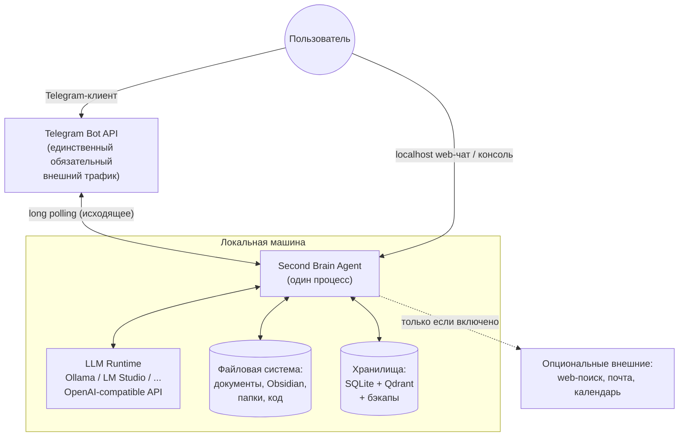
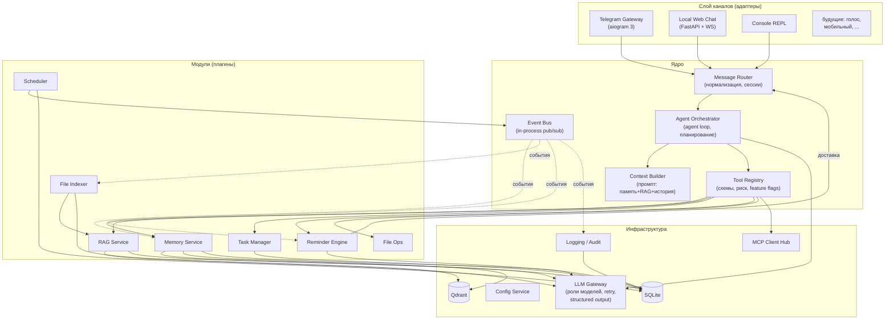
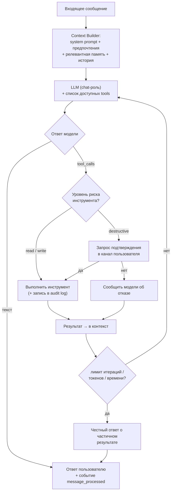
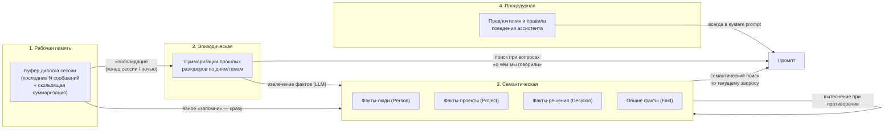
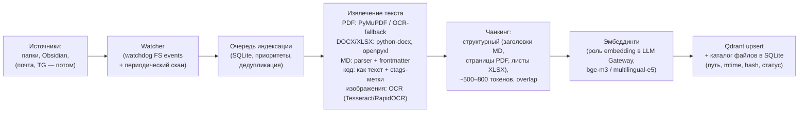
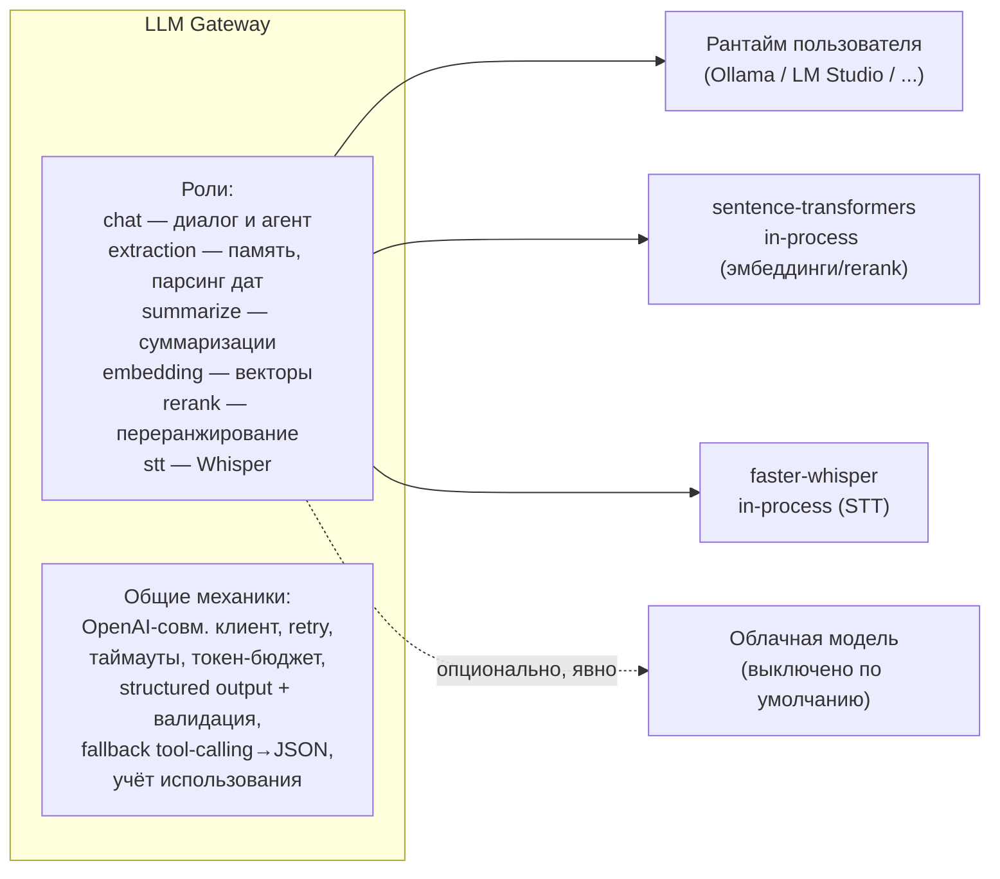

# Этапы 2–3. Архитектура: варианты, выбор, устройство системы

---

## 1. Варианты архитектуры (Этап 2)

Рассматривались три реалистичных варианта верхнего уровня и один «анти-вариант».

### Вариант A. Набор скриптов + готовый фреймворк-комбайн

Быстро собрать на LangChain/LlamaIndex + готовый Telegram-бот, всё в одном скрипте с цепочками.

### Вариант B. Микросервисы

Каждый сервис (LLM Gateway, RAG, Memory, Tasks, Telegram…) — отдельный процесс, общение через HTTP/gRPC + брокер (Redis/NATS), оркестрация Docker Compose.

### Вариант C. Модульный монолит с событийной шиной и плагинами ⭐

Один Python-процесс (`asyncio`). Жёсткие границы модулей: каждый модуль — пакет со своим публичным интерфейсом (Protocol), своими таблицами и своим конфигом. Связь — DI-контейнер (прямые вызовы интерфейсов) + внутренняя событийная шина для асинхронных реакций. Инструменты агента — плагины поверх модулей. Внешние интеграции — через MCP. Любой модуль выносится в отдельный процесс при необходимости, потому что общается только через интерфейс.

### Сравнение

| Критерий | A. Скрипты/комбайн | B. Микросервисы | C. Модульный монолит |
|----------|:--:|:--:|:--:|
| Скорость первого результата | ✅ дни | ❌ недели | ✅ ~неделя |
| Эксплуатация одним человеком на Windows | 🟡 | ❌ (компоуз, брокер, N процессов) | ✅ один сервис |
| Слабая связанность | ❌ | ✅ | ✅ (дисциплиной интерфейсов) |
| Горизонт 3–5 лет без переписывания | ❌ | ✅ | ✅ |
| Отключаемость модулей (принцип Modular) | ❌ | ✅ | ✅ (feature flags в конфиге) |
| Стоимость добавления канала/инструмента | 🟡 | 🟡 (новый сервис + деплой) | ✅ (новый пакет + регистрация) |
| Отладка / трассировка | ✅ | ❌ (распределённая) | ✅ |
| Потребление ресурсов | ✅ | ❌ | ✅ |
| Риск деградации в «большой шар грязи» | ❌ высокий | ✅ низкий | 🟡 средний — купируется правилами границ |
| Зависимость от чужого фреймворка | ❌ высокая (LangChain API нестабилен) | — | ✅ ядро своё, библиотеки — на краях |

**Выбор: Вариант C.**

Почему не A: комбайны дают быстрый прототип, но их абстракции протекают ровно там, где у нас специфика (модель памяти, уровни риска инструментов, локальные модели со слабым tool calling), а breaking changes LangChain — постоянный налог. Библиотеки используем точечно (парсеры документов, клиенты), но ядро агента — своё и маленькое (~300 строк цикла).

Почему не B: вся ценность микросервисов (независимый деплой командами, независимое масштабирование) на личной машине отсутствует, а вся цена (сеть, сериализация, оркестрация, распределённая отладка) — остаётся. Требование «не монолит» в исходной постановке на самом деле означает «не сильносвязанный ком» — модульный монолит решает именно это.

Правила, удерживающие границы модулей (проверяются линтером `import-linter` в CI):

1. Модуль импортирует другой модуль **только** через его `interface.py` (Protocol) либо общается событием.
2. Таблицы БД принадлежат одному модулю; чужие таблицы читать нельзя.
3. Ядро (`core/`) не знает ни об одном модуле; модули не знают о каналах (Telegram и т.д.).
4. Всё I/O — async; блокирующие операции (OCR, парсинг) — в worker-пуле.

---

## 2. Общая архитектура (Этап 3)

### 2.1. Контекстная диаграмма (C4 level 1)



Ключевое следствие Local First: **входящих соединений нет вообще** — Telegram работает через long polling (исходящее соединение), web-чат слушает только `127.0.0.1`.

### 2.2. Компонентная диаграмма (C4 level 2)



Принципиальные линии:

- **Каналы ничего не знают об агенте** — только о Router (нормализованное сообщение туда, ответ/уведомление обратно). Добавление голоса или mobile = новый адаптер, ядро не меняется (FR-1.4).
- **Агент видит модули только как инструменты** из Tool Registry. Модуль «выключен» = его инструменты не зарегистрированы, всё остальное работает.
- **Reminder Engine доставляет через Router**, а не напрямую в Telegram — поэтому напоминания автоматически появятся в любом будущем канале.
- **Event Bus** — для реакций «после»: `message_processed` → Memory извлекает факты; `file_changed` → Indexer ставит в очередь; `task_overdue` → Reminder создаёт follow-up. Модули не вызывают друг друга напрямую по цепочке.

### 2.3. Agent loop (сердце системы)

Собственный цикл (~300 строк), стандартный OpenAI tool-calling формат:



Особенности под **локальные модели** (П-2):

- Если модель не поддерживает нативный tool calling — Gateway прозрачно переключается в режим «JSON в ответе» (промпт-инструкция + Pydantic-валидация + retry до 3 раз).
- Никаких гигантских промптов: Context Builder держит бюджет токенов на секции (история / память / RAG) и режет по приоритету.
- Сложные операции («объедини похожие задачи») — не один вызов, а мини-пайплайн из простых вызовов со structured output.

---

## 3. Модель памяти

Собственная модель: **4 слоя × структурированные типы фактов**, с фоновой консолидацией
(аналогия с человеческой памятью: рабочая → эпизодическая → семантическая, с «сном» как консолидацией).



### Хранение

| Слой | Где | Формат |
|------|-----|--------|
| Рабочая | SQLite `conversations`, `messages` | Полные сообщения + rolling summary |
| Эпизодическая | SQLite `episodes` + вектор в Qdrant `memory` | Суммаризация с датой, темами, участниками |
| Семантическая | SQLite `memory_facts` + вектор в Qdrant `memory` | Типизированные записи (см. ниже) |
| Процедурная | SQLite `preferences` | Ключ-значение + текстовые правила |

Семантический факт — типизированная запись:

```
MemoryFact:
  id, user_id, type: person|project|decision|fact
  subject        # "Иван Петров", "проект Экспедиция-2026"
  content        # само знание, 1-3 предложения
  project_id?    # привязка к проекту (память проектов = фильтр)
  source         # msg id / документ / "explicit"
  confidence     # explicit=1.0, extracted=0.6-0.9
  created_at, updated_at, superseded_by?   # факты не удаляются, а вытесняются
```

Принципы:

- **Память проектов** — не отдельное хранилище, а фильтр `project_id` поверх фактов, эпизодов и документов. Активный проект определяется контекстом разговора и влияет на retrieval.
- **Противоречия**: новый факт о том же subject не затирает старый, а ставит `superseded_by` — история решений сохраняется («мы решили X, потом передумали на Y»).
- **Извлечение** (FR-3.7) — фоновая LLM-задача (роль `extraction`, маленькая модель) по событию `message_processed` и ночной консолидацией; никогда не блокирует диалог.
- **Забывание**: явное «забудь» помечает факт retracted (мягкое удаление, вычищается из retrieval сразу, физически — политикой хранения).

---

## 4. RAG и индексация

### 4.1. Выбор векторного хранилища

| Критерий | Chroma | Qdrant | FAISS | LanceDB | SQLite (sqlite-vec) | PostgreSQL + pgvector |
|----------|:--:|:--:|:--:|:--:|:--:|:--:|
| Работа без отдельного сервера | ✅ | ✅ (embedded-режим в Python) | ✅ (библиотека) | ✅ | ✅ | ❌ сервер |
| Гибридный поиск (dense + sparse/BM25) | 🟡 частично | ✅ нативно | ❌ сам пиши | ✅ (FTS + вектор) | 🟡 руками (FTS5 + RRF) | 🟡 расширениями |
| Фильтры по метаданным (тип, дата, папка, проект) | 🟡 базовые | ✅ богатые, индексируемые | ❌ | ✅ | 🟡 SQL, но вручную с вектором | ✅ SQL |
| Масштаб до ~1 млн чанков на десктопе | 🟡 | ✅ (HNSW + квантование) | ✅ | ✅ | 🟡 предел ~сотни тысяч | ✅ |
| Инкрементальные update/delete по id | ✅ | ✅ | ❌ (пересборка) | ✅ | ✅ | ✅ |
| Снапшоты/бэкапы | 🟡 | ✅ штатные снапшоты | ❌ | ✅ (файлы + версии) | ✅ (файл) | 🟡 pg_dump |
| Named vectors (разные эмбеддеры рядом) | ❌ | ✅ | ❌ | 🟡 | ❌ | 🟡 |
| Windows без Docker | ✅ | ✅ (embedded; сервер — бинарник) | ✅ | ✅ | ✅ | 🟡 инсталлятор |
| Путь роста (сервер, реплики, GPU) | 🟡 | ✅ тот же API embedded→server | ❌ | 🟡 | ❌ | ✅ |
| Зрелость/темп развития | 🟡 | ✅ | ✅ (но низкоуровневый) | 🟡 моложе | 🟡 молодой | ✅ |

**Выбор: Qdrant.** Решающие аргументы:

1. **Один и тот же клиентский API** в embedded-режиме (`QdrantClient(path=...)` — файлы на диске, нулевая эксплуатация, идеально для старта на Windows) и в server-режиме (когда корпус вырастет или захочется вынести на домашний сервер). Миграция = снапшот + смена URL в конфиге. Это ровно NFR-1/NFR-9.
2. **Гибридный поиск нативно** (dense + sparse BM25/SPLADE с RRF-fusion) — критично для смешанного ру/en корпуса и точных терминов (имена, коды, номера), где чистая семантика проваливается (FR-2.4).
3. **Богатые payload-фильтры** — «найди в PDF из папки X за прошлый год по проекту Y» выражается штатно.
4. Named vectors — смена эмбеддинг-модели без сноса коллекции (переиндексация рядом, атомарное переключение).

FAISS отвергнут как библиотека без CRUD и метаданных (пришлось бы строить свою БД вокруг); Chroma — слабее фильтры и нет пути роста; LanceDB — сильный кандидат № 2, но моложе и слабее гибридный поиск; SQLite-vec хорош как «нулевая» опция, но упирается в масштаб и ручной гибрид; pgvector тянет за собой Postgres-сервер — неоправданно для одного пользователя.

### 4.2. Пайплайн индексации



- Каталог файлов в SQLite (`files`: path, content_hash, mtime, chunks) — источник истины: диффы по хэшу, дубликаты (FR-6.3) — по этому же хэшу, «почти дубликаты» — по векторной близости документов.
- Obsidian-коннектор дополнительно сохраняет wikilinks и теги в payload → «найди связанные заметки».
- Retrieval-конвейер: гибридный запрос (dense+sparse, RRF) → top-50 → опциональный локальный reranker (bge-reranker-v2-m3) → top-8 в контекст с цитированием источников (путь + страница/заголовок).

---

## 5. Инструменты и MCP

### 5.1. Tool Registry

Каждый инструмент — декларация:

```
ToolSpec:
  name, description          # то, что видит LLM
  args_schema                # Pydantic → JSON Schema
  risk: read | write | destructive
  module                     # владелец (для feature flags)
  handler                    # async-функция ИЛИ ссылка на MCP-тул
```

- Registry отдаёт агенту только инструменты включённых модулей (+ фильтр по контексту: в «утренней сводке» не нужны файловые операции — меньше промпт, меньше ошибок выбора у локальной модели).
- `destructive` перехватывается оркестратором → подтверждение (см. agent loop).
- Каждый вызов пишется в audit log до и после исполнения.

Базовый набор: `search_documents`, `read_document`, `list_files`, `move_file`, `copy_file`, `rename_file`, `archive_files`, `find_duplicates`, `create_task`, `update_task`, `complete_task`, `search_tasks`, `create_reminder`, `remember_fact`, `recall`, `forget`, `web_search`*, `open_in_obsidian`* (* — опциональные).

### 5.2. Стратегия MCP

MCP используется в обе стороны:

| Роль | Что | Зачем |
|------|-----|-------|
| **MCP-клиент** (MCP Client Hub) | Подключение готовых серверов: `filesystem` (как альтернативный бэкенд File Ops), `git`, `fetch`/`brave-search`, obsidian-mcp, календарь (CalDAV) | Не писать чужое: интеграции берём готовыми, конфигом |
| **MCP-сервер** (свой, отдельный entrypoint) | Экспорт наших инструментов: `memory`, `rag_search`, `tasks` | Тот же мозг доступен из Claude Desktop / других MCP-клиентов; и это готовый путь выноса модуля в отдельный процесс |

MCP-тулы из подключённых серверов попадают в тот же Tool Registry с тем же механизмом риска и feature flags — для агента они неотличимы от внутренних. Писать самим: Obsidian-специфику (если готовые серверы не устроят), ничего больше на старте.

---

## 6. LLM Gateway и роли моделей



Роль → модель назначается в конфиге. Это отвечает на Q-1 архитектурно: чем бы ни оказался рантайм, меняется YAML, не код. Эмбеддинги и rerank по умолчанию in-process (не зависят от рантайма и его перезапусков).

---

## 7. Безопасность (Блок 13)

| Угроза/требование | Мера |
|-------------------|------|
| Чужой пишет боту в Telegram | Whitelist `user_id` на уровне Gateway; остальным — молчание + запись в лог |
| Утечка данных наружу | Внешний трафик только: Telegram API, включённые коннекторы. Реестр разрешённых хостов в конфиге; всё остальное — запрещено политикой кода (единый HTTP-клиент с allowlist) |
| Агент портит файлы | Уровни риска + подтверждение destructive + операции только в whitelisted корнях + undo-журнал перемещений (transactional move: запись в журнал → операция → фиксация) |
| Prompt injection из документов | Контент документов в промпте маркируется как данные («содержимое, не инструкции»); инструменты destructive недоступны в turn'ах, где контекст содержит сырой контент документов, без подтверждения |
| Потеря данных | Ночной бэкап: SQLite `VACUUM INTO` + Qdrant snapshot + конфиг → версионированная папка/диск; retention 7 дневных + 4 недельных; ежемесячная автоматическая **проверка восстановления** (подъём бэкапа во временную папку + smoke-запрос) |
| Кража диска | Базово — полагаемся на BitLocker (Q-7); опция: SQLCipher для SQLite + шифрование бэкапов (age) |
| Сбой процесса | Сервис-режим (NSSM/systemd) с автоперезапуском; идемпотентная инициализация; APScheduler restore из SQLite; очередь индексации переживает рестарт |
| «Кто что делал» | Audit log (SQLite, append-only): каждый входящий запрос, каждый tool call с аргументами и результатом, каждое напоминание. Команда «что ты делал вчера?» — читает его же |

---

## 8. Реестр ключевых решений (ADR-сводка)

| ADR | Решение | Статус |
|-----|---------|--------|
| ADR-1 | Модульный монолит, не микросервисы и не фреймворк-комбайн | Принято |
| ADR-2 | Собственный agent loop поверх OpenAI tool-calling; LangChain/LlamaIndex — только утилитарно | Принято |
| ADR-3 | Qdrant (embedded → server) как векторное хранилище | Принято |
| ADR-4 | SQLite (WAL) для всех реляционных данных | Принято |
| ADR-5 | LLM Gateway с ролями моделей; рантайм — конфиг | Принято |
| ADR-6 | 4-слойная память с типизированными фактами и консолидацией | Принято |
| ADR-7 | MCP как протокол внешних инструментов (клиент) и экспорта (сервер) | Принято |
| ADR-8 | aiogram 3 + long polling; каналы — тонкие адаптеры вокруг Router | Принято |
| ADR-9 | APScheduler + SQLite job store | Принято |
| ADR-10 | Трёхуровневая модель риска инструментов | Принято |

**Следующий документ:** [03-project-structure.md](03-project-structure.md).
