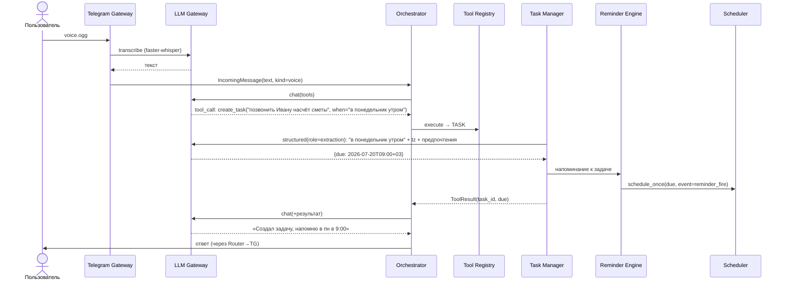
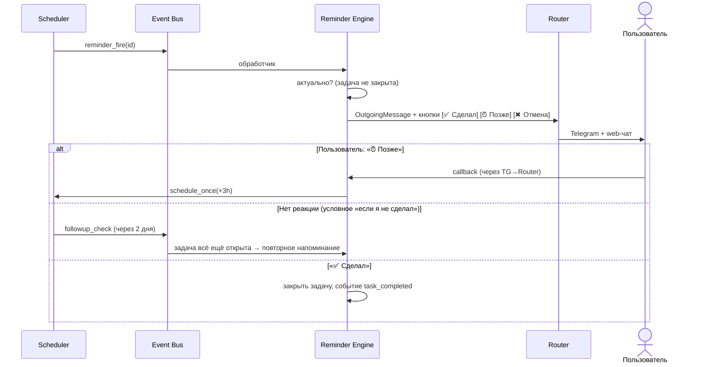
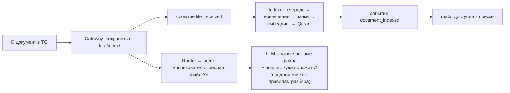
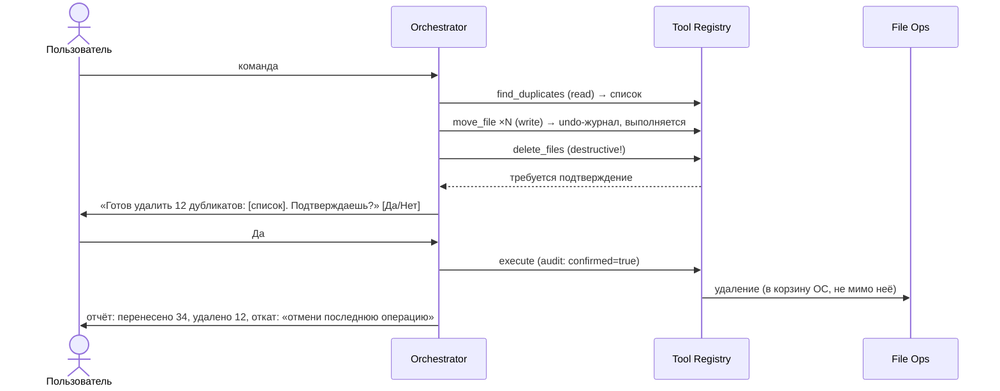
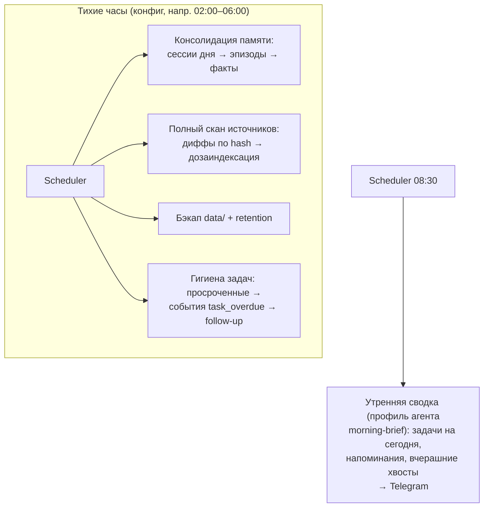

# Этап 6. Потоки обработки

Шесть ключевых сценариев. Все остальные — комбинации этих.

---

## 1. Текстовый вопрос с поиском по документам (основной поток)

Пример: *«Найди договор с подрядчиком по экспедиции и скажи, какие там сроки»*

```mermaid
sequenceDiagram
    actor U as Пользователь
    participant TG as Telegram Gateway
    participant R as Router
    participant A as Orchestrator
    participant CB as Context Builder
    participant M as Memory
    participant L as LLM Gateway
    participant T as Tool Registry
    participant RAG as RAG Service

    U->>TG: сообщение
    TG->>TG: whitelist check
    TG->>R: IncomingMessage
    R->>R: сессия, сохранить в messages
    R->>A: process(msg, session)
    A->>CB: build_context()
    CB->>M: preferences() + recall("договор подрядчик экспедиция")
    M-->>CB: предпочтения; факты (проект «Экспедиция», подрядчик N)
    CB-->>A: промпт (system+память+история)
    A->>L: chat(role=chat, tools=[...])
    L-->>A: tool_call: search_documents(query, filters={project})
    A->>T: execute (risk=read → сразу; audit)
    T->>RAG: search(...)
    RAG-->>T: топ-8 пассажей с цитатами
    T-->>A: ToolResult
    A->>L: chat(+результаты)
    L-->>A: финальный текст с источниками
    A->>R: OutgoingMessage (streaming)
    R->>TG: доставка (редактирование сообщения)
    TG->>U: ответ + «📄 источник: .../договор.pdf, стр. 4»
    A--)M: событие message_processed → фоновое извлечение фактов
```

---

## 2. Голосовое сообщение → задача с напоминанием

Пример: 🎤 *«Напомни мне в понедельник утром позвонить Ивану насчёт сметы»*



---

## 3. Срабатывание напоминания и follow-up



Надёжность: доставка фиксируется в `reminder_log`; при падении в момент
срабатывания APScheduler (misfire_grace) доставит после рестарта.

---

## 4. Пользователь прислал документ в Telegram



---

## 5. Разрушающая файловая операция (подтверждение)

Пример: *«Разбери папку Downloads — перенеси документы по проектам и удали дубликаты»*



---

## 6. Фоновые циклы (ночь)



**Следующий документ:** [06-roadmap.md](06-roadmap.md).
