# Этапы 7–9. Итерации разработки и Roadmap

Правила нарезки:

1. **Каждый спринт заканчивается работающей системой**, которой можно пользоваться ежедневно.
2. Сначала — вертикальный срез «канал → агент → LLM», потом наращивание способностей.
3. Инфраструктурные вещи (логи, конфиг, аудит) не откладываются «на потом» — они в Sprint 0, потому что вплетать их задним числом дороже.

Оценки объёма — в вечерах/выходных одного разработчика с AI-ассистентом (⏱ 1 ≈ 1 вечер).

---

## Sprint 0 — Скелет платформы

| | |
|---|---|
| **Цель** | Фундамент, на который ложатся все модули |
| **Реализуется** | Каркас пакета, Config Service (yaml+env, Pydantic), structlog + request_id, SQLite + миграции, Event Bus, DI-композиция в `app.py`, консольный REPL-канал, Router с сессиями, CI (lint, mypy, import-linter, pytest), фейк-LLM для тестов |
| **Критерии готовности** | `python -m sba` стартует; в REPL echo-диалог проходит через Router; конфиг с ошибкой валидно падает; тесты и линтеры зелёные в CI; границы модулей проверяются import-linter |
| **Риски** | Overengineering — держать Bus и DI примитивными (по 50–100 строк, без фреймворков) |
| **Объём** | ⏱ 4–6 |

## Sprint 1 — Telegram + локальная LLM (первый «живой» ассистент)

| | |
|---|---|
| **Цель** | Разговаривать со своей LLM из Telegram |
| **Реализуется** | LLM Gateway (OpenAI-совм. провайдер, роли, retry, streaming), Telegram Gateway (whitelist, текст, разбиение длинных ответов), Agent Orchestrator v1 (без тулов: контекст = system + история), Context Builder v1, сервис-режим (NSSM/systemd) |
| **Критерии готовности** | Диалог в TG с историей в рамках сессии; чужой user_id игнорируется; убийство процесса → авто-рестарт → диалог продолжается; смена рантайма/модели — только конфиг (проверить на 2 рантаймах) |
| **Риски** | Q-1/Q-2 закрыты (Ollama, CPU-only — см. 01-requirements §4.1–4.2); mistral 7B слаб в русском → сразу сравнить с `qwen2.5:7b-instruct`; CPU-скорость → жёсткий бюджет промпта и streaming с первого дня; заложить fallback JSON-режим уже сейчас |
| **Объём** | ⏱ 5–7 |

## Sprint 2 — Tool Calling + первые инструменты + аудит

| | |
|---|---|
| **Цель** | Ассистент становится агентом |
| **Реализуется** | Tool Registry, agent loop с итерациями и лимитами, уровни риска + подтверждения кнопками в TG, audit log, инструменты-пробники: `get_time`, `list_files`, `read_document` (txt/md), structured output механика |
| **Критерии готовности** | «Что лежит в папке X?» → модель сама зовёт `list_files`; destructive-заглушка требует подтверждения; каждый вызов виден в audit; модель без нативного tool calling работает через JSON-fallback |
| **Риски** | Локальная модель плохо выбирает тулзы → короткие описания, few-shot в system prompt, ≤ 10 тулов в промпте |
| **Объём** | ⏱ 5–7 |

## Sprint 3 — Память v1

| | |
|---|---|
| **Цель** | «Запомни…» / «что ты знаешь о…» + предпочтения влияют на поведение |
| **Реализуется** | Memory Service: факты (все 4 типа), предпочтения в system prompt, инструменты `remember_fact` / `recall` / `forget`, recall в Context Builder (пока — SQL/FTS-поиск, векторный придёт в Sprint 4), rolling summary истории |
| **Критерии готовности** | Рассказанное вчера ассистент вспоминает сегодня (после рестарта); «забудь» работает; предпочтение «отвечай кратко» реально меняет ответы |
| **Риски** | Слишком рьяное автоизвлечение — в v1 память **только явная**, автоизвлечение отложено в Sprint 7 |
| **Объём** | ⏱ 4–6 |

## Sprint 4 — RAG: индексация и семантический поиск

| | |
|---|---|
| **Цель** | «Найди в моих документах…» работает по PDF/DOCX/MD/txt |
| **Реализуется** | Qdrant embedded, эмбеддинги (bge-m3 in-process), Indexer: watcher + очередь + экстракторы (PDF, DOCX, MD, txt) + чанкер + каталог файлов, RAG Service: гибридный поиск + фильтры + цитаты, инструмент `search_documents`, память переезжает на векторный recall, скрипт `reindex.py` |
| **Критерии готовности** | Вопрос по содержимому личного корпуса → ответ с указанием файла и места; новый файл в папке находится поиском в течение минут; переиндексация не мешает диалогу; ру/en запросы работают |
| **Риски** | Q-3 (пути и объём корпуса), Q-5 (язык), Q-6 (embedded vs server); качество экстракции кривых PDF → OCR-fallback в Sprint 8 |
| **Объём** | ⏱ 7–9 (самый тяжёлый спринт) |

## Sprint 5 — Задачи

| | |
|---|---|
| **Цель** | Полноценный task-менеджер естественным языком |
| **Реализуется** | Task Manager: CRUD + статусы + проекты, LLM-парсинг дат/повторений (structured, с tz), инструменты create/update/complete/search, связь задача ↔ исходное сообщение |
| **Критерии готовности** | «Создай задачу…», «что у меня по проекту X?», «отметь сделанным» — работают; «каждый понедельник» превращается в корректный RRULE; относительные даты учитывают tz |
| **Риски** | Парсинг дат локальной моделью — валидация + переспрос при низкой уверенности («уточни: в этот понедельник или в следующий?») |
| **Объём** | ⏱ 5–6 |

## Sprint 6 — Напоминания и Scheduler

| | |
|---|---|
| **Цель** | Ассистент сам приходит к пользователю вовремя |
| **Реализуется** | Scheduler (APScheduler + SQLite store), Reminder Engine: одноразовые/RRULE/follow-up, кнопки ✅/⏰/✖, misfire-политика, утренняя сводка (профиль morning-brief), «умный момент» без срока |
| **Критерии готовности** | «Напомни через неделю» приходит через неделю, переживая любые рестарты; snooze работает; «если я не сделал — напомни снова» срабатывает; сводка приходит каждое утро |
| **Риски** | Двойная доставка после сбоя → идемпотентность по `reminder_log` |
| **Объём** | ⏱ 4–6 |

## Sprint 7 — Автоматическая память и консолидация

| | |
|---|---|
| **Цель** | Память пополняется сама, «второй мозг» начинает жить |
| **Реализуется** | Фоновое извлечение фактов из диалогов, ночная консолидация сессия→эпизод→факты, вытеснение противоречий (`superseded_by`), память проектов как сквозной фильтр, инструмент «что ты знаешь о N?» с агрегацией |
| **Критерии готовности** | Упомянутое вскользь имя/решение всплывает в recall через неделю; противоречивые факты не конфликтуют (виден актуальный + история); мусорные факты не копятся (порог confidence, дедуп) |
| **Риски** | Качество извлечения слабой моделью → консервативные промпты, периодическая ручная ревизия («покажи, что ты запомнил за неделю» → удобно чистить) |
| **Объём** | ⏱ 5–7 |

## Sprint 8 — Файловые операции + OCR + Excel

| | |
|---|---|
| **Цель** | Ассистент наводит порядок в файлах |
| **Реализуется** | File Ops: move/copy/rename/archive с undo-журналом, дубликаты и почти-дубликаты, старые версии; экстракторы XLSX и OCR (сканы, изображения); Obsidian-обогащение (wikilinks/теги) |
| **Критерии готовности** | «Разбери Downloads» — работает с подтверждением destructive; «отмени последнюю операцию» откатывает; текст со скана находится поиском; заметки Obsidian ищутся с учётом тегов |
| **Риски** | Самый опасный спринт (порча файлов) → сначала dry-run режим: неделя работы «только план, без исполнения» |
| **Объём** | ⏱ 6–8 |

## Sprint 9 — Web-чат + MCP

| | |
|---|---|
| **Цель** | Второй канал и открытая расширяемость |
| **Реализуется** | Local Web Chat (FastAPI+WS, streaming, кнопки), MCP Client Hub (подключение `git`, `fetch`, календарь — по конфигу), MCP Server (экспорт rag/memory/tasks), инструмент web-поиска (опционально) |
| **Критерии готовности** | Диалог и напоминания видны в web и TG одновременно; сторонний MCP-тул виден агенту и подчиняется уровням риска; наш MCP-сервер работает из Claude Desktop |
| **Риски** | Разнобой UX подтверждений между каналами → подтверждение живёт в Router, канал только рендерит |
| **Объём** | ⏱ 6–8 |

## Sprint 10 — Закалка (hardening)

| | |
|---|---|
| **Цель** | Годы автономной работы |
| **Реализуется** | Backup + автоматический restore-тест, health-мониторинг с самоотчётом в TG («индексатор стоит 2 часа»), ротация/retention логов и памяти, allowlist HTTP, опц. шифрование (Q-7), нагрузочная проверка на полном корпусе (NFR-5), документация эксплуатации |
| **Критерии готовности** | Восстановление из бэкапа на чистой машине ≤ 30 мин по инструкции; месяц работы без ручных вмешательств; сбой любого компонента виден в TG |
| **Риски** | «Скучный» спринт, соблазн пропустить — но именно он делает систему платформой |
| **Объём** | ⏱ 4–6 |

---

## Backlog (после ядра — по желанию)

Голосовой канал (локальный STT уже есть, добавить TTS + wake word) · почтовый коннектор (IMAP) · Telegram-архив (Telethon) · календарь двусторонне · мульти-агентные профили (ресёрчер, ревьюер) · мобильный доступ (Tailscale к web-чату — без публичного IP) · семантический граф знаний поверх памяти · дашборд состояния.

---

## Roadmap и его обоснование (Этап 9)

```mermaid
gantt
    dateFormat X
    axisFormat %s
    section Фундамент
    S0 Скелет            :0, 1
    S1 TG + LLM          :1, 2
    S2 Агентность        :2, 3
    section Знания
    S3 Память v1         :3, 4
    S4 RAG               :4, 6
    section Действия
    S5 Задачи            :6, 7
    S6 Напоминания       :7, 8
    section Автономность
    S7 Автопамять        :8, 9
    S8 Файлы+OCR         :9, 10
    S9 Web+MCP           :10, 11
    S10 Hardening        :11, 12
```

Почему такой порядок:

1. **S0→S1→S2 — вертикальный срез сначала.** Пока нет цепочки «Telegram → агент → LLM → инструмент», любой модуль пишется вслепую. После S2 каждый следующий спринт = новые инструменты на готовом каркасе — это резко дешевле.
2. **Память (S3) раньше RAG (S4)**, потому что она мала, сразу даёт «wow»-эффект ежедневного использования и обкатывает structured output до самого сложного спринта. RAG тяжёлый — к нему лучше приходить с уже стабильным ядром.
3. **Задачи (S5) → Напоминания (S6)** — напоминаниям нужен и Scheduler, и задачи как сущность; порядок естественный.
4. **Автоизвлечение памяти (S7) отложено** до момента, когда явная память и RAG обкатаны: автоизвлечение — самое чувствительное к качеству модели место, ему нужны зрелые механики валидации.
5. **Файловые операции (S8) поздно намеренно**: это самый рискованный функционал, и ему нужны зрелые audit, подтверждения и undo, которые к S8 уже проверены временем.
6. **MCP (S9) после ядра**: расширяемость наружу имеет смысл, когда есть что расширять; при этом архитектурно MCP заложен с S2 (Registry не различает внутренние и MCP-тулы).
7. **Hardening (S10) — не «потом»**: значительная его часть (аудит, бэкапы) появляется раньше по спринтам; S10 доводит до состояния «поставил и забыл».

Контрольные точки пользы (можно жить на системе уже с этих точек):

- после **S1** — локальный ChatGPT в Telegram;
- после **S4** — «спроси свои документы»;
- после **S6** — полноценный ежедневный ассистент;
- после **S10** — автономная платформа на годы.

---

## Чек-лист старта реализации

- [x] Q-1 (рантайм): Ollama + mistral 7B, `http://localhost:11434/v1` — [01-requirements.md §4.1](01-requirements.md)
- [x] Q-2 (железо): CPU-only, i7-1165G7 / 16 ГБ RAM — роли моделей и NFR скорректированы, [01-requirements.md §4.2](01-requirements.md)
- [ ] Согласованы решения ADR-1…ADR-10 — [02-architecture.md §8](02-architecture.md)
- [ ] Подтверждены пути к документам и Obsidian (Q-3) — можно позже, к S3/S4
- [ ] Создан Telegram-бот (@BotFather), токен в `local.yaml` — нужен к Sprint 1
- [x] Sprint 0 завершён (2026-07-17): скелет платформы, echo-диалог через Router, CI зелёный
- [x] Sprint 1 завершён (2026-07-17): LLM Gateway (OpenAI-совм. + retry + streaming), оркестратор v1 с историей и бюджетом контекста, Telegram-канал (whitelist, streaming-редактирование, разбиение длинных ответов), сервис-режим Windows/Linux. Примечание: «проверка на 2 рантаймах» выполнена как Ollama + фейковый OpenAI-сервер в e2e; проверка на живом втором рантайме (LM Studio) — по желанию владельца
- [x] Sprint 2 завершён (2026-07-18): Tool Registry с уровнями риска (ADR-10), agent loop с лимитом итераций, audit log, потоковый tool calling + JSON-fallback (`tool_mode: json`), инструменты `get_current_time` / `list_files` / `find_files` / `read_document` / `delete_file` (destructive, в корзину), файловая безопасность через `files.allowed_roots`. Отступление от плана: подтверждение destructive — текстом «да/нет»; кнопки отложены к Sprint 6. Добавлено по итогам живой отладки с 7B-моделью: видимые маркеры вызовов 🔧, команды `/audit` `/tools` `/new` (служебные обмены не попадают в историю), чистка служебных строк из контекста модели, принудительный tool_choice на тематических вопросах, спасение JSON-вызовов текстом, дедуп повторных вызовов, таймауты инструментов и поиска, heartbeat «модель думает» в Telegram
- [x] Sprint 3 завершён (2026-07-18): Memory Service (SQLite + FTS5 с префиксным поиском под русскую морфологию), типизированные факты (person/project/decision/preference/fact), инструменты `remember_fact` / `recall_memory` / `forget_memory`, предпочтения в system prompt, релевантные факты в контекст рядом с вопросом, вытеснение предпочтений с сохранением истории, мягкое «забудь», MemoryPort как инверсия зависимости (ядро не знает модуль памяти), feature flag `modules.memory.enabled`. Отступления: rolling summary истории отложен к Sprint 7 (консолидация) — не входил в DoD; память проектов появится как фильтр после Sprint 4
- [x] Sprint 4 завершён (2026-07-18): RAG — Qdrant embedded (`data/qdrant`, ленивое создание коллекций с контролем размерности), гибридный поиск: dense-векторы (роль `embedding` → bge-m3 через Ollama) + лексический FTS5 с префиксами, слияние RRF; Indexer — периодический скан источников (диффы по mtime/size → sha256), очередь в SQLite с дедупом по пути и повторами (3 попытки → failed; недоступность LLM не сжигает попытки), экстракторы PDF (pypdf) / DOCX / MD (заголовки, frontmatter) / TXT (cp1251-fallback), структурный чанкер с локаторами («стр. 3», «раздел …»); инструмент `search_documents` с цитатами «файл + место»; память переехала на гибридный векторный recall (коллекция `memory`, best-effort: без Ollama работает FTS, вытеснение/забывание чистят векторы); команда `/rag` (инъекция сервис-команд модулей в оркестратор — ядро по-прежнему не знает модулей); `scripts/reindex.py [--full]`; пауза индексации при активном диалоге (cooldown 90 с по событию MessageReceived). **Отступления от плана:** (1) эмбеддинги через Ollama `/v1/embeddings`, а не sentence-transformers in-process — не тащим torch (~2 ГБ) на машину владельца, RAM всех моделей управляет один Ollama; порт `Embedder` позволяет добавить in-process провайдер позже; (2) sparse-половина гибрида — SQLite FTS5 + RRF вместо нативного sparse Qdrant (не нужен отдельный sparse-энкодер, FTS5 обкатан на памяти); (3) watcher — периодический скан (2 мин) вместо watchdog: DoD «в течение минут» закрыт, FS-события — возможный ускоритель позже; (4) PDF — pypdf вместо PyMuPDF (чистый Python, без бинарных зависимостей), OCR-fallback — Sprint 8 по плану; (5) reranker (опциональный по 02-architecture §4.2) отложен — на CPU он удвоил бы латентность поиска. Для владельца: `ollama pull bge-m3` + `modules.rag.sources` в local.yaml (README §«Поиск по документам»). Добавлено по итогам живой отладки: Ollama **игнорирует** `tool_choice=required` — модель на вопросы «найди…» отвечала выдуманными файлами, не вызывая инструментов (подтверждено `/audit`). Принуждение перенесено на нашу сторону: на «файловых/памятных» вопросах текст без вызова инструмента не показывается (буферизация), один строгий повтор, после второго отказа — честное «ответ мог быть выдуман» вместо текста; плюс растяжка на любые ответы с путями/именами файлов без единого реального вызова за ход («⚠️ … проверить: /audit»); маркеры файловой темы расширены вопросами о наличии информации («есть ли инфа про…»). **Принят владельцем 2026-07-19** после живой проверки на его корпусе (~2226 файлов): семантический вопрос «есть ли инфа про абразивную губку для овощей» → реальный `search_documents` → два файла Obsidian-заметок с разделами и цитатами
- [x] Sprint 5 завершён (2026-07-19): Task Manager — SQLite `tasks` + FTS5 (статусы open/done/cancelled, проекты, связь задача ↔ исходное сообщение через ContextVar `core/execctx.py`); разбор сроков **двухслойный**: (1) детерминированный парсер частых русских формулировок («завтра в 9», «через 2 часа», «в пятницу вечером», «25.12», «25 декабря», «каждый понедельник» → `FREQ=WEEKLY;BYDAY=MO`, «по будням», tz владельца) — быстро, без LLM и без фабрикаций; (2) LLM-fallback (роль extraction, structured JSON) со строгой валидацией: разбор даты, проверка RRULE через dateutil, «срок не в прошлом», порог уверенности `clarify_confidence` — ниже порога или при неоднозначности инструмент возвращает переспрос, задача НЕ создаётся (риск спринта закрыт); при недоступном разборе (Ollama лежит) задача создаётся без срока с честным предупреждением — CRUD не зависит от LLM. Инструменты `create_task` / `search_tasks` / `complete_task` / `update_task` (ссылка на задачу — короткий id `#a1b2c3` или слова названия; неоднозначность → список кандидатов); выполнение повторяющейся задачи сдвигает срок на следующее срабатывание RRULE, а не закрывает её; команда `/tasks` — открытые задачи мимо LLM; тематические маркеры задач с принуждением к инструментам. **Отступления от плана:** (1) `merge_tasks` (FR-4.4, Should) отложен — кандидаты по векторной близости осмысленны после обкатки корпуса задач, вернёмся после Sprint 6/7; (2) события `task_created`/`task_completed` не публикуются — первый подписчик (Reminder Engine) появится в Sprint 6, добавим вместе с ним; (3) фильтры по проекту/подстроке — в Python, а не SQL `lower()` (SQLite не приводит кириллицу к нижнему регистру). Для владельца: README §«Задачи», интервальные повторения («раз в 2 недели») намеренно отданы LLM-слою. **Добавлено по итогам живой отладки с владельцем** (тот же урок недоверия к 7B, что и в Sprint 2/4): (а) страховка от фабрикации задач — если ответ заявляет «задача создана/закрыта», а инструмент за ход не вызывался, приписывается «⚠️ задача НЕ создана… проверьте /tasks» (модель повторяла выдуманный id-пример `a1b2c3` из промпта); (б) маркеры расширены на recurring/reminder-формулировки (стем `напом` ловит напомни/напоминай/напоминал — исходное `напомни` не совпадало с `напомин`); (в) в промпте разведены «напомни, КОГДА…» (вопрос → `search_tasks`, ничего не создавать) и «напоминай каждое утро…» (создание); (г) явный запрет придумывать id и несуществующую команду `delete_task` (удаления нет — «удали» = отмена со `status=cancelled`, история сохраняется); (д) прогрев модели при старте (`App.run()` до приёма сообщений и до индексатора) с заметной строкой «✅ Модель загружена, можно писать» — первый вопрос больше не падает по `ReadTimeout` на холодной модели. **Принят владельцем 2026-07-19** после живой проверки в Telegram: «каждый вторник в 10:00 планёрка» → реальный `create_task` с `FREQ=WEEKLY;BYDAY=TU`; «Напомни, когда мне надо отправить письмо?» → `search_tasks` (не создание) с верным ответом «каждый день до 08:00»; `/tasks` показывает актуальный список без дублей. Известное ограничение (принято владельцем): ответы с инструментами на CPU-only 7B — минуты (два прохода модели), ускорение отложено
- [x] Sprint 6 завершён (2026-07-19): Напоминания и Scheduler. **Scheduler** (`modules/scheduler/`) — джобы в SQLite `scheduler_jobs`, цикл-поллинг (тик 15 с), при срабатывании только публикует `JobFired(topic, payload)` в шину (сам ничего не исполняет — docs/04 §12); одноразовые и RRULE-джобы (правило считается в поясе владельца), semantics at-least-once: продвижение джоба — условное (`WHERE next_fire_at=?`), чтобы не затирать перепланирование из обработчика; misfire-политика per-job: `deliver` — доставить с опозданием (напоминания), `skip` — пропустить позже grace 4 ч (сводка). **Reminder Engine** (`modules/reminders/`) — сущность в SQLite `reminders` (одноразовые / RRULE / follow-up), доставка `OutgoingMessage(kind=NOTIFICATION)` через Router во все активные каналы; кнопки **✅/⏰/✖** — generic-механика `actions` в `OutgoingMessage` + `Router.register_action_handler(prefix)` (ядро модулей не знает), Telegram рендерит inline-клавиатуру и дописывает отклик в сообщение (повторное нажатие исключено), CLI показывает подсказку текстом; идемпотентность по `reminder_log (reminder_id, scheduled_for UNIQUE)` — дубль после сбоя подавляется (риск спринта закрыт); follow-up «пока не сделаю» (`repeat_until_done`, период `followup_hours`, до ✅/✖); авто-напоминания задач со сроком — по событию `TaskChanged` из TasksService + стартовая синхронизация (задачи, созданные до Sprint 6, тоже получают напоминания; ✅ на таком напоминании закрывает задачу, у повторяющейся сдвигает срок; закрытая мимо напоминания задача гасит его без доставки); «умный момент» без срока — ближайшее утро в `default_hour`; опоздавшая доставка честно помечается. **Утренняя сводка** — детерминированная (задачи на сегодня, просроченные, напоминания дня), джоб `FREQ=DAILY` c misfire=skip; перерегистрация на старте не затирает созревшее срабатывание (иначе рестарт «съедал» бы утро). Инструменты: `create_reminder` / `list_reminders` / `snooze_reminder` / `cancel_reminder`; команда `/reminders`; system-промпт и нуджи переведены с «сам в срок не уведомлю» на «напомню сам»; растяжка на фабрикацию расширена на заявления о напоминаниях. **Отступления от плана:** (1) **вместо APScheduler (ADR-9) — свой поллинг-цикл** поверх уже имеющегося SQLite: не тащим SQLAlchemy ради job store, джобы хранятся JSON-ом (не pickle), misfire-политика своя и прозрачная, объём ~150 строк; суть ADR (SQLite-хранилище джобов, переживающее рестарт) сохранена; (2) сводка — **без LLM-профиля morning-brief**: по П-1 (docs/01 §5) регулярная доставка не должна зависеть от модели, а 7B склонна приукрашивать список дел; профиль вернётся, когда появится второй потребитель профилей (Sprint 7+); (3) «умный момент» — детерминированная эвристика вместо LLM (та же причина + бюджет CPU); (4) снапшот-кнопки подтверждения destructive на кнопки не переведены — механика actions готова, перевод отдельным шагом после обкатки на напоминаниях. Для владельца: README §«Напоминания». **Принят владельцем 2026-07-19** после живой проверки в Telegram: «напомни через 10 минут попить воды» → реальный `create_reminder` (маркер 🔧), напоминание пришло само в срок (20:32) с кнопками ✅/⏰/✖, нажатие ✖ отменило его и дописало отклик в сообщение (клавиатура снята). Живьём не проверены (покрыты тестами): snooze/follow-up и утренняя сводка (придёт в 08:30 на следующий день). **Известный побочный эффект спринта, к устранению в Sprint 7+:** число инструментов в промпте выросло до 17 (было 13 — добавились 4 по напоминаниям), это выше ориентира «≤10 тулов» из Sprint 2; на живой проверке 7B на файловом вопросе после верного вызова `list_files` сорвалась в англоязычную «воду» вместо русского ответа по списку. Причина вероятная — перегрузка малой модели числом тулов (плюс дефицит RAM на машине владельца, 0.7 ГБ свободно). **Решено (2026-07-19) настройками под слабое железо, все по умолчанию выключены/сохраняют прежнее поведение, включаются в local.yaml:** (а) `agent.topic_scoped_tools` — контекстная фильтрация инструментов: на реплику без темы модель не получает инструментов вовсе, на тематический вопрос — только релевантные модули (файлы/задачи/память), а не все 17; оказалось, что схемы всех тулов и были главным тормозом — на CPU prefill длинного промпта одинаково грузил и «привет», и «сколько времени» (владелец замерил ~1.5–2 мин на оба). После включения оба ответа — **~5 с** (живая проверка владельца); (б) `modules.memory.semantic=false` — recall памяти на FTS вместо векторов, снимает bge-m3 с горячего пути (~1.2 ГБ RAM, конец конкуренции моделей за CPU); (в) прогрев на старте теперь честный: `warmup()` возвращает факт готовности, старт ждёт модель с повтором и не печатает ложное «✅ Модель загружена» (раньше первый вопрос после старта молча падал по ReadTimeout, т.к. холодная загрузка тяжёлой модели превышала таймаут чтения). Для владельца на i7-1165G7/16 ГБ также подтверждено: 7B слишком тяжела даже для загрузки под дефицитом RAM — переход `chat` на `qwen2.5:3b-instruct` в models.yaml снял таймауты. README §«Ускорение ответов…» и §«Экономия памяти…»
