# Этапы 7–9. Итерации разработки и Roadmap

Правила нарезки:

1. **Каждый спринт заканчивается работающей системой**, которой можно пользоваться ежедневно.
2. Сначала — вертикальный срез «канал → агент → LLM», потом наращивание способностей.
3. Инфраструктурные вещи (логи, конфиг, аудит) не откладываются «на потом» — они в Sprint 0, потому что вплетать их задним числом дороже.

Оценки объёма — в вечерах/выходных одного разработчика с AI-ассистентом (⏱ 1 ≈ 1 вечер).

---

## Sprint 0 — Скелет платформы

| | |
|---|---|
| **Цель** | Фундамент, на который ложатся все модули |
| **Реализуется** | Каркас пакета, Config Service (yaml+env, Pydantic), structlog + request_id, SQLite + миграции, Event Bus, DI-композиция в `app.py`, консольный REPL-канал, Router с сессиями, CI (lint, mypy, import-linter, pytest), фейк-LLM для тестов |
| **Критерии готовности** | `python -m sba` стартует; в REPL echo-диалог проходит через Router; конфиг с ошибкой валидно падает; тесты и линтеры зелёные в CI; границы модулей проверяются import-linter |
| **Риски** | Overengineering — держать Bus и DI примитивными (по 50–100 строк, без фреймворков) |
| **Объём** | ⏱ 4–6 |

## Sprint 1 — Telegram + локальная LLM (первый «живой» ассистент)

| | |
|---|---|
| **Цель** | Разговаривать со своей LLM из Telegram |
| **Реализуется** | LLM Gateway (OpenAI-совм. провайдер, роли, retry, streaming), Telegram Gateway (whitelist, текст, разбиение длинных ответов), Agent Orchestrator v1 (без тулов: контекст = system + история), Context Builder v1, сервис-режим (NSSM/systemd) |
| **Критерии готовности** | Диалог в TG с историей в рамках сессии; чужой user_id игнорируется; убийство процесса → авто-рестарт → диалог продолжается; смена рантайма/модели — только конфиг (проверить на 2 рантаймах) |
| **Риски** | Q-1/Q-2 закрыты (Ollama, CPU-only — см. 01-requirements §4.1–4.2); mistral 7B слаб в русском → сразу сравнить с `qwen2.5:7b-instruct`; CPU-скорость → жёсткий бюджет промпта и streaming с первого дня; заложить fallback JSON-режим уже сейчас |
| **Объём** | ⏱ 5–7 |

## Sprint 2 — Tool Calling + первые инструменты + аудит

| | |
|---|---|
| **Цель** | Ассистент становится агентом |
| **Реализуется** | Tool Registry, agent loop с итерациями и лимитами, уровни риска + подтверждения кнопками в TG, audit log, инструменты-пробники: `get_time`, `list_files`, `read_document` (txt/md), structured output механика |
| **Критерии готовности** | «Что лежит в папке X?» → модель сама зовёт `list_files`; destructive-заглушка требует подтверждения; каждый вызов виден в audit; модель без нативного tool calling работает через JSON-fallback |
| **Риски** | Локальная модель плохо выбирает тулзы → короткие описания, few-shot в system prompt, ≤ 10 тулов в промпте |
| **Объём** | ⏱ 5–7 |

## Sprint 3 — Память v1

| | |
|---|---|
| **Цель** | «Запомни…» / «что ты знаешь о…» + предпочтения влияют на поведение |
| **Реализуется** | Memory Service: факты (все 4 типа), предпочтения в system prompt, инструменты `remember_fact` / `recall` / `forget`, recall в Context Builder (пока — SQL/FTS-поиск, векторный придёт в Sprint 4), rolling summary истории |
| **Критерии готовности** | Рассказанное вчера ассистент вспоминает сегодня (после рестарта); «забудь» работает; предпочтение «отвечай кратко» реально меняет ответы |
| **Риски** | Слишком рьяное автоизвлечение — в v1 память **только явная**, автоизвлечение отложено в Sprint 7 |
| **Объём** | ⏱ 4–6 |

## Sprint 4 — RAG: индексация и семантический поиск

| | |
|---|---|
| **Цель** | «Найди в моих документах…» работает по PDF/DOCX/MD/txt |
| **Реализуется** | Qdrant embedded, эмбеддинги (bge-m3 in-process), Indexer: watcher + очередь + экстракторы (PDF, DOCX, MD, txt) + чанкер + каталог файлов, RAG Service: гибридный поиск + фильтры + цитаты, инструмент `search_documents`, память переезжает на векторный recall, скрипт `reindex.py` |
| **Критерии готовности** | Вопрос по содержимому личного корпуса → ответ с указанием файла и места; новый файл в папке находится поиском в течение минут; переиндексация не мешает диалогу; ру/en запросы работают |
| **Риски** | Q-3 (пути и объём корпуса), Q-5 (язык), Q-6 (embedded vs server); качество экстракции кривых PDF → OCR-fallback в Sprint 8 |
| **Объём** | ⏱ 7–9 (самый тяжёлый спринт) |

## Sprint 5 — Задачи

| | |
|---|---|
| **Цель** | Полноценный task-менеджер естественным языком |
| **Реализуется** | Task Manager: CRUD + статусы + проекты, LLM-парсинг дат/повторений (structured, с tz), инструменты create/update/complete/search, связь задача ↔ исходное сообщение |
| **Критерии готовности** | «Создай задачу…», «что у меня по проекту X?», «отметь сделанным» — работают; «каждый понедельник» превращается в корректный RRULE; относительные даты учитывают tz |
| **Риски** | Парсинг дат локальной моделью — валидация + переспрос при низкой уверенности («уточни: в этот понедельник или в следующий?») |
| **Объём** | ⏱ 5–6 |

## Sprint 6 — Напоминания и Scheduler

| | |
|---|---|
| **Цель** | Ассистент сам приходит к пользователю вовремя |
| **Реализуется** | Scheduler (APScheduler + SQLite store), Reminder Engine: одноразовые/RRULE/follow-up, кнопки ✅/⏰/✖, misfire-политика, утренняя сводка (профиль morning-brief), «умный момент» без срока |
| **Критерии готовности** | «Напомни через неделю» приходит через неделю, переживая любые рестарты; snooze работает; «если я не сделал — напомни снова» срабатывает; сводка приходит каждое утро |
| **Риски** | Двойная доставка после сбоя → идемпотентность по `reminder_log` |
| **Объём** | ⏱ 4–6 |

## Sprint 7 — Автоматическая память и консолидация

| | |
|---|---|
| **Цель** | Память пополняется сама, «второй мозг» начинает жить |
| **Реализуется** | Фоновое извлечение фактов из диалогов, ночная консолидация сессия→эпизод→факты, вытеснение противоречий (`superseded_by`), память проектов как сквозной фильтр, инструмент «что ты знаешь о N?» с агрегацией |
| **Критерии готовности** | Упомянутое вскользь имя/решение всплывает в recall через неделю; противоречивые факты не конфликтуют (виден актуальный + история); мусорные факты не копятся (порог confidence, дедуп) |
| **Риски** | Качество извлечения слабой моделью → консервативные промпты, периодическая ручная ревизия («покажи, что ты запомнил за неделю» → удобно чистить) |
| **Объём** | ⏱ 5–7 |

## Sprint 8 — Файловые операции + OCR + Excel

| | |
|---|---|
| **Цель** | Ассистент наводит порядок в файлах |
| **Реализуется** | File Ops: move/copy/rename/archive с undo-журналом, дубликаты и почти-дубликаты, старые версии; экстракторы XLSX и OCR (сканы, изображения); Obsidian-обогащение (wikilinks/теги) |
| **Критерии готовности** | «Разбери Downloads» — работает с подтверждением destructive; «отмени последнюю операцию» откатывает; текст со скана находится поиском; заметки Obsidian ищутся с учётом тегов |
| **Риски** | Самый опасный спринт (порча файлов) → сначала dry-run режим: неделя работы «только план, без исполнения» |
| **Объём** | ⏱ 6–8 |

## Sprint 9 — Web-чат + MCP

| | |
|---|---|
| **Цель** | Второй канал и открытая расширяемость |
| **Реализуется** | Local Web Chat (FastAPI+WS, streaming, кнопки), MCP Client Hub (подключение `git`, `fetch`, календарь — по конфигу), MCP Server (экспорт rag/memory/tasks), инструмент web-поиска (опционально) |
| **Критерии готовности** | Диалог и напоминания видны в web и TG одновременно; сторонний MCP-тул виден агенту и подчиняется уровням риска; наш MCP-сервер работает из Claude Desktop |
| **Риски** | Разнобой UX подтверждений между каналами → подтверждение живёт в Router, канал только рендерит |
| **Объём** | ⏱ 6–8 |

## Sprint 10 — Закалка (hardening)

| | |
|---|---|
| **Цель** | Годы автономной работы |
| **Реализуется** | Backup + автоматический restore-тест, health-мониторинг с самоотчётом в TG («индексатор стоит 2 часа»), ротация/retention логов и памяти, allowlist HTTP, опц. шифрование (Q-7), нагрузочная проверка на полном корпусе (NFR-5), документация эксплуатации |
| **Критерии готовности** | Восстановление из бэкапа на чистой машине ≤ 30 мин по инструкции; месяц работы без ручных вмешательств; сбой любого компонента виден в TG |
| **Риски** | «Скучный» спринт, соблазн пропустить — но именно он делает систему платформой |
| **Объём** | ⏱ 4–6 |

---

## Backlog (после ядра — по желанию)

Голосовой канал (локальный STT уже есть, добавить TTS + wake word) · почтовый коннектор (IMAP) · Telegram-архив (Telethon) · календарь двусторонне · мульти-агентные профили (ресёрчер, ревьюер) · мобильный доступ (Tailscale к web-чату — без публичного IP) · семантический граф знаний поверх памяти · дашборд состояния.

---

## Roadmap и его обоснование (Этап 9)

```mermaid
gantt
    dateFormat X
    axisFormat %s
    section Фундамент
    S0 Скелет            :0, 1
    S1 TG + LLM          :1, 2
    S2 Агентность        :2, 3
    section Знания
    S3 Память v1         :3, 4
    S4 RAG               :4, 6
    section Действия
    S5 Задачи            :6, 7
    S6 Напоминания       :7, 8
    section Автономность
    S7 Автопамять        :8, 9
    S8 Файлы+OCR         :9, 10
    S9 Web+MCP           :10, 11
    S10 Hardening        :11, 12
```

Почему такой порядок:

1. **S0→S1→S2 — вертикальный срез сначала.** Пока нет цепочки «Telegram → агент → LLM → инструмент», любой модуль пишется вслепую. После S2 каждый следующий спринт = новые инструменты на готовом каркасе — это резко дешевле.
2. **Память (S3) раньше RAG (S4)**, потому что она мала, сразу даёт «wow»-эффект ежедневного использования и обкатывает structured output до самого сложного спринта. RAG тяжёлый — к нему лучше приходить с уже стабильным ядром.
3. **Задачи (S5) → Напоминания (S6)** — напоминаниям нужен и Scheduler, и задачи как сущность; порядок естественный.
4. **Автоизвлечение памяти (S7) отложено** до момента, когда явная память и RAG обкатаны: автоизвлечение — самое чувствительное к качеству модели место, ему нужны зрелые механики валидации.
5. **Файловые операции (S8) поздно намеренно**: это самый рискованный функционал, и ему нужны зрелые audit, подтверждения и undo, которые к S8 уже проверены временем.
6. **MCP (S9) после ядра**: расширяемость наружу имеет смысл, когда есть что расширять; при этом архитектурно MCP заложен с S2 (Registry не различает внутренние и MCP-тулы).
7. **Hardening (S10) — не «потом»**: значительная его часть (аудит, бэкапы) появляется раньше по спринтам; S10 доводит до состояния «поставил и забыл».

Контрольные точки пользы (можно жить на системе уже с этих точек):

- после **S1** — локальный ChatGPT в Telegram;
- после **S4** — «спроси свои документы»;
- после **S6** — полноценный ежедневный ассистент;
- после **S10** — автономная платформа на годы.

---

## Чек-лист старта реализации

- [x] Q-1 (рантайм): Ollama + mistral 7B, `http://localhost:11434/v1` — [01-requirements.md §4.1](01-requirements.md)
- [x] Q-2 (железо): CPU-only, i7-1165G7 / 16 ГБ RAM — роли моделей и NFR скорректированы, [01-requirements.md §4.2](01-requirements.md)
- [ ] Согласованы решения ADR-1…ADR-10 — [02-architecture.md §8](02-architecture.md)
- [ ] Подтверждены пути к документам и Obsidian (Q-3) — можно позже, к S3/S4
- [ ] Создан Telegram-бот (@BotFather), токен в `local.yaml` — нужен к Sprint 1
- [x] Sprint 0 завершён (2026-07-17): скелет платформы, echo-диалог через Router, CI зелёный
- [x] Sprint 1 завершён (2026-07-17): LLM Gateway (OpenAI-совм. + retry + streaming), оркестратор v1 с историей и бюджетом контекста, Telegram-канал (whitelist, streaming-редактирование, разбиение длинных ответов), сервис-режим Windows/Linux. Примечание: «проверка на 2 рантаймах» выполнена как Ollama + фейковый OpenAI-сервер в e2e; проверка на живом втором рантайме (LM Studio) — по желанию владельца
